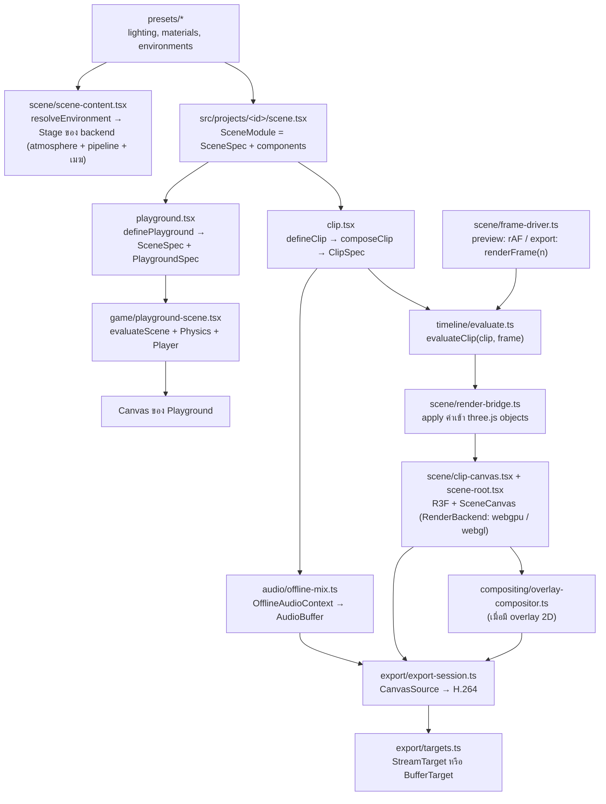

# สถาปัตยกรรม 3D Clip Studio

เอกสารนี้สรุปการออกแบบจาก `final-front-end-3d-video-stack.th.md` ให้ตรงกับโครงสร้างโค้ดจริง (Next.js App Router แทน Vite)

งานแบ่งเป็น **project** แต่ละ project คือโฟลเดอร์ `src/projects/<id>/` ที่มีฉากเดียวใช้ร่วมกันใน 2 โหมด:

- **Playground** (`/projects/<id>/play`): เดินในฉากด้วยคีย์บอร์ดและ physics (Rapier) เพื่อดูแสง สี และวัสดุ
- **Studio** (`/projects/<id>/studio`): preview คลิปของ project แล้ว export เป็น MP4 (H.264 + AAC) ในเบราว์เซอร์ (1 คลิปต่อ project)

## คำศัพท์

| คำ               | ความหมาย                                                                           | อยู่ที่              |
| ---------------- | ---------------------------------------------------------------------------------- | -------------------- |
| Project          | โฟลเดอร์ `src/projects/<id>/` ที่มี `scene.tsx`, `playground.tsx` และ `clip.tsx`   | `src/projects/`      |
| `SceneSpec`      | data ของฉาก: `environment`, `lights` และ `objects`                                 | `src/model/types.ts` |
| `ClipDefinition` | สิ่งที่ `clip.tsx` เขียนทับฉาก: video, camera, audio, `animate` และ `extraObjects` | `src/model/types.ts` |
| `ClipSpec`       | ผลของ `composeClip(scene, definition)` ที่ engine ใช้ evaluate และ export          | `src/model/types.ts` |
| `PlaygroundSpec` | `spawn`, `colliders` และ `extraObjects`                                            | `src/model/types.ts` |

## Data flow



`scene/scene-content.tsx` (environment, post pipeline, lights, objects) ใช้ร่วมกันทั้ง `scene-root.tsx` ของคลิปและ `playground-scene.tsx` แสง ท้องฟ้า และวัสดุจึงเหมือนกันทั้งสองโหมด

## โมดูล

| Path                                             | หน้าที่                                                                                                                                              | ข้อจำกัด                                                                                                         |
| ------------------------------------------------ | ---------------------------------------------------------------------------------------------------------------------------------------------------- | ---------------------------------------------------------------------------------------------------------------- |
| `src/app/`                                       | routing อย่างเดียว page เป็น Server Component แบบบาง                                                                                                 | ห้าม import R3F หรือ three ตรง ๆ ต้องผ่าน loader                                                                 |
| `src/features/studio`, `src/features/playground` | UI ของแต่ละโหมด รับ `projectId`                                                                                                                      | `*-loader.tsx` เป็น client boundary (`'use client'` + `dynamic(..., { ssr: false })`)                            |
| `src/projects/`                                  | project ที่ AI เขียน, `define.ts`, `manifest.ts` (metadata) และ `loaders.ts` (lazy import แยก clip/playground)                                       | `manifest.ts` ต้องไม่ import โค้ด project เพราะ Server Component ใช้ไฟล์นี้ และ project ห้าม import project อื่น |
| `src/model/`                                     | type ของ scene/clip/playground, ค่าเริ่มต้น และ `composeClip`                                                                                        | **pure**: ข้อมูลต้อง serialize เป็น JSON ได้                                                                     |
| `src/timeline/`                                  | evaluator, interpolation, easing และ seeded random                                                                                                   | **pure**: เป็นฟังก์ชันของ `(spec, frame)` เท่านั้น                                                               |
| `src/presets/`                                   | preset แสง วัสดุ และสภาพแวดล้อมที่ใช้ร่วมกัน รวมถึงค่าเริ่มต้นและการตรวจค่าของเมฆ (`clouds.ts`)                                                      | **pure data**                                                                                                    |
| `src/scene/`                                     | ชั้น render ด้วย R3F + WebGPU, scene content, render bridge, frame driver และ clip clock (ดู "Render layer")                                         | client-only และห้าม import `src/projects`                                                                        |
| `src/scene/canvas/`                              | `SceneCanvas` ตัวเดียวที่ทั้ง playground และ studio ใช้ โหลด backend ตาม `backend` prop ตรวจว่าเบราว์เซอร์รองรับ แล้วสร้าง renderer ของ backend นั้น | ห้ามสร้าง `<Canvas>` เองที่อื่น                                                                                  |
| `src/scene/backend/`                             | สัญญา `RenderBackend` (renderer, `Stage`, `createMaterial`), `selectRenderBackend` และ backend `webgpu`                                              | ห้าม import `src/scene/webgl/` ตรง ๆ นอกจาก loader ใน `load-backend.ts`                                          |
| `src/scene/atmosphere/`                          | ท้องฟ้า ดวงอาทิตย์ และ IBL จาก takram (`createAtmosphere`, `<Atmosphere>`, `<Sky>`, `<SunLight>`)                                                    | import `@takram/*` ผ่าน `atmosphere/takram.ts` เท่านั้น                                                          |
| `src/scene/pipeline/`                            | post-processing (`createScenePipeline`, `<ScenePipeline>`)                                                                                           | import `@takram/*` ผ่าน `pipeline/takram.ts` เท่านั้น                                                            |
| `src/scene/clouds/`                              | ฐานของเมฆที่ใช้ร่วมทุก backend: quality presets (`quality.ts`) และ loader ของ texture (`cloud-textures.ts`)                                          | ห้าม import `@takram/three-clouds` (WebGL)                                                                       |
| `src/scene/webgl/`                               | WebGL backend ชั่วคราวสำหรับเมฆ: `WebGLRenderer`, LUT, `SunDirectionalLight` + `SkyLightProbe` และ `EffectComposer` (ดู "Render backends")           | import `@takram/*` และ `postprocessing` ผ่าน `webgl/takram.ts` เท่านั้น ลบทั้งโฟลเดอร์ได้เมื่อ WebGPU รองรับเมฆ  |
| `src/game/`                                      | controls, physics config, player และ playground scene                                                                                                | client-only, physics ใช้ fixed timestep                                                                          |
| `src/audio/`                                     | โหลดเสียง, เล่นเสียงตอน preview และ mix แบบ offline                                                                                                  | client-only                                                                                                      |
| `src/export/`                                    | capability check, AAC fallback, output target และ export loop                                                                                        | `mediabunny` import ได้เฉพาะใน `export/mediabunny.ts`                                                            |
| `src/compositing/`                               | Canvas 2D สำหรับ subtitle/logo ที่ต้องติดไปในวิดีโอ                                                                                                  | เพิ่มเมื่อมีความต้องการจริง                                                                                      |
| `src/stores/`                                    | zustand store สำหรับ state ของ UI                                                                                                                    | ห้ามใช้ store ขับ scene ทีละเฟรม                                                                                 |
| `public/assets/`                                 | ใช้ร่วมกัน: `models/`, `textures/`, `hdri/`, `audio/`, `fonts/` และ texture ของเมฆ (`clouds/`) เฉพาะ project: `projects/<id>/`                       | same-origin เท่านั้น เพื่อเลี่ยงปัญหา CORS ตอนอ่าน canvas                                                        |

**pure** หมายถึงห้าม import `react`, `three`, `@react-three/*`, `@takram/*`, `mediabunny` และโมดูลชั้นบน ESLint (`no-restricted-imports` ใน `eslint.config.mjs`) บังคับกฎนี้ กฎ entry เดียวของ mediabunny กฎ adapter ของ `@takram/*` (`atmosphere/takram.ts`, `pipeline/takram.ts`, `webgl/takram.ts`) กฎห้ามใช้ `postprocessing`/`@react-three/postprocessing`/`@takram/three-clouds` นอก `webgl/takram.ts` และกฎห้าม project import project อื่น (`@/projects/<id>/…`)

## Render layer

### Render backends

WebGPU เป็น backend หลัก ส่วน WebGL เป็น backend ชั่วคราวที่มีไว้ render `@takram/three-clouds` จนกว่า takram จะออกเมฆ WebGPU

```text
features (playground-app / viewport)
└─ useSelectedRenderBackend(environment)    ?renderer= > RENDER_BACKEND > auto
   └─ SceneCanvas backend={id} quality (canvas/)  lazy import backend → detectSupport() → <Canvas gl={backend.createRenderer}> flat, shadows="percentage", dpr ตาม RENDER_QUALITIES[quality], frameloop
      └─ RenderBackendContext + RenderQualityContext
         └─ SceneContent                    resolveEnvironment(spec.environment)
            ├─ <backend.Stage>              atmosphere + post pipeline (+ เมฆ) ของแต่ละ backend
            ├─ LightRig                     แสงเสริมจาก spec.lights
            └─ SceneObject × n              primitive + backend.createMaterial (MeshStandardNodeMaterial / MeshStandardMaterial)
```

- **`RenderBackend`** (`backend/render-backend.ts`) มี `detectSupport`, `createRenderer`, `Stage` และ `createMaterial`
  - โค้ดที่ใช้ร่วมกันอ่าน backend จาก `useRenderBackend()` ห้าม import ไฟล์ของ backend ตรง ๆ
  - ส่วนที่ใช้ร่วมทุก backend: `atmosphere/geo-frame.ts` (`computeCelestialFrame`), `materials/material-parameters.ts`, `lights/sun-shadow.ts`, `clouds/*`, `LightRig` และ geometry ของ `SceneObject`
- **การเลือก** (`backend/select-backend.ts`):
  - ลำดับคือ `?renderer=webgpu|webgl` > `RENDER_BACKEND` ใน `render-config.ts` (ค่าเริ่มต้น `"auto"`) > auto
  - auto เลือก `webgpu` ถ้ารองรับทุก feature ที่ฉากใช้ ตาม `RENDER_BACKEND_FEATURES` ตอนนี้ฉากที่มี `environment.clouds` จึงได้ `webgl`
  - ถ้าบังคับ backend ที่ไม่รองรับเมฆ จะ `console.warn` ครั้งเดียวแล้ว render โดยไม่มีเมฆ
  - เปลี่ยน backend คือ remount canvas ทั้งตัว (`key`) จึงได้ renderer, scene และกล้องชุดใหม่
- **คุณภาพการแสดงผล** (`RENDER_QUALITIES` ใน `render-config.ts`): `high` (ค่าเริ่มต้น) กับ `performance` กำหนด dpr และคุณภาพเมฆ
  - `SceneCanvas` รับ prop `quality` แล้วส่งต่อผ่าน `RenderQualityContext` (`canvas/render-quality.ts`) backend อ่านด้วย `useRenderQuality()`
  - Studio ใช้ค่าเริ่มต้นเสมอ playground ค่าเริ่มต้นจึงเห็นภาพเดียวกับ Studio ส่วน `performance` (เมฆ `medium` + dpr 1) เป็นตัวเลือกใน environment panel ของ playground เท่านั้น ห้ามใช้ตอน export
  - เปลี่ยนคุณภาพไม่ remount canvas: R3F resize ตาม dpr และ WebGL stage เรียก `setCloudsQuality` กับ `CloudsEffect` ตัวเดิม (แค่ compile shader ใหม่ ไม่โหลด LUT/texture ซ้ำ)
  - เติม `?stats` ใน URL ของ playground เพื่อแสดง FPS (drei `<Stats>`) วัดใน production build (`bun run build` แล้ว `bun run start`) เพราะ dev mode มี StrictMode และ overlay
- **Lazy load**: `backend/load-backend.ts` ใช้ dynamic import หน้า WebGPU จึงไม่โหลดโค้ดและ GLSL ของเมฆ แต่ยังโหลด `postprocessing` ผ่าน root entry ของ three-atmosphere (ดู "`@takram/three-atmosphere` root entry")
- **Error**: `WebGPUUnavailableError` และ `WebGLUnavailableError` สืบจาก `RenderBackendUnavailableError` ซึ่ง `CanvasErrorBoundary` แปลงเป็น `fallback`

### WebGPU backend

```text
WebGPUStage (backend/webgpu.tsx)
├─ EnvironmentRenderer              environmentEpochMs(dateTime)
│  └─ Atmosphere (atmosphere/)      AtmosphereContext → renderer.contextNode, พิกัดโลก (geo-frame.ts), วันเวลา, กล้อง
│     ├─ Sky                        scene.backgroundNode = skyBackground() (ปิดดาว), scene.environmentNode = skyEnvironment()
│     └─ SunLight                   AtmosphereLight (เงา, ปิด indirect เพราะใช้ IBL จาก skyEnvironment)
└─ ScenePipeline (pipeline/)        pass(MRT output + highpVelocity) → lensFlare → toneMapping(AgX, exposure) → TAA → renderOutput (sRGB) → dithering
```

- **สองชั้นในแต่ละโฟลเดอร์**:
  - ฟังก์ชัน imperative (`createAtmosphere`, `createScenePipeline`) สร้าง อัปเดต และ dispose node เอง
  - component บาง ๆ ผูกกับ R3F ด้วย `useMemo` + `useDisposable` + effect
  - แยกแบบนี้เพื่อให้ export (M1) เรียกฟังก์ชันชุดเดียวกันได้โดยไม่ผ่าน React และผ่านกฎ `react-hooks/immutability`
- **ค่าที่จูนได้** (คุณภาพการแสดงผล ซึ่งรวม dpr และคุณภาพเมฆ, กล้อง, tone mapping, เงาดวงอาทิตย์) อยู่ใน `scene/render-config.ts` ที่เดียว
- **พิกัด**: world origin วางที่ `environment.location` ด้วย `Ellipsoid.WGS84.getNorthUpEastFrame` แกนเป็น +X เหนือ, +Y ขึ้น, +Z ตะวันออก และ 1 หน่วยเท่ากับ 1 เมตร
  - การแปลง geodetic → ECEF และ local frame → ECEF อยู่ใน `atmosphere/geo-frame.ts` ที่เดียว
  - ไม่เปิด `highPrecision` และ `reversedDepthBuffer` เพราะใช้เมื่อวาง object ในพิกัด ECEF เท่านั้น
  - `highPrecision` ใช้กับ `SkinnedMesh`/`InstancedMesh` ไม่ได้
- **เวลา**: ทิศดวงอาทิตย์และดวงจันทร์คำนวณจาก `environment.dateTime` โดยใช้ origin เป็นตำแหน่งผู้สังเกต (observer)
  - `environmentEpochMs` บังคับให้ `dateTime` เป็น ISO-8601 ที่ลงท้ายด้วย `Z` หรือ `±hh:mm` เพราะถ้าไม่มี offset จะถูกตีเป็นเวลาของเครื่อง
  - ห้ามใช้ `new Date()` ตอน runtime
- **Tone mapping** ทำใน pipeline ที่เดียว `SceneCanvas` จึงตั้ง `flat` ถ้าไม่ตั้ง R3F จะใส่ ACES ให้ แล้ว `RenderPipeline` จะ tone map ซ้ำ
- **Dithering ทำหลังแปลงเป็น sRGB**: `createScenePipeline` ตั้ง `outputColorTransform = false` แล้วเรียก `renderOutput()` เองก่อน `dithering`
  - `dithering` มีขนาด ±0.5/255 ใน display space ถ้าใส่ก่อน OETF ของ sRGB noise ในส่วนมืดจะขยายเป็นหลายระดับของ 8-bit
  - `renderOutput()` ที่ไม่ส่งอาร์กิวเมนต์อ่าน tone mapping และ color space ของ renderer จาก context ของ `RenderPipeline` จึงยังต้องตั้ง `flat`
- **Velocity สำหรับ TAA** ใช้ `highpVelocity` ของ takram ห้ามใช้ `velocity` ของ three
  - TAA ของ takram ยกเลิก jitter ผ่าน `highpVelocity.setProjectionMatrix()` เท่านั้น และใช้ค่า `.z` ตรวจ depth แต่ `velocity` ของ three เป็น `vec2`
  - `highpVelocity` ใช้กับ `SkinnedMesh`/`InstancedMesh` ได้ เพราะ MRT มี key `velocity` และ three จะคำนวณ `positionPrevious` ให้
- **กล้อง**: canvas หนึ่งตัวมีกล้องตัวเดียวตลอดอายุ และห้าม `makeDefault` กล้องใหม่
  - node ของ takram (sky, environment, TAA) จับกล้องไว้ตอน setup ส่วน `ScenePipeline` จะ rebuild ทุกครั้งที่กล้องเปลี่ยน
  - โหมดต่าง ๆ (inspect, player, clip) เขียนค่าลงกล้อง default ของ R3F เอง
- **ลำดับ `useFrame`**: controls (-1) → update (0) → render (`RENDER_PRIORITY` = 1)
  - priority ที่มากกว่า 0 ทำให้ R3F เลิกเรียก `gl.render` เอง
- **ต้องเป็น WebGPU จริง**: `createRenderer` ตรวจ `renderer.backend` หลัง `init()`
  - ถ้าไม่ใช่ WebGPU backend หรือ init ล้มเหลว จะ throw `WebGPUUnavailableError`
  - `CanvasErrorBoundary` แปลง error นี้เป็น `fallback` ส่วน error อื่นส่งต่อให้ `error.tsx`
- **Dispose**: `RTTNode` ไม่คืน render target เอง `createScenePipeline` จึง dispose `renderTarget` ของ tone-mapped RTT และ `lensFlare.featuresNode` เอง
- **Exposure** ของ takram เป็นหน่วย luminance ค่าที่ใช้ได้จริงอยู่ราว 3–10
- **`@takram/*`** import ได้เฉพาะ `atmosphere/takram.ts`, `pipeline/takram.ts` และ `webgl/takram.ts`
  - ไฟล์เหล่านี้ cast type ให้เข้ากับ `@types/three` 0.184 เมื่อจำเป็น เพราะ d.ts ของ takram build กับ 0.182
  - เมื่ออัปเกรด takram ให้ตรวจไฟล์เหล่านี้ก่อน
- **ไม่ใช้ WebGL2 fallback ของ `WebGPURenderer`**: `detectWebGPU` ตรวจ `navigator.gpu` แล้วแสดง `fallback` ถ้าไม่รองรับ เพราะ node ของ takram ยังพังบน fallback (issue #108, #114–#116) ส่วน WebGL backend ใช้ `WebGLRenderer` แยกต่างหาก
- **`@takram/three-atmosphere` root entry**: ฟังก์ชันคำนวณทิศดวงอาทิตย์และดวงจันทร์มีแค่ใน root entry ซึ่ง `build/shared.js` import `postprocessing` (WebGL)
  - ก่อนมี WebGL backend Turbopack ตัด `postprocessing` ทิ้ง เหลือแค่ GLSL ของ `AerialPerspectiveEffect`
  - ตอนนี้ WebGL backend ใช้ `postprocessing` จริง จึงไม่ถูกตัดทิ้ง
    - Turbopack วางไว้ใน chunk ที่ใช้ร่วมกับ WebGPU เพราะ `shared.js` อยู่ในทั้งสอง backend
    - หน้า WebGPU จึงดาวน์โหลดด้วย (ทั้ง package หลัง minify ราว 330 KB หรือ 115 KB gzip) แต่ไม่ได้ใช้งาน
    - ถือเป็น known cost จนกว่าจะลบ WebGL backend
  - เมื่ออัปเกรด takram หรือ Next.js ให้ตรวจซ้ำ
- **หนึ่ง `Atmosphere` ต่อ canvas** และอยู่ตลอดอายุ canvas เพราะ node ที่ compile แล้วจับ `AtmosphereContext` ไว้ตอน setup
- **ยังไม่ได้ทำ**:
  - aerial perspective: แทรก `aerialPerspective(color, depth)` ระหว่าง scene pass กับ `lensFlare` ใน `createScenePipeline` เมื่อมีฉากกลางแจ้งระยะไกล
    - ตัวนี้โหลด `stbn.bin` จาก media.githubusercontent.com ตอน runtime และต้องตรวจ license ตาม issue #117
    - ใน `@takram/three-geospatial` 0.9.1 ตั้ง `stbnTexture.url` เพื่อ self-host ไม่ได้ เพราะ `STBNTextureNode.clone()` ไม่ copy `url` และ `stbn` clone ทุกครั้ง
    - `AerialPerspectiveNode` วาด sky เองที่ depth = 1 ต้องตั้ง `skyNode = null` หรือเอา `scene.backgroundNode` ออก ไม่อย่างนั้น sky จะถูกคำนวณซ้ำ
  - clouds บน WebGPU: รอ takram (M6) ตอนนี้ render บน WebGL backend ดูหัวข้อ "Clouds"
  - stars: `Sky` ตั้ง `showStars = false` เพราะค่า default จะโหลด `stars.bin` จาก GitHub ต้อง self-host ก่อนเปิดใช้กับฉากกลางคืน
  - animate เวลาของวันในคลิป ต้องเพิ่ม environment เข้า `EvaluatedScene` และ render bridge
  - TAA สะสม history ข้ามเฟรม ตอน M1 ต้องตัดสินว่าจะ warm-up หลัง seek หรือปิด TAA ตอน export
  - export ต้อง render warm-up หลายเฟรมก่อนเริ่ม: รอ LUT และ `AtmosphereLight` จะอัปเดตตำแหน่งช้าไปหนึ่ง render ในเฟรมแรก ๆ
  - `FrameDriverOptions.advance` รับเวลาเป็นวินาที เพราะ R3F ในโหมด `frameloop="never"` เอาค่านี้ไปใส่ `clock.elapsedTime` ตรง ๆ

### WebGL backend (ชั่วคราว)

```text
WebGLStage (webgl/stage.tsx)        createWebGLStage(renderer, scene, camera, { clouds })
├─ SunDirectionalLight              สีจาก transmittance LUT, เงาตาม SUN_SHADOW
├─ SkyLightProbe                    SH จาก irradiance LUT (diffuse เท่านั้น)
└─ EffectComposer (HalfFloat)       RenderPass → EffectPass(CloudsEffect, AerialPerspectiveEffect, ToneMapping AgX) + dithering
```

- โค้ดทั้งหมดอยู่ใน `src/scene/webgl/` และ import `@takram/*` กับ `postprocessing` ผ่าน `webgl/takram.ts` เท่านั้น ห้ามเพิ่ม effect ใหม่ที่นี่ ให้เพิ่มใน WebGPU pipeline
- ไม่ใช้ entry `/r3f` ของ takram เพราะต้องพึ่ง `@react-three/postprocessing` ให้ใช้ `createWebGLStage` (imperative) กับ `WebGLStage` (component บาง ๆ) แทน
- **LUT**: `PrecomputedTexturesGenerator(renderer)` สร้างตอน runtime โดยใช้ texture ได้ทันที
  - `stage.ready` รอให้ LUT, texture ของเมฆ และ STBN พร้อม
  - ก่อน ready จะไม่ render
  - ถ้าโหลดไม่สำเร็จ `WebGLStage` จะ throw ไปที่ `error.tsx`
- **แสง**: `AerialPerspectiveEffect` ตั้ง `sky = true`, `sunLight = false`, `skyLight = false` และ `correctGeometricError = false` เพราะวัสดุเป็น PBR ที่รับแสงจาก `SunDirectionalLight` + `SkyLightProbe` แล้ว
  - constructor ของ `SunDirectionalLight` (0.19.1) ไม่อ่าน `transmittanceTexture` จาก params จึงต้องตั้ง property หลังสร้าง
- **เมฆ**: ส่ง `atmosphereOverlay` และ `atmosphereShadowLength` เข้า aerial perspective ทุกครั้งที่ `CloudsEffect.events` ยิง `change`
  - ไม่ส่ง `atmosphereShadow` เพราะ shader ใช้ผลของมัน (`HAS_SHADOW`) เฉพาะตอนเปิด `sunLight`/`skyLight` ถ้าส่งไปจะได้ loop เงา 8 sample ต่อ pixel ที่ไม่มีผลกับภาพ
- **Tone mapping**: AgX ของ `postprocessing` อ่าน `renderer.toneMappingExposure` ซึ่งตั้งจาก `environment.exposure` และ `EffectPass` ทำ dithering หลังแปลงเป็น sRGB เหมือน WebGPU
  - รวมเป็น effect ตัวสุดท้ายใน `EffectPass` เดียวกับเมฆและ aerial perspective เพื่อประหยัด pass เต็มจอหนึ่งรอบ ทำได้เพราะ `ToneMappingEffect` ไม่มี `EffectAttribute.CONVOLUTION`
- **เวลา**: `composer.render(0)` จึงไม่สะสม delta
  - offset ของเมฆมาจาก `evaluateCloudMotion(clouds, clock.elapsedTime)`
  - ตอน `frameloop="never"` ค่านี้คือเวลาที่ส่งเข้า `advance()` (`TODO(M2)`: เปลี่ยนไปใช้ `useClipFrame()`)
- **สิ่งที่ต่างจาก WebGPU** อย่าใช้ภาพจาก WebGL จูนวัสดุ:
  - ไม่มี TAA และ lens flare (เมฆมี temporal upscale ของตัวเอง)
  - aerial perspective ลงบนวัตถุด้วย ซึ่ง WebGPU ยังไม่มี
  - IBL เป็น `SkyLightProbe` ซึ่งไม่มี specular วัสดุโลหะจึงดูแบนกว่า
  - เงาเมฆไม่ลงบนวัสดุ PBR (ข้อจำกัดของ takram เหมือนกันทั้งสอง backend)
- **Export (M1)**: ต้องรอ `stage.ready` ก่อนเฟรมแรก และ `CloudsEffect` มี frame counter กับ temporal history ภายใน จึงต้อง warm-up หลัง seek เหมือน TAA

### Clouds

สถานะ: render ได้แล้วบน WebGL backend (ดู "WebGL backend") ฉากที่มี `environment.clouds` จะใช้ WebGL อัตโนมัติ ส่วนเมฆบน WebGPU รอ takram (M6) ตัวอย่างอยู่ที่ project `showroom`

- **`@takram/three-clouds` 0.7.6 ใช้ได้เฉพาะ WebGL**: เป็น GLSL บน `postprocessing` (`CloudsEffect` + `EffectComposer`) ไม่มี entry `./webgpu`
  - import ได้เฉพาะ `webgl/takram.ts` (ESLint บังคับ)
  - upstream ระบุว่าเมฆ WebGPU ยังเป็น work in progress และจะเป็น API ใหม่แบบ node ที่ใช้แทนของเดิมไม่ได้
  - GLSL อ้างอิงอยู่ที่ `node_modules/@takram/three-clouds/src/shaders/`
- **การแปลงค่า** (`webgl/clouds.ts`):
  - `applyClouds` แปลง `ResolvedClouds` เข้า `CloudsEffect` โดยใช้ `cloudLayers.reset().set(...)`
  - ตั้ง velocity ทุกตัวเป็น 0
  - `applyCloudsQuality` ใช้ setter `qualityPreset` ของ takram แล้วตามด้วย `temporalUpscale`
- **ข้อมูล** (`EnvironmentSpec.clouds`): ไม่มี field นี้คือไม่มีเมฆ ส่วน `{}` คือค่าเริ่มต้นของ takram
  - `resolveClouds` (`presets/clouds.ts`) merge ค่าเริ่มต้นกับ spec ทีละกลุ่ม แล้วตรวจค่าและ throw เมื่อผิด
  - `layers` ที่ระบุจะแทนชุดเดิมทั้งหมด ไม่ patch ทีละ slot แบบ `.set()` ของ takram และมีได้สูงสุด 4 ชั้น เพราะ shader ใช้ `vec4` และ channel RGBA ของ weather texture
  - ค่าเริ่มต้นทุกค่าคัดลอกจากซอร์สของ takram 0.7.6 (`CloudLayer`, `CloudLayers.DEFAULT`, `CloudsEffect`, `CloudsMaterial`) ได้แก่ coverage 0.3, ชั้นที่มีเงาช่วง 750–1,400 ม. และ 1,000–2,200 ม. กับชั้นบางช่วง 7,500–8,000 ม.
  - clip ที่ตั้ง `environment.clouds` จะแทน clouds ของ scene ทั้งก้อน เพราะ `composeClip` merge แค่ระดับบนสุด
- **หน่วย**: `altitude` และ `height` เป็นเมตร วัดจากผิว WGS84 ellipsoid ไม่ใช่จากพื้นฉากหรือระดับน้ำทะเล
  - origin ของฉากอยู่ที่ `location.height` เหนือ ellipsoid ฐานเมฆเหนือพื้นฉากจึงเท่ากับ `altitude − location.height`
  - ไม่มีการยกฐานเมฆตามภูมิประเทศ
- **การเคลื่อนที่**: `velocity` คือ texture offset ต่อวินาที ไม่ใช่ความเร็วลมหน่วย m/s
  - renderer ต้องอ่าน offset จาก `evaluateCloudMotion(clouds, timeSeconds)` (`timeline/clouds.ts`) ซึ่งเท่ากับ `offset + velocity × timeSeconds`
  - ห้ามสะสม delta แบบ `CloudsEffect.update(deltaTime)` เพราะ seek และ export ต้องได้ค่าเดิม
- **คุณภาพ**: `scene/clouds/quality.ts` คัดลอก `qualityPresets.ts` ของ takram ซึ่งไม่ได้ export ไว้
  - ใช้ค่าจากโค้ด ไม่ใช้ค่าใน README เช่น high ใช้ `maxIterationCountToSun` 2 และ `maxIterationCountToGround` 3 และ ultra ลด `minStepSize` เป็น 10 ม. นอกจากขยาย shadow map
  - เลือก preset ที่ `RENDER_QUALITIES[quality].clouds` ใน `render-config.ts` ค่าเริ่มต้น (`high`) คือ preset `high` กับ `temporalUpscale` ซึ่งไม่อยู่ใน preset
  - `qualityPreset` ของ takram ใส่ `Vector2` ที่ใช้ร่วมกันของ preset เข้า `shadowMaps.mapSize` ห้ามเรียก `.set()` กับค่านี้ ให้กำหนด `new Vector2(...)` แทน
  - อย่าตัด `maxShadowLengthRayDistance` ให้สั้นลงตาม `camera.far` เพื่อเร่งความเร็ว cascade สุดท้ายของ cloud shadow ไม่มีขอบไกล (`cascadedShadowMaps.glsl`) จึงยังอ่านเงาได้เลย `far` โดยเฉพาะตอนมองเข้าหาดวงอาทิตย์ light shafts จะเปลี่ยน
  - คุณภาพเป็นเรื่องของ renderer จึงไม่อยู่ใน spec ของฉาก
- **Assets**: `public/assets/clouds/` คัดลอกจาก `node_modules/@takram/three-clouds/assets/` (0.7.6) พร้อม `LICENSE` (MIT)
  - เป็น data texture จึงใช้ `NoColorSpace` และ `RepeatWrapping`
  - `loadCloudTextures()` ตรวจขนาด `.bin` (128³ และ 32³ ไบต์) เพื่อจับ 404, หน้า HTML หรือ Git LFS pointer
  - `.gitattributes` ตั้ง `*.bin binary` เพราะ `shape.bin` และ `shape_detail.bin` ไม่มีไบต์ NUL Git จึงเดาว่าเป็น text และ `core.autocrlf` จะแปลงข้อมูลเสีย
  - เมื่ออัปเกรด takram ให้คัดลอก texture ใหม่ และตรวจค่าเริ่มต้นกับ quality presets ซ้ำ
  - STBN (blue noise) ยังไม่ self-host เพราะไม่มีในแพ็กเกจ และต้องตรวจ license ตาม issue #117
    - WebGL backend โหลด `DEFAULT_STBN_URL` จาก media.githubusercontent.com ตอน runtime (`TODO(future)`)
    - server ส่ง CORS header ให้ จึงไม่ทำให้ canvas tainted
- **ย้ายไป WebGPU (M6)** เมื่อ takram ออก node ของเมฆ:
  1. import node ใน `pipeline/takram.ts`
  2. ให้ `createScenePipeline` รับ `clouds` แล้วแทรกเมฆกับ `aerialPerspective` ตรง `TODO(M6)` โดย map `ResolvedClouds` และ `evaluateCloudMotion` เข้า API ใหม่ จากนั้นให้ `WebGPUStage` ส่ง `environment.clouds` ต่อ
  3. ตั้ง `RENDER_BACKEND_FEATURES.webgpu.clouds = true` ทุกฉากจะกลับมาใช้ WebGPU เอง
  4. ลบ `src/scene/webgl/`, `"webgl"` ใน `RenderBackendId` และ loader, ESLint block ของ `webgl/takram.ts`, dependency `postprocessing` และเนื้อหาที่เกี่ยวข้องใน docs

  model, presets, timeline, texture และ project ไม่ต้องแก้

- **ถ้าต้องเขียน TSL เอง**: ทำตามลำดับ pass ของ takram คือ shadow → shadow resolve → clouds → clouds resolve
  - อ่าน `matrixWorldToECEF`, `sunDirectionECEF` และ LUT (`lutNode.getTextureNode(...)`) จาก `AtmosphereContext` ตัวเดียวกับท้องฟ้า เพื่อให้ทิศดวงอาทิตย์และพิกัดตรงกัน
  - ลำดับใน `createScenePipeline` คือ scene pass → `aerialPerspective` (ส่ง shadow length ของเมฆเข้า `shadowLengthNode`) → composite เมฆเอง (`color × transmittance + clouds`) → `lensFlare` เพราะ `AerialPerspectiveNode` ของ WebGPU ไม่มี `overlay` และ `shadow` แบบ WebGL
  - เงาเมฆ (Beer shadow map) ไม่ลงบน `MeshStandardNodeMaterial` เอง ต้องต่อเข้ากับ `AtmosphereLight`
  - temporal upscale สะสม history ข้ามเฟรมเหมือน TAA จึงต้องตัดสินเรื่อง warm-up และ seek ตอน export ไปพร้อมกัน
  - `shadow.maxFar` ถูกจำกัดด้วย `camera.far` (`CAMERA_DEFAULTS.far` = 5,000 ม.)

## กฎหลัก

### เวลาและ determinism

- `frame` เป็นจำนวนเต็ม และ `timeSeconds = frame / fps`
- ค่าในฉากทุกค่าต้องมาจาก `evaluateClip(clip, frame)` ซึ่ง preview, seek และ export เรียกใช้ร่วมกัน ส่วน playground ใช้ `evaluateScene(scene, frame)` ตัวเดียวกับที่ `evaluateClip` เรียกต่อ
- ห้ามใช้ `Math.random()`, `Date.now()`, `performance.now()` หรือ delta ของ `useFrame` เป็นนาฬิกา ให้ใช้ `createSeededRandom(clip.seed)` แทน กฎนี้ใช้กับ `scene.tsx` และ `clip.tsx` ส่วน component ที่มีเฉพาะใน playground ใช้เวลาจริงได้เพราะไม่ถูกบันทึก
- GLB animation ใช้ `AnimationMixer.setTime(t)` ไม่สะสม delta
- Physics และ particle ใช้ fixed timestep และต้อง reset/replay หรือ bake ไว้ล่วงหน้าเมื่อ seek
- Deterministic หมายถึงเวลาและสถานะฉากทำซ้ำได้ ไม่ได้รับประกันว่าพิกเซลหรือไบต์ของ MP4 จะเหมือนกันทุก GPU

### Render loop

- Canvas ของคลิปใช้ `frameloop="never"` และ `frame-driver` เป็นคนเรียก `advance()` เอง
- ค่าที่เปลี่ยนทุกเฟรมเขียนผ่าน `render-bridge` แบบ imperative ห้ามใช้ `setState(frame)` แล้ว capture ทันที เพราะ React อาจยังไม่ commit
- Custom component อ่านเวลาจาก `useClipFrame()` (ref) ภายใน `useFrame()`
- `studio-store.displayFrame` ใช้แสดงผลใน UI เท่านั้น

### UI ของ Studio

- Layout: header (Export อยู่ที่นี่) → Outliner | Viewport | Inspector → Transport + Timeline เต็มความกว้าง
- Component ทุกตัวสั่งเล่น/seek/export ผ่าน `useStudioController()` ใน `features/studio/studio-controller.tsx` ไม่เรียก setter ของ store ตรง ๆ ตอนต่อ `FrameDriver` (M2) และ export pipeline (M1) จึงแก้แค่ไฟล์นี้
- `studio-store` เก็บ `selection` (รายการที่เลือกใน Outliner/Timeline), `isPlaying`, `isLooping`, `displayFrame`, `exportPresetId` และ `exportState` (union เดียวที่ใช้คำเดียวกับ `CapabilityReport`/`ExportResult`)
- Timeline และ Inspector อ่าน keyframe จาก `ClipSpec` ตรง ๆ (`features/studio/timeline-rows.ts`) ส่วนค่าที่เฟรมปัจจุบันจะแสดงใน M2 ด้วย `evaluateAnimatable`
- หน้า `/dev/ui` (เฉพาะ dev) แสดงทุก state ของ Export dialog, panel ของ Studio และ Playground ที่ยังเปิดจากแอปจริงไม่ได้

### สิ่งที่ติดไปใน MP4

- ไฟล์จะมีเฉพาะสิ่งที่วาดลง canvas ที่ส่งไป encode เท่านั้น DOM, CSS และ Drei `<Html>` จะไม่ติดไปด้วย
- ข้อความให้ render เป็น 3D text หรือวาดใน `compositing/`
- ต้องโหลดโมเดล texture และฟอนต์ (รวมถึงฟอนต์ไทย) ให้พร้อมก่อนเฟรมแรก
- LUT ของ atmosphere สร้างบน GPU ทีละขั้นผ่าน `requestIdleCallback` เฟรมแรก ๆ จึงยังไม่ถูกต้อง ต้องรอให้ครบก่อนเริ่ม export
- capture หลัง `ScenePipeline` render (pass สุดท้าย)

### Export

ลำดับ: เลือกปลายทางไฟล์จาก click ของผู้ใช้ (`pickOutputTarget`) → ตรวจ codec (`checkExportCapabilities`) → snapshot `ClipSpec` → render ทีละเฟรมพร้อมเคารพ backpressure และ cancel → finalize → cleanup ทุกกรณี

- ห้ามเปลี่ยนไฟล์ WebM ให้เป็นนามสกุล `.mp4`
- ห้ามตัดเสียงทิ้งเงียบ ๆ เมื่อ AAC ใช้ไม่ได้

## Stub และ roadmap

ฟังก์ชันที่ยังไม่ทำประกาศ signature เป็น type และให้ stub เรียก `notImplemented()` จาก `src/lib/not-implemented.ts` ส่วน component ที่ยังไม่ทำคืน `null` ทุกจุดมี `TODO(<milestone>)` กำกับ:

```bash
grep -rn "TODO(M1)" src
```

| Milestone                | เป้าหมาย (เกณฑ์ผ่าน)                                                                     | ไฟล์หลัก                                                                                                                                                                                                                                                                                                                       |
| ------------------------ | ---------------------------------------------------------------------------------------- | ------------------------------------------------------------------------------------------------------------------------------------------------------------------------------------------------------------------------------------------------------------------------------------------------------------------------------ |
| **M1** พิสูจน์ export    | คลิป `example-turntable` ยาว 10 วินาที, 1080p30, ไม่มีเสียง, เปิดนอกแอปได้, จำนวนเฟรมถูก | `timeline/evaluate.ts` (`evaluateClip`), `timeline/random.ts`, `scene/clip-canvas.tsx`, `scene-root.tsx`, `scene-content.tsx` (render bridge), `render-bridge.ts`, `frame-driver.ts` (export), `camera/`, `export/capabilities.ts`, `targets.ts`, `export-session.ts`, `features/studio/studio-controller.tsx` (`startExport`) |
| **M2** preview และ seek  | preview, seek และ export ได้ค่าตรงกันที่เฟรม 0 กลางคลิป และเฟรมสุดท้าย                   | `frame-driver.ts` (preview), `clip-clock.tsx`, `objects/` (custom), `studio-controller.tsx` (play/pause/seek), `inspector-fields.tsx` (ค่าที่เฟรมปัจจุบัน)                                                                                                                                                                     |
| **M3** เสียง             | beep ตรง marker ทั้ง native AAC และ WASM fallback                                        | `audio/*`, `export/aac-fallback.ts`, audio track ใน `export-session.ts`                                                                                                                                                                                                                                                        |
| **M4** assets และข้อความ | GLB, ฟอนต์ไทย และ overlay ติดครบในไฟล์                                                   | `model/assets.ts`, `objects/` (model/text), `materials/` (texture maps), `compositing/`                                                                                                                                                                                                                                        |
| **M5** ขอบเขต MVP        | 30–60 วินาที, แนวนอน/แนวตั้ง, cancel, export ซ้ำ, codec ไม่รองรับ, ปลายทางไฟล์ทั้งสองแบบ | `export/*` (cancel, cleanup, ขนาดสูงสุดของ memory target)                                                                                                                                                                                                                                                                      |
| **M6** effects/4K        | วัด RAM, GPU, เวลา export และ A/V sync ใหม่                                              | เพิ่ม node ใน `scene/pipeline/create-scene-pipeline.ts` (bloom, DOF, aerial perspective) และเมฆบน WebGPU (แทน `scene/webgl/`, ดู "Clouds")                                                                                                                                                                                     |
| **G1** เดินใน playground | WASD + pointer lock + physics                                                            | `game/playground-scene.tsx`, `player/` (แทน `game/inspect-camera.tsx`), `features/playground/components/hud.tsx`                                                                                                                                                                                                               |
| **G2** สลับ preset       | สลับแสง สภาพแวดล้อม และดู material swatch                                                | `projects/showroom/`, `environment-panel.tsx`                                                                                                                                                                                                                                                                                  |
| **future**               | นำเข้า JSON และ LLM ในแอป                                                                | `model/schema.ts`                                                                                                                                                                                                                                                                                                              |
