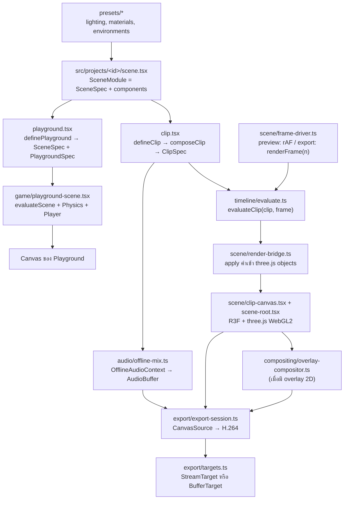

# สถาปัตยกรรม 3D Clip Studio

เอกสารนี้สรุปการออกแบบจาก `final-front-end-3d-video-stack.th.md` ให้ตรงกับโครงสร้างโค้ดจริง (Next.js App Router แทน Vite)

งานแบ่งเป็น **project** แต่ละ project คือโฟลเดอร์ `src/projects/<id>/` ที่มีฉากเดียวใช้ร่วมกันใน 2 โหมด:

- **Playground** (`/projects/<id>/play`): เดินในฉากด้วยคีย์บอร์ดและ physics (Rapier) เพื่อดูแสง สี และวัสดุ
- **Studio** (`/projects/<id>/studio`): preview คลิปของ project แล้ว export เป็น MP4 (H.264 + AAC) ในเบราว์เซอร์ (1 คลิปต่อ project)

## คำศัพท์

| คำ               | ความหมาย                                                                           | อยู่ที่              |
| ---------------- | ---------------------------------------------------------------------------------- | -------------------- |
| Project          | โฟลเดอร์ `src/projects/<id>/` ที่มี `scene.tsx`, `playground.tsx` และ `clip.tsx`   | `src/projects/`      |
| `SceneSpec`      | data ของฉาก: `environment`, `lights` และ `objects`                                 | `src/model/types.ts` |
| `ClipDefinition` | สิ่งที่ `clip.tsx` เขียนทับฉาก: video, camera, audio, `animate` และ `extraObjects` | `src/model/types.ts` |
| `ClipSpec`       | ผลของ `composeClip(scene, definition)` ที่ engine ใช้ evaluate และ export          | `src/model/types.ts` |
| `PlaygroundSpec` | `spawn`, `colliders` และ `extraObjects`                                            | `src/model/types.ts` |

## Data flow



`scene/scene-content.tsx` (environment, lights, objects) ใช้ร่วมกันทั้ง `scene-root.tsx` ของคลิปและ `playground-scene.tsx` แสงและวัสดุจึงเหมือนกันทั้งสองโหมด

## โมดูล

| Path                                             | หน้าที่                                                                                                        | ข้อจำกัด                                                                                                         |
| ------------------------------------------------ | -------------------------------------------------------------------------------------------------------------- | ---------------------------------------------------------------------------------------------------------------- |
| `src/app/`                                       | routing อย่างเดียว page เป็น Server Component แบบบาง                                                           | ห้าม import R3F หรือ three ตรง ๆ ต้องผ่าน loader                                                                 |
| `src/features/studio`, `src/features/playground` | UI ของแต่ละโหมด รับ `projectId`                                                                                | `*-loader.tsx` เป็น client boundary (`'use client'` + `dynamic(..., { ssr: false })`)                            |
| `src/projects/`                                  | project ที่ AI เขียน, `define.ts`, `manifest.ts` (metadata) และ `loaders.ts` (lazy import แยก clip/playground) | `manifest.ts` ต้องไม่ import โค้ด project เพราะ Server Component ใช้ไฟล์นี้ และ project ห้าม import project อื่น |
| `src/model/`                                     | type ของ scene/clip/playground, ค่าเริ่มต้น และ `composeClip`                                                  | **pure**: ข้อมูลต้อง serialize เป็น JSON ได้                                                                     |
| `src/timeline/`                                  | evaluator, interpolation, easing และ seeded random                                                             | **pure**: เป็นฟังก์ชันของ `(spec, frame)` เท่านั้น                                                               |
| `src/presets/`                                   | preset แสง วัสดุ และสภาพแวดล้อมที่ใช้ร่วมกัน                                                                   | **pure data**                                                                                                    |
| `src/scene/`                                     | ชั้น render ด้วย R3F, scene content, render bridge, frame driver และ clip clock                                | client-only และห้าม import `src/projects`                                                                        |
| `src/game/`                                      | controls, physics config, player และ playground scene                                                          | client-only, physics ใช้ fixed timestep                                                                          |
| `src/audio/`                                     | โหลดเสียง, เล่นเสียงตอน preview และ mix แบบ offline                                                            | client-only                                                                                                      |
| `src/export/`                                    | capability check, AAC fallback, output target และ export loop                                                  | `mediabunny` import ได้เฉพาะใน `export/mediabunny.ts`                                                            |
| `src/compositing/`                               | Canvas 2D สำหรับ subtitle/logo ที่ต้องติดไปในวิดีโอ                                                            | เพิ่มเมื่อมีความต้องการจริง                                                                                      |
| `src/stores/`                                    | zustand store สำหรับ state ของ UI                                                                              | ห้ามใช้ store ขับ scene ทีละเฟรม                                                                                 |
| `public/assets/`                                 | ใช้ร่วมกัน: `models/`, `textures/`, `hdri/`, `audio/`, `fonts/` เฉพาะ project: `projects/<id>/`                | same-origin เท่านั้น เพื่อเลี่ยงปัญหา CORS ตอนอ่าน canvas                                                        |

**pure** หมายถึงห้าม import `react`, `three`, `@react-three/*`, `mediabunny` และโมดูลชั้นบน ESLint (`no-restricted-imports` ใน `eslint.config.mjs`) บังคับกฎนี้ กฎ entry เดียวของ mediabunny และกฎห้าม project import project อื่น (`@/projects/<id>/…`)

## กฎหลัก

### เวลาและ determinism

- `frame` เป็นจำนวนเต็ม และ `timeSeconds = frame / fps`
- ค่าในฉากทุกค่าต้องมาจาก `evaluateClip(clip, frame)` ซึ่ง preview, seek และ export เรียกใช้ร่วมกัน ส่วน playground ใช้ `evaluateScene(scene, frame)` ตัวเดียวกับที่ `evaluateClip` เรียกต่อ
- ห้ามใช้ `Math.random()`, `Date.now()`, `performance.now()` หรือ delta ของ `useFrame` เป็นนาฬิกา ให้ใช้ `createSeededRandom(clip.seed)` แทน กฎนี้ใช้กับ `scene.tsx` และ `clip.tsx` ส่วน component ที่มีเฉพาะใน playground ใช้เวลาจริงได้เพราะไม่ถูกบันทึก
- GLB animation ใช้ `AnimationMixer.setTime(t)` ไม่สะสม delta
- Physics และ particle ใช้ fixed timestep และต้อง reset/replay หรือ bake ไว้ล่วงหน้าเมื่อ seek
- Deterministic หมายถึงเวลาและสถานะฉากทำซ้ำได้ ไม่ได้รับประกันว่าพิกเซลหรือไบต์ของ MP4 จะเหมือนกันทุก GPU

### Render loop

- Canvas ของคลิปใช้ `frameloop="never"` และ `frame-driver` เป็นคนเรียก `advance()` เอง
- ค่าที่เปลี่ยนทุกเฟรมเขียนผ่าน `render-bridge` แบบ imperative ห้ามใช้ `setState(frame)` แล้ว capture ทันที เพราะ React อาจยังไม่ commit
- Custom component อ่านเวลาจาก `useClipFrame()` (ref) ภายใน `useFrame()`
- `studio-store.displayFrame` ใช้แสดงผลใน UI เท่านั้น

### สิ่งที่ติดไปใน MP4

- ไฟล์จะมีเฉพาะสิ่งที่วาดลง canvas ที่ส่งไป encode เท่านั้น DOM, CSS และ Drei `<Html>` จะไม่ติดไปด้วย
- ข้อความให้ render เป็น 3D text หรือวาดใน `compositing/`
- ต้องโหลดโมเดล texture HDRI และฟอนต์ (รวมถึงฟอนต์ไทย) ให้พร้อมก่อนเฟรมแรก
- เมื่อมี postprocessing ให้ capture หลัง effect pass สุดท้าย

### Export

ลำดับ: เลือกปลายทางไฟล์จาก click ของผู้ใช้ (`pickOutputTarget`) → ตรวจ codec (`checkExportCapabilities`) → snapshot `ClipSpec` → render ทีละเฟรมพร้อมเคารพ backpressure และ cancel → finalize → cleanup ทุกกรณี

- ห้ามเปลี่ยนไฟล์ WebM ให้เป็นนามสกุล `.mp4`
- ห้ามตัดเสียงทิ้งเงียบ ๆ เมื่อ AAC ใช้ไม่ได้

## Stub และ roadmap

ฟังก์ชันที่ยังไม่ทำประกาศ signature เป็น type และให้ stub เรียก `notImplemented()` จาก `src/lib/not-implemented.ts` ส่วน component ที่ยังไม่ทำคืน `null` หรือแสดง `<Placeholder>` ทุกจุดมี `TODO(<milestone>)` กำกับ:

```bash
grep -rn "TODO(M1)" src
```

| Milestone                | เป้าหมาย (เกณฑ์ผ่าน)                                                                     | ไฟล์หลัก                                                                                                                                                                                                                                                                                                                           |
| ------------------------ | ---------------------------------------------------------------------------------------- | ---------------------------------------------------------------------------------------------------------------------------------------------------------------------------------------------------------------------------------------------------------------------------------------------------------------------------------- |
| **M1** พิสูจน์ export    | คลิป `example-turntable` ยาว 10 วินาที, 1080p30, ไม่มีเสียง, เปิดนอกแอปได้, จำนวนเฟรมถูก | `timeline/*`, `scene/clip-canvas.tsx`, `scene-root.tsx`, `scene-content.tsx`, `render-bridge.ts`, `frame-driver.ts` (export), `camera/`, `lights/`, `materials/`, `objects/` (primitive), `environment/` (สีพื้นหลัง), `export/capabilities.ts`, `targets.ts`, `export-session.ts`, `features/studio/components/export-dialog.tsx` |
| **M2** preview และ seek  | preview, seek และ export ได้ค่าตรงกันที่เฟรม 0 กลางคลิป และเฟรมสุดท้าย                   | `frame-driver.ts` (preview), `clip-clock.tsx`, `objects/` (custom), `transport-bar.tsx`, `timeline-panel.tsx`, `inspector-panel.tsx`                                                                                                                                                                                               |
| **M3** เสียง             | beep ตรง marker ทั้ง native AAC และ WASM fallback                                        | `audio/*`, `export/aac-fallback.ts`, audio track ใน `export-session.ts`                                                                                                                                                                                                                                                            |
| **M4** assets และข้อความ | GLB, HDRI, ฟอนต์ไทย และ overlay ติดครบในไฟล์                                             | `model/assets.ts`, `objects/` (model/text), `environment/` (HDRI), `materials/` (texture maps), `compositing/`                                                                                                                                                                                                                     |
| **M5** ขอบเขต MVP        | 30–60 วินาที, แนวนอน/แนวตั้ง, cancel, export ซ้ำ, codec ไม่รองรับ, ปลายทางไฟล์ทั้งสองแบบ | `export/*` (cancel, cleanup, ขนาดสูงสุดของ memory target)                                                                                                                                                                                                                                                                          |
| **M6** effects/4K        | วัด RAM, GPU, เวลา export และ A/V sync ใหม่                                              | เพิ่ม `@react-three/postprocessing` เมื่อจำเป็น                                                                                                                                                                                                                                                                                    |
| **G1** เดินใน playground | WASD + pointer lock + physics                                                            | `game/playground-scene.tsx`, `player/`, `features/playground/components/hud.tsx`                                                                                                                                                                                                                                                   |
| **G2** สลับ preset       | สลับแสง สภาพแวดล้อม และดู material swatch                                                | `projects/showroom/`, `environment-panel.tsx`                                                                                                                                                                                                                                                                                      |
| **future**               | นำเข้า JSON และ LLM ในแอป                                                                | `model/schema.ts`                                                                                                                                                                                                                                                                                                                  |
