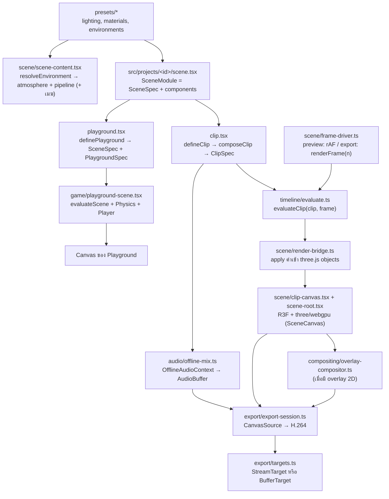

# สถาปัตยกรรม 3D Clip Studio

เอกสารนี้สรุปการออกแบบจาก `final-front-end-3d-video-stack.th.md` ให้ตรงกับโครงสร้างโค้ดจริง (Next.js App Router แทน Vite)

งานแบ่งเป็น **project** แต่ละ project คือโฟลเดอร์ `src/projects/<id>/` ที่มีฉากเดียวใช้ร่วมกันใน 2 โหมด:

- **Playground** (`/projects/<id>/play`): เดินในฉากด้วยคีย์บอร์ดและ physics (Rapier) เพื่อดูแสง สี และวัสดุ
- **Studio** (`/projects/<id>/studio`): preview คลิปของ project แล้ว export เป็น MP4 (H.264 + AAC) ในเบราว์เซอร์ (1 คลิปต่อ project)

## คำศัพท์

| คำ               | ความหมาย                                                                           | อยู่ที่              |
| ---------------- | ---------------------------------------------------------------------------------- | -------------------- |
| Project          | โฟลเดอร์ `src/projects/<id>/` ที่มี `scene.tsx`, `playground.tsx` และ `clip.tsx`   | `src/projects/`      |
| `SceneSpec`      | data ของฉาก: `environment`, `lights` และ `objects`                                 | `src/model/types.ts` |
| `ClipDefinition` | สิ่งที่ `clip.tsx` เขียนทับฉาก: video, camera, audio, `animate` และ `extraObjects` | `src/model/types.ts` |
| `ClipSpec`       | ผลของ `composeClip(scene, definition)` ที่ engine ใช้ evaluate และ export          | `src/model/types.ts` |
| `PlaygroundSpec` | `spawn`, `colliders` และ `extraObjects`                                            | `src/model/types.ts` |

## Data flow



`scene/scene-content.tsx` (environment, post pipeline, lights, objects) ใช้ร่วมกันทั้ง `scene-root.tsx` ของคลิปและ `playground-scene.tsx` แสง ท้องฟ้า และวัสดุจึงเหมือนกันทั้งสองโหมด

## โมดูล

| Path                                             | หน้าที่                                                                                                                                                                                                                        | ข้อจำกัด                                                                                                         |
| ------------------------------------------------ | ------------------------------------------------------------------------------------------------------------------------------------------------------------------------------------------------------------------------------ | ---------------------------------------------------------------------------------------------------------------- |
| `src/app/`                                       | routing อย่างเดียว page เป็น Server Component แบบบาง                                                                                                                                                                           | ห้าม import R3F หรือ three ตรง ๆ ต้องผ่าน loader                                                                 |
| `src/features/studio`, `src/features/playground` | UI ของแต่ละโหมด รับ `projectId`                                                                                                                                                                                                | `*-loader.tsx` เป็น client boundary (`'use client'` + `dynamic(..., { ssr: false })`)                            |
| `src/projects/`                                  | project ที่ AI เขียน, `define.ts`, `manifest.ts` (metadata) และ `loaders.ts` (lazy import แยก clip/playground)                                                                                                                 | `manifest.ts` ต้องไม่ import โค้ด project เพราะ Server Component ใช้ไฟล์นี้ และ project ห้าม import project อื่น |
| `src/model/`                                     | type ของ scene/clip/playground, ค่าเริ่มต้น และ `composeClip`                                                                                                                                                                  | **pure**: ข้อมูลต้อง serialize เป็น JSON ได้                                                                     |
| `src/timeline/`                                  | evaluator, interpolation, easing และ seeded random                                                                                                                                                                             | **pure**: เป็นฟังก์ชันของ `(spec, frame)` เท่านั้น                                                               |
| `src/presets/`                                   | preset แสง วัสดุ และสภาพแวดล้อมที่ใช้ร่วมกัน รวมถึงค่าเริ่มต้นและการตรวจค่าของเมฆ (`clouds.ts`) และทะเล (`ocean.ts`) โดยใช้ตัวตรวจค่ากลาง (`validation.ts`)                                                                    | **pure data**                                                                                                    |
| `src/scene/`                                     | ชั้น render ด้วย R3F + WebGPU, scene content, render bridge, frame driver และ clip clock (ดู "Render layer")                                                                                                                   | client-only และห้าม import `src/projects`                                                                        |
| `src/scene/canvas/`                              | `SceneCanvas` ตัวเดียวที่ทั้ง playground และ studio ใช้ สร้าง `WebGPURenderer` (ขอ limit ของเมฆ), ตรวจว่ารองรับ WebGPU, คำนวณ pixel budget, idle render (`RenderActivity`), สถานะการโหลด (`SceneLoadTracker`) และ `?inspector` | ห้ามสร้าง `<Canvas>` เองที่อื่น                                                                                  |
| `src/scene/camera/`                              | เจ้าของกล้อง: adapter ของ `camera-controls`, `CameraSystem`, `<CameraRig>` (playground) และ `<ClipCamera>` (M1) (ดู "กล้อง")                                                                                                   | import `camera-controls` ผ่าน `camera/camera-controls.ts` เท่านั้น                                               |
| `src/scene/atmosphere/`                          | บรรยากาศจาก takram: aerial perspective + ท้องฟ้า (`createAerialPerspective`), ดวงอาทิตย์/ดวงจันทร์ (`<CelestialLight>`), IBL (`<SkyEnvironment>`) และ context (`<Atmosphere>`, `useAtmosphere()`)                              | import `@takram/*` ผ่าน `atmosphere/takram.ts` เท่านั้น                                                          |
| `src/scene/pipeline/`                            | post-processing (`createScenePipeline`, `<ScenePipeline>`)                                                                                                                                                                     | import `@takram/*` ผ่าน `pipeline/takram.ts` เท่านั้น                                                            |
| `src/scene/clouds/`                              | เมฆเชิงปริมาตร: `createClouds` (`CloudsHandle`), adapter ของไลบรารีเมฆ (`three-clouds.ts`), quality presets (`quality.ts`) และ loader ของ texture (`cloud-textures.ts`) (ดู "Clouds")                                          | import ไลบรารีเมฆและ `@takram/*` ผ่าน `clouds/three-clouds.ts` เท่านั้น                                          |
| `src/scene/ocean/`                               | FFT ocean ที่ port จาก Poseidon: `createOcean` (`OceanHandle`), `<Ocean>`, simulation (`simulation/`) และ material ของผิวน้ำ (`surface/`) (ดู "Ocean")                                                                         | ไฟล์นอกโฟลเดอร์ใช้ได้แค่ `create-ocean.ts` กับ `ocean.tsx` (ESLint บังคับ)                                       |
| `src/game/`                                      | controls, physics config, player, playground scene และ settings ของ playground (`settings.ts`)                                                                                                                                 | client-only, physics ใช้ fixed timestep                                                                          |
| `src/audio/`                                     | โหลดเสียง, เล่นเสียงตอน preview และ mix แบบ offline                                                                                                                                                                            | client-only                                                                                                      |
| `src/export/`                                    | capability check, AAC fallback, output target และ export loop                                                                                                                                                                  | `mediabunny` import ได้เฉพาะใน `export/mediabunny.ts`                                                            |
| `src/compositing/`                               | Canvas 2D สำหรับ subtitle/logo ที่ต้องติดไปในวิดีโอ                                                                                                                                                                            | เพิ่มเมื่อมีความต้องการจริง                                                                                      |
| `src/stores/`                                    | zustand store สำหรับ state ของ UI: `playground-store` (override เฉพาะฉาก) และ `playground-settings-store` (ค่าตั้งของ playground)                                                                                              | ห้ามใช้ store ขับ scene ทีละเฟรม                                                                                 |
| `public/assets/`                                 | ใช้ร่วมกัน: `models/`, `textures/`, `hdri/`, `audio/`, `fonts/`, texture ของเมฆ (`clouds/`) และข้อมูลดาว (`atmosphere/`) เฉพาะ project: `projects/<id>/`                                                                       | same-origin เท่านั้น เพื่อเลี่ยงปัญหา CORS ตอนอ่าน canvas                                                        |

**pure** หมายถึงห้าม import `react`, `three`, `@react-three/*`, `@takram/*`, `@yong_three/*`, `camera-controls`, `mediabunny` และโมดูลชั้นบน ESLint (`no-restricted-imports` ใน `eslint.config.mjs`) บังคับกฎนี้ กฎ entry เดียวของ mediabunny กฎ adapter ของ `@takram/*` (`atmosphere/takram.ts`, `pipeline/takram.ts`, `clouds/three-clouds.ts`) กฎ adapter เดียวของไลบรารีเมฆ (`@yong_three/*` ผ่าน `clouds/three-clouds.ts`) กฎห้ามใช้ `postprocessing`/`@react-three/postprocessing` และ entry WebGL ของ `@takram/three-clouds`/`@yong_three/three-clouds` กฎ adapter เดียวของ `camera-controls` (`camera/camera-controls.ts`) กฎห้ามใช้ controls และกล้องของ drei (`OrbitControls`, `CameraControls`, `PerspectiveCamera` ฯลฯ) และกฎห้าม project import project อื่น (`@/projects/<id>/…`) หรือ `@/scene/camera/`

## Render layer (WebGPU)

ทั้งแอป render ด้วย WebGPU อย่างเดียว ไม่มี WebGL path

```text
features (playground-app / viewport)
└─ SceneCanvas quality (canvas/)        useWebGPUSupport() → <Canvas gl={createRenderer}> flat, shadows="percentage", dpr จาก resolvePixelRatio (pixel budget), frameloop, resize debounce
   └─ RenderQualityContext + RenderActivityContext + SceneLoadContext
      ├─ CameraRig (camera/)            เฉพาะ playground: CameraSystem (camera-controls) เขียน pose ที่ CAMERA_PRIORITY และ fov
      └─ SceneContent                   resolveEnvironment(spec.environment), useOceanHandle (ถ้ามีทะเล) สร้าง OceanHandle ให้ pipeline และ <Ocean>
         ├─ Atmosphere (atmosphere/)    AtmosphereContext → renderer.contextNode, CelestialFrame (geo-frame.ts) จากพิกัดและวันเวลา, กล้อง, useAtmosphere()
         │  ├─ SkyEnvironment           scene.environmentNode = skyEnvironment() (IBL)
         │  ├─ CelestialLight           AtmosphereLight ตัวเดียว: กลางวันเป็นดวงอาทิตย์ (ปิด indirect เพราะใช้ IBL) กลางคืนเป็นดวงจันทร์
         │  ├─ ScenePipeline (pipeline/) pass(MRT output + highpVelocity) → aerialPerspective (วาดท้องฟ้า ดวงอาทิตย์ ดวงจันทร์ ดาว + shadow length ของเมฆ) → เมฆ (ถ้ามี) → underwater medium (ถ้ามีทะเล) → lensFlare → toneMapping(Neutral, exposure) → TAA → renderOutput (sRGB) → dithering
         │  └─ Ocean (ocean/)             ทะเล FFT (ถ้ามี environment.ocean) compute ก่อน pipeline render แล้ววาดเป็น mesh ใน scene pass และลงทะเบียน caustics กับ light node
         ├─ LightRig                    แสงเสริมจาก spec.lights
         └─ SceneObject × n             primitive + MeshStandardNodeMaterial
```

- **สองชั้นในแต่ละโฟลเดอร์**:
  - ฟังก์ชัน imperative (`createAtmosphere`, `createScenePipeline`, `createClouds`, `createOcean`) สร้าง อัปเดต และ dispose node เอง
  - component บาง ๆ ผูกกับ R3F ด้วย `useMemo` + `useDisposable` + effect
  - แยกแบบนี้เพื่อให้ export (M1) เรียกฟังก์ชันชุดเดียวกันได้โดยไม่ผ่าน React และผ่านกฎ `react-hooks/immutability`
- **ค่าที่จูนได้** (คุณภาพการแสดงผล ซึ่งรวม dpr, pixel budget, shadow map และคุณภาพเมฆ, กล้อง, tone mapping, เงาดวงอาทิตย์, `IDLE_SETTLE_FRAMES`) อยู่ใน `scene/render-config.ts` ที่เดียว
- **คุณภาพการแสดงผล** (`RENDER_QUALITIES` ใน `render-config.ts`): `high` (ค่าเริ่มต้น) กับ `performance` เป็น `RenderQualitySettings` แบบ flat (pixel ratio สูงสุด, `PIXEL_BUDGETS`, `sunShadowMapSize`, preset เมฆ, temporal upscale และ `OCEAN_GRIDS`) ตารางอยู่ใน "Performance"
  - `resolveRenderQuality(settings)` แปลงเป็น `RenderQuality` ที่ renderer ใช้ ค่าเริ่มต้นคือ `DEFAULT_QUALITY_PROFILE`
  - `SceneCanvas` รับ prop `quality` (`RenderQuality`) แล้วส่งต่อผ่าน `RenderQualityContext` (`canvas/render-quality.ts`) ทุก component อ่านด้วย `useRenderQuality()`: `ScenePipeline` ส่ง `clouds` ให้ `CloudsHandle.setQuality` (ข้ามถ้าค่าเท่าเดิม) และ `CelestialLight` ตั้งขนาด shadow map
  - Studio ใช้ `DEFAULT_QUALITY_PROFILE` เสมอ playground ค่าเริ่มต้นจึงเห็นภาพเดียวกับ Studio ส่วน dialog ตั้งค่าของ playground เลือก tier หรือปรับทีละค่าได้ ห้ามใช้ค่าเหล่านี้ตอน export
  - เปลี่ยนคุณภาพไม่ remount canvas: R3F resize ตาม dpr, `ShadowNode` resize shadow map เอง และ `ScenePipeline` ตั้ง preset ใหม่กับ `CloudsNode` ตัวเดิม (compile shader ใหม่เมื่อ flag ที่ฝังใน shader เปลี่ยน ไม่โหลด texture ซ้ำ)
  - วัดผลด้วย `?inspector` (ดู "Performance") และ `?stats` ใน URL ของ playground เพื่อแสดง FPS (drei `<Stats>`) หรือเปิดจาก section Debug ของ dialog ตั้งค่า วัดใน production build (`bun run build` แล้ว `bun run start`) เพราะ dev mode มี StrictMode และ overlay
- **พิกัด**: world origin วางที่ `environment.location` ด้วย `Ellipsoid.WGS84.getNorthUpEastFrame` แกนเป็น +X เหนือ, +Y ขึ้น, +Z ตะวันออก และ 1 หน่วยเท่ากับ 1 เมตร
  - การแปลง geodetic → ECEF, local frame → ECEF, มุมเงยของดวงอาทิตย์ และสัดส่วนสว่างของดวงจันทร์ อยู่ใน `computeCelestialFrame` (`atmosphere/geo-frame.ts`) ที่เดียว
  - ไม่เปิด `highPrecision` เพราะใช้เมื่อวาง object ในพิกัด ECEF เท่านั้น และใช้กับ `SkinnedMesh`/`InstancedMesh` ไม่ได้
  - frame นี้มี translation จึงต้องใช้ patch ของ atmosphere ที่กลับ matrix ด้วย `invert()` (ดู "Clouds")
- **Reversed depth**: `createRenderer` เปิด `reversedDepthBuffer` และ `CAMERA_DEFAULTS.far` = 100 กม. เพื่อให้ aerial perspective และ cascade เงาเมฆครอบคลุมระยะไกล (depth แบบปกติที่ near 0.1 แม่นแค่หลักสิบเมตรที่ 10 กม.)
  - ตั้งได้ตอนสร้าง renderer เท่านั้น เปลี่ยนทีหลังต้องสร้าง canvas ใหม่
  - three 0.184 เรียง render list ด้วย clip z ซึ่งกลับทิศเมื่อเป็น reversed depth `canvas/reversed-depth-sort.ts` จึงตั้ง sort ของ opaque และ transparent ใหม่ (ลบได้เมื่อ three แก้ใน `RenderList.push`)
  - เมฆต้องได้ `depth.mode: 'reversed-z'` ตอนสร้าง (`createClouds(depth, { reversedDepth })`) และ `FrustumCorners` ของ fork ต้องใช้ patch ที่รู้จัก reversed depth (ดู "Clouds")
  - node ของ three และ takram ที่อ่าน depth (TAA, aerial perspective, shadow map) รองรับแล้ว แต่ TSL `depth` ของ three, `polygonOffset` และ `depthFunc` แบบ Always/Equal ยังไม่กลับทิศ ห้ามใช้กับฉาก
  - กล้องของคลิป (M1) ต้องเขียน near/far ลงกล้อง default แล้วเรียก `updateProjectionMatrix()` ห้าม clone เพราะ `Camera.copy` ไม่ copy `_reversedDepth`
- **เวลา**: ทิศดวงอาทิตย์และดวงจันทร์คำนวณจาก `environment.dateTime` โดยใช้ origin เป็นตำแหน่งผู้สังเกต (observer)
  - `environmentEpochMs` บังคับให้ `dateTime` เป็น ISO-8601 ที่ลงท้ายด้วย `Z` หรือ `±hh:mm` เพราะถ้าไม่มี offset จะถูกตีเป็นเวลาของเครื่อง
  - ห้ามใช้ `new Date()` ตอน runtime
- **Tone mapping** ทำใน pipeline ที่เดียว `SceneCanvas` จึงตั้ง `flat` ถ้าไม่ตั้ง R3F จะใส่ ACES ให้ แล้ว `RenderPipeline` จะ tone map ซ้ำ
  - ใช้ `NeutralToneMapping` (Khronos PBR Neutral) แทน AgX ตั้งแต่ 2026-10-09 เพื่อให้ทะเลตรงกับ Poseidon ซึ่งจูนกับ Neutral เพราะรักษาสีของ highlight ส่วน AgX ทำให้น้ำมืดซีดเทาและแสงแดดบนน้ำขาวเทา
  - `exposure` ของ environment preset ยังเป็นค่าที่ตั้งไว้กับ AgX ต้องตรวจด้วยตาอีกครั้ง
- **Dithering ทำหลังแปลงเป็น sRGB**: `createScenePipeline` ตั้ง `outputColorTransform = false` แล้วเรียก `renderOutput()` เองก่อน `dithering`
  - `dithering` มีขนาด ±0.5/255 ใน display space ถ้าใส่ก่อน OETF ของ sRGB noise ในส่วนมืดจะขยายเป็นหลายระดับของ 8-bit
  - `renderOutput()` ที่ไม่ส่งอาร์กิวเมนต์อ่าน tone mapping และ color space ของ renderer จาก context ของ `RenderPipeline` จึงยังต้องตั้ง `flat`
- **Velocity สำหรับ TAA** ใช้ `highpVelocity` ของ takram ห้ามใช้ `velocity` ของ three
  - TAA ของ takram ยกเลิก jitter ผ่าน `highpVelocity.setProjectionMatrix()` เท่านั้น และใช้ค่า `.z` ตรวจ depth แต่ `velocity` ของ three เป็น `vec2`
  - jitter ของ TAA มีผลเฉพาะ scene pass: `ScenePassNode` (`pipeline/create-scene-pipeline.ts`) เรียก `clearViewOffset()` หลัง render ฉาก ท้องฟ้า aerial perspective เมฆ underwater medium และ lens flare จึงได้ projection ที่ไม่มี jitter
    - resolve ของ TAA ข้าม pixel ที่ 3×3 รอบตัวเป็น depth = far ทั้งหมด (ท้องฟ้าและเมฆที่ไม่เขียน depth) ถ้า jitter ค้างไปถึง pass เหล่านี้ ท้องฟ้าและเมฆจะขึ้นจอแบบมี jitter ดิบและสั่นตอนกล้องนิ่ง
    - ลำดับนี้ใช้ได้เพราะ `PassNode` ถูก build ก่อน (ผ่าน texture ของ depth/color) `updateBefore` ของมันจึงรันก่อน `CloudsNode` และ quad ที่ประเมิน aerial perspective ส่วน `clearViewOffset()` ตอนท้าย TAA เรียกซ้ำได้โดยไม่มีผล
  - `highpVelocity` ใช้กับ `SkinnedMesh`/`InstancedMesh` ได้ เพราะ MRT มี key `velocity` และ three จะคำนวณ `positionPrevious` ให้
  - ยกเว้นทะเลที่ตั้ง `mrtNode` เอง (ดู "Ocean") ห้ามอ่าน field ภายในของ `highpVelocity` เพราะ `update()` ของมันรันเฉพาะเฟรมที่มี mesh อื่นใช้ node นี้
- **กล้อง**: canvas หนึ่งตัวมีกล้อง perspective ตัวเดียวตลอดอายุ และห้าม `makeDefault` กล้องใหม่
  - node ของ takram (aerial perspective, ดาว, environment, TAA) และ `CloudsNode` จับกล้องไว้ตอน setup ส่วน `ScenePipeline` จะ rebuild ทุกครั้งที่กล้องเปลี่ยน
  - ไม่รองรับ `OrthographicCamera` เพราะ aerial perspective, underwater medium และ cascade เงาเมฆสร้าง ray แบบ perspective
  - โหมดต่าง ๆ เปลี่ยนผู้เขียน ไม่เปลี่ยนตัวกล้อง canvas หนึ่งตัวมีเจ้าของ pose รายเดียว: playground คือ `<CameraRig>` ส่วนคลิปคือ `<ClipCamera>` (M1) ห้าม mount สองตัวใน canvas เดียว
  - ผู้เขียนแต่ละค่า:

    | ค่า                        | playground                                | คลิป (studio และ export)                                     |
    | -------------------------- | ----------------------------------------- | ------------------------------------------------------------ |
    | position, quaternion, zoom | camera-controls ผ่าน `CameraSystem`       | `ClipCamera` จาก `evaluateClip`                              |
    | fov                        | `CameraSystem.setFov` (`<CameraRig fov>`) | `ClipCamera`                                                 |
    | aspect                     | R3F ตามขนาด canvas                        | `ClipCamera` (`manual = true`, `video.width / video.height`) |
    | near, far                  | `CAMERA_DEFAULTS`                         | `ClipCamera`                                                 |

  - `CameraSystem` (`camera/camera-system.ts`) เป็นเจ้าของ `CameraControls` ตัวเดียวต่อ canvas คำสั่งกล้องทั้งหมดผ่าน `setPose`, `setProfile` และ `setFov` ห้ามเขียน `camera.position`, `lookAt()` หรือ `zoom` ตรง ๆ เพราะ `update()` ของ camera-controls เขียนทับทุกเฟรม
  - `setPose` ตรวจว่าค่า finite และ position ไม่ทับ target แล้วเรียก `setLookAt` ถ้าไม่ใช้ transition จะเรียก `update(0)` ทันทีเพื่อให้กล้องตรงก่อน consumer อ่าน
  - `CameraProfile` คือ input mapping, ความเร็ว, smoothing และระยะ ห้าม tween position/target ซ้อนกับ smoothing ของไลบรารี (`CAMERA_SMOOTHING`)
  - `<CameraRig>` ใช้ delta เวลาจริงทำ smoothing จึงห้ามอยู่ใน `ClipCanvas` ค่ากล้องของคลิปมาจาก `evaluateClip` เท่านั้น
  - G1 (first-person): ใช้ `CameraSystem` ตัวเดิมแล้วเปลี่ยนเป็น profile first-person (ระยะ orbit เกือบศูนย์) ใช้ `lockPointer()`/`unlockPointer()` ของไลบรารี และเรียก `moveTo(ตำแหน่งตา, false)` หลัง physics step ทุกเฟรม ทิศเดินอ่านจาก `azimuthAngle` ไม่สร้าง controller ที่เขียนกล้องเอง และเพิ่ม method หรือ context (`useCameraSystem()`) เฉพาะที่ใช้จริงตอนนั้น
  - camera cut และ teleport ยังไม่แจ้ง post-processing: TAA ไม่มี reset สาธารณะ (อาศัย velocity rejection) และ `CloudsNode.resetHistory()` ยังไม่ได้ expose ผ่าน `CloudsHandle` ถ้าเห็น ghost หลัง teleport ใน G1 ให้เพิ่มตอนนั้น
- **ลำดับ `useFrame`**: กล้อง (`CAMERA_PRIORITY` = -1) → update (0) → render (`RENDER_PRIORITY` = 1)
  - ocean (0) และ pipeline (1) จึงเห็น pose สุดท้ายของเฟรม
  - `CameraSystem.update` จำกัด delta ไว้ที่ `CAMERA_MAX_DELTA` เพราะ `frameloop="demand"` ให้ delta ยาวเท่าช่วงที่ idle
  - priority ที่มากกว่า 0 ทำให้ R3F เลิกเรียก `gl.render` เอง
- **ต้องเป็น WebGPU จริง**: `createRenderer` ตรวจ `renderer.backend` หลัง `init()`
  - ถ้าไม่ใช่ WebGPU backend หรือ init ล้มเหลว จะ throw `WebGPUUnavailableError`
  - `CanvasErrorBoundary` แปลง error นี้เป็น `fallback` ส่วน error อื่นส่งต่อให้ `error.tsx`
  - `createRenderer` ขอ `CLOUDS_REQUIRED_LIMITS` (`maxSampledTexturesPerShaderStage` 32) ทุกครั้ง GPU ที่ให้ไม่ถึงจะ init ไม่ผ่านและเห็น `fallback` แม้ฉากไม่มีเมฆ
- **Dispose**: `RTTNode` ไม่คืน render target เอง `createScenePipeline` จึง dispose `renderTarget` ของ tone-mapped RTT, `lensFlare.featuresNode` และ `lensFlare.inputNode` (RTT ที่ `lensFlare()` สร้างจาก `convertToTexture`) เอง
- **Exposure** ของ takram เป็นหน่วย luminance ค่าที่ใช้ได้จริงกลางวันอยู่ราว 3–10 และกลางคืนราว 100 (preset `night`) environment preset ทุกตัวจึงตั้ง `exposure` เอง
- **`@takram/*`** import ได้เฉพาะ `atmosphere/takram.ts`, `pipeline/takram.ts` และ `clouds/three-clouds.ts`
  - ไฟล์เหล่านี้ cast type ให้เข้ากับ `@types/three` 0.184 เมื่อจำเป็น เพราะ d.ts ของ takram build กับ 0.182
  - เมื่ออัปเกรด takram ให้ตรวจไฟล์เหล่านี้และ `patches/` ก่อน รวมถึง signature ของ `aerialPerspective` (ตัด normal), ค่าเริ่มต้นของ `SkyNode.showStars` และ `intensity` ของ `AtmosphereLight` ที่ถูกคูณสองครั้ง
  - ทะเล (`ocean/surface/sky-light.ts`) ใช้ `getIndirectLuminance`, `getSplitIlluminance` และ field ของ `AtmosphereBuildContext` (`cameraPositionUnit`, `altitudeCorrectionUnit`, `sunDirectionECEF`, `matrixWorldToECEF`, `matrixECEFToWorld`) ต้องตรวจ signature และหน่วยซ้ำด้วย
  - `whenLUTComputed` (`atmosphere/takram.ts`) นับ event `update` ของ `AtmosphereLUTNode` ให้ครบ `LUT_COMPUTE_STEPS` (4) ถ้าจำนวนขั้นใน `performCompute` เปลี่ยน overlay จะค้างหรือหายเร็วเกิน (ดู "การโหลดและ reveal ของ canvas")
- **ไม่ใช้ WebGL2 fallback ของ `WebGPURenderer`**: `detectWebGPU` ตรวจ `navigator.gpu` แล้วแสดง `fallback` ถ้าไม่รองรับ เพราะ node ของ takram ยังพังบน fallback (issue #108, #114–#116)
- **`@takram/three-atmosphere` root entry**: ฟังก์ชันคำนวณทิศดวงอาทิตย์และดวงจันทร์มีแค่ใน root entry ซึ่ง `build/shared.js` import `postprocessing` (WebGL)
  - ตรวจ production build (Turbopack) แล้ว `EffectComposer` และ `EffectPass` ถูกตัดทิ้ง แต่ class พื้นฐานบางส่วนของ `postprocessing` (เช่น `Effect`/`BlendMode`) กับ GLSL ของ `AerialPerspectiveEffect` ยังติดมา ถือเป็น known cost ไว้ก่อน
  - เมื่ออัปเกรด takram หรือ Next.js ให้ตรวจซ้ำ
- **หนึ่ง `Atmosphere` ต่อ canvas** และอยู่ตลอดอายุ canvas เพราะ node ที่ compile แล้ว (รวมถึง `CloudsNode`) จับ `AtmosphereContext` ไว้ตอน setup
  - ทุกอย่างที่ใช้ atmosphere (`SkyEnvironment`, `CelestialLight`, `ScenePipeline`) อยู่ใต้ `<Atmosphere>` และอ่าน handle กับ `CelestialFrame` ผ่าน `useAtmosphere()`
- **Aerial perspective** (`atmosphere/create-aerial-perspective.ts`): ใช้ API ของ 0.19.1 คือ `aerialPerspective(color, depth, null, shadowLength)`
  - อาร์กิวเมนต์ที่ 3 คือ normal ต้องเป็น `null` เสมอ ถ้าใส่ค่าจะเปิด post-process lighting ซึ่งซ้ำกับ `AtmosphereLight` (WEBGPU.md บน `main` ตัด normal ออกแล้ว ตอนอัปเกรดต้องแก้ signature)
  - วาดท้องฟ้า ดวงอาทิตย์ ดวงจันทร์ และดาวเองที่ pixel ที่ depth = far จึงไม่ตั้ง `scene.backgroundNode`
  - output ถูกบังคับ alpha = 1 เพราะ alpha มาจาก clear color ของ scene pass
  - ปิด `raymarchScattering` (ค่าเริ่มต้นของ takram WebGPU เป็น `true`) ด้วย `ATMOSPHERE_RAYMARCH_SCATTERING` ใน `render-config.ts` ให้ใช้ LUT lookup แบบ `AerialPerspectiveEffect` ของ WebGL
    - raymarch เดิน 4–14 step ต่อ pixel และอ่าน LUT ทุก step ที่ full-res บนทุก pixel ที่เป็นพื้นผิว (รวมทะเล) ส่วน lookup อ่าน 4D scattering LUT ไม่กี่ครั้ง ค่านี้ยังมีผลกับ aerial perspective หน้าเมฆใน march ด้วย
    - lookup ยกกล้องและจุดขึ้นเหนือพื้นราว 600 ม. (`safeBottomRadius`) แล้ว extrapolate ถ้าเห็น artifact ที่ขอบฟ้าหรือผิวทะเลไกลให้กลับเป็น `true`
    - ตั้งได้ครั้งเดียวต่อ canvas ไม่แยกตาม tier เพราะ node ที่ compile แล้วจับ `AtmosphereContext` ไว้
    - raymarch ใช้ `stbn.bin` จาก media.githubusercontent.com เมื่อเปิด จึงต้องตรวจ license ตาม issue #117 และใน `@takram/three-geospatial` 0.9.1 ตั้ง `stbnTexture.url` เพื่อ self-host ไม่ได้ เพราะ `STBNTextureNode.clone()` ไม่ copy `url` (เมฆยังโหลด STBN เองเสมอ)
- **กลางคืน** (`atmosphere/night.ts`): กลางคืนคือดวงอาทิตย์ต่ำกว่า −1°
  - ดาว: `createAerialPerspective` แทน `skyNode.starsNode` ด้วย `StarsNode("/assets/atmosphere/stars.bin")` ก่อน build (default ของ 0.19.1 เปิดดาวและโหลดจาก GitHub) และ dispose `starsNode` เอง เพราะ `SkyNode` ไม่ dispose ให้
  - `showStars` ฝังใน shader เปลี่ยนแล้ว `setNightSky` คืน `true` ให้ pipeline ตั้ง `needsUpdate` ส่วน `starsNode.intensity` เป็น uniform ไล่จาก 0 ที่ −1° ถึง 1000 ที่ −12°
  - `CelestialLight` ใช้ `AtmosphereLight` ตัวเดียว (shadow map เดียว) สลับ `body` เป็น `'moon'` และเปิด `indirect` ตอนกลางคืน
  - takram คูณ `light.intensity` สองครั้งใน direct light (สีของ `AnalyticLightNode` และ uniform ของ `AtmosphereLightNode`) `setLinearIntensity` จึงตั้ง `intensity = G` และ `color = 1/G`
  - แสงจันทร์ของ takram เท่ากับ 2.5e-6 เท่าของดวงอาทิตย์ซึ่งมืดเกินช่วงของ fp16 จึงคูณ gain (`MOON_LIGHT_GAIN` × สัดส่วนสว่างของดวงจันทร์) และใช้ exposure กลางคืน ค่าเหล่านี้จูนด้วยตา
  - ไม่เปิด `moonScattering` (ค่าเริ่มต้นของ takram เป็น `false`) เพราะผลแทบมองไม่เห็นจากค่า 2.5e-6 ที่ hard-code ในไลบรารี แต่ทำให้ aerial perspective และ lookup ของท้องฟ้าหนักขึ้นสองเท่า
  - เมฆยังได้แสงจากดวงอาทิตย์อย่างเดียว ตอนกลางคืนจึงเป็นสีดำ
- **เงาเมฆบนวัตถุ** (experimental): `registerAtmosphere` ลงทะเบียน `ShadowedAtmosphereLightNode` (`atmosphere/shadowed-light-node.ts`) แทน `AtmosphereLightNode`
  - คูณ direct light ของดวงอาทิตย์ด้วย `sunTransmittance` ของเมฆ (`getSunTransmittanceNode` ของ fork) ส่วนดวงจันทร์ไม่คูณ
  - `ScenePipeline` ส่ง `CloudsHandle` ให้ `AtmosphereHandle.setSunTransmittance` ซึ่งสร้าง `renderer.contextNode` ใหม่ (key `getSunTransmittance`) เพื่อ rebuild material ทุกตัว เพราะ light node ถูก cache ต่อ light ตลอดอายุ
  - shadow map ของเมฆ update หลัง scene pass จึงช้าหนึ่งเฟรม (เห็นตอนตัดกล้อง) ส่วน history ถูกล้างเฉพาะเมื่อ flag ของ kernel หรือขนาด shadow map เปลี่ยน ไม่ล้างตอน compile material แล้ว (patch ข้อ 9 ใน "Clouds")
  - texel ของ cascade 0 ราว 50 ม. (preset high) เงาบนฉากเล็กจึงเป็นการหรี่แสงแบบนุ่ม
  - key ที่สอง `getWaterLight` (`WaterLightSource`) คูณ direct light ด้วย caustics ของทะเล (ดู "ใต้น้ำ" ใน Ocean) โดยคูณนอก `sunWeight` จึงมีผลกับดวงจันทร์ด้วย `<Ocean>` ตั้งผ่าน `AtmosphereHandle.setWaterLight` ซึ่ง rebuild material ครั้งเดียวตอนเปิด/ปิดทะเลเหมือนกัน
- **ยังไม่ได้ทำ**:
  - light shafts จากเงาวัตถุ (`shadowLength(csm, viewZUnit)`) ใช้ร่วมกับ shafts ของเมฆไม่ได้ เพราะ shadow length รับได้ช่วงเดียว
  - texture ผิวดวงจันทร์ (`moonNode.colorNode`, `matrixMoonFixedToECEF`) ไม่คุ้มเพราะดวงจันทร์กว้างราว 11 px ที่ fov 50
  - animate เวลาของวันในคลิป ต้องเพิ่ม environment เข้า `EvaluatedScene` และ render bridge
  - TAA และ temporal upscale ของเมฆสะสม history ข้ามเฟรม ตอน M1 ต้องตัดสินว่าจะ warm-up หลัง seek หรือปิดตอน export
  - export ต้อง render warm-up หลายเฟรมก่อนเริ่ม: รอ LUT และ `AtmosphereLight` จะอัปเดตตำแหน่งช้าไปหนึ่ง render ในเฟรมแรก ๆ
  - `FrameDriverOptions.advance` รับเวลาเป็นวินาที เพราะ R3F ในโหมด `frameloop="never"` เอาค่านี้ไปใส่ `clock.elapsedTime` ตรง ๆ

### Clouds

สถานะ: render บน WebGPU ด้วย `@yong_three/three-clouds` 0.1.3 (entry `/webgpu`) ซึ่งเป็น fork ของ three-geospatial ที่ port `CloudsEffect` ของ takram เป็น TSL ใช้ชั่วคราวจนกว่า takram จะออกเมฆ WebGPU (branch `webgpu/clouds` ของ takram ยังมีแค่ procedural texture) ตัวอย่างอยู่ที่ project `showroom`

```text
ScenePipeline (pipeline/)            createScenePipeline(renderer, scene, camera, { clouds: environment.clouds !== null })
└─ createClouds(depth, { reversedDepth }) clouds/create-clouds.ts → CloudsHandle { ready, shadowLength, composite, sunTransmittance, setClouds, setQuality, setMotion }
   ├─ clouds(depth, options)         clouds/three-clouds.ts → CloudsNode ของ fork (cast เป็น type ของเรา)
   └─ loadCloudTextures() + STBN     texture จาก /assets/clouds/ และ STBN จาก DEFAULT_STBN_URL
```

- **ขอบเขตของไลบรารี**: โค้ดที่รู้จักไลบรารีเมฆมีแค่ 2 ไฟล์ใน `scene/clouds/`
  - `three-clouds.ts` เป็นไฟล์เดียวที่ import ไลบรารีเมฆ (ESLint บังคับ) มีแค่ re-export กับ cast เป็น type `CloudsNode` ที่ประกาศเฉพาะ member ที่ใช้ เพราะ d.ts ของ fork เขียนกับ `@types/three` คนละเวอร์ชัน (`UniformNode<number>`)
  - `create-clouds.ts` แปลง `ResolvedClouds`, `CloudsRenderSettings` และ `EvaluatedCloudMotion` เข้า node แล้วคืน `CloudsHandle` ซึ่งเป็นสัญญาเดียวที่ pipeline ใช้
  - pipeline, component ของ R3F, model, presets, timeline และ texture loader ไม่รู้จักไลบรารีเมฆ
  - ใช้ entry `/webgpu` เท่านั้น เพราะ entry หลักกับ `/r3f` เป็น GLSL บน `postprocessing`
- **ต่อเข้า pipeline**: `createScenePipeline` สร้างเมฆเมื่อ `environment.clouds` ไม่เป็น null แล้วส่ง `clouds.composite(aerialPerspective)` เข้า `lensFlare`
  - composite คือ `color × (1 − clouds.a) + clouds.rgb` เพราะ output ของ `CloudsNode` เป็น premultiplied (rgb เป็น radiance, a เป็น coverage)
  - composite ต้องอยู่หลัง aerial perspective เพราะเมฆใส่ aerial perspective ระหว่างกล้องกับเมฆมาแล้ว และ aerial perspective เขียนทับ pixel ท้องฟ้าทั้งหมด ถ้าสลับลำดับเมฆบนท้องฟ้าจะหาย
  - `CloudsNode` อ่าน `matrixWorldToECEF`, `sunDirectionECEF`, LUT และกล้องจาก `AtmosphereContext` ผ่าน `renderer.contextNode` ตัวเดียวกับท้องฟ้า จึงไม่ต้องส่ง atmosphere เข้าไปเอง
  - `CloudsNode.updateBefore` รันหลัง scene pass จึงได้ projection ที่ไม่มี jitter ของ TAA (ดู "Velocity สำหรับ TAA") reprojection ของเมฆจึงได้ velocity เป็นศูนย์จริงตอนกล้องนิ่ง
  - เปิดหรือปิดเมฆ (null ↔ ไม่ null) คือ rebuild pipeline ทั้งชุด ส่วนการเปลี่ยนค่าของเมฆใช้ node ตัวเดิม
  - `render()` ไม่ทำงานจนกว่า `ready` (texture + STBN) จะ resolve ถ้าโหลดไม่สำเร็จ `ScenePipeline` จะ throw ไปที่ `error.tsx`
  - light shafts: `CloudsHandle.shadowLength` (`getShadowLengthNode()`) ต่อเข้า `aerialPerspective` เสมอ และ `lightShafts` เปิดตาม preset (high/ultra เปิด, low/medium ปิด) เมื่อปิด resolve เขียน shadow length เป็น 0 จึงเปลี่ยนคุณภาพได้โดยไม่ rebuild pipeline
  - เงาเมฆ (BSM) ลงบนวัสดุผ่าน `CloudsHandle.sunTransmittance` (ดู "เงาเมฆบนวัตถุ" ใน Render layer)
- **GPU limit**: `CloudsNode` ใช้ sampled texture เกินค่าเริ่มต้น 16 ต่อ stage `createRenderer` จึงขอ `CLOUDS_REQUIRED_LIMITS` (`maxSampledTexturesPerShaderStage` 32) ทุกครั้ง
- **การแปลงค่า** (`create-clouds.ts`):
  - `cloudLayers.reset()` แล้ว `setCloudLayers(layers)` เพราะ `set` ของ fork merge ทีละ slot และ `setCloudLayers` เป็นทางเดียวที่อัปเดต channel swizzle ที่ฝังใน shader
  - `turbulenceDisplacement`, `scatteringCoefficient` และ `absorptionCoefficient` อยู่ใน `parameterUniforms`
  - `scatterAnisotropy*` เป็น field ของ `marchNode` ที่ฝังใน shader (เปลี่ยนแล้ว rebuild เอง) ส่วน `skyLightScale`, `groundBounceScale`, `powder*` และ `haze*` เป็น uniform ของ `marchNode`
  - `setQuality` ใช้ setter `qualityPreset` ของ fork แล้วตามด้วย `temporalUpscale`
- **ข้อมูล** (`EnvironmentSpec.clouds`): ไม่มี field นี้คือไม่มีเมฆ ส่วน `{}` คือค่าเริ่มต้นของ takram
  - `resolveClouds` (`presets/clouds.ts`) merge ค่าเริ่มต้นกับ spec ทีละกลุ่ม แล้วตรวจค่าและ throw เมื่อผิด
  - `layers` ที่ระบุจะแทนชุดเดิมทั้งหมด ไม่ patch ทีละ slot แบบ `.set()` ของ takram และมีได้สูงสุด 4 ชั้น เพราะ shader ใช้ `vec4` และ channel RGBA ของ weather texture
  - ค่าเริ่มต้นทุกค่าคัดลอกจากซอร์สของ takram 0.7.6 (`CloudLayer`, `CloudLayers.DEFAULT`, `CloudsEffect`, `CloudsMaterial`) ซึ่ง fork ใช้ค่าเดียวกัน ได้แก่ coverage 0.3, ชั้นที่มีเงาช่วง 750–1,400 ม. และ 1,000–2,200 ม. กับชั้นบางช่วง 7,500–8,000 ม.
  - clip ที่ตั้ง `environment.clouds` จะแทน clouds ของ scene ทั้งก้อน เพราะ `composeClip` merge แค่ระดับบนสุด
- **หน่วย**: `altitude` และ `height` เป็นเมตร วัดจากผิว WGS84 ellipsoid ไม่ใช่จากพื้นฉากหรือระดับน้ำทะเล
  - origin ของฉากอยู่ที่ `location.height` เหนือ ellipsoid ฐานเมฆเหนือพื้นฉากจึงเท่ากับ `altitude − location.height`
  - ไม่มีการยกฐานเมฆตามภูมิประเทศ
- **การเคลื่อนที่**: `velocity` คือ texture offset ต่อวินาที ไม่ใช่ความเร็วลมหน่วย m/s
  - renderer ต้องอ่าน offset จาก `evaluateCloudMotion(clouds, timeSeconds)` (`timeline/clouds.ts`) ซึ่งเท่ากับ `offset + velocity × timeSeconds`
  - `CloudsNode.updateBefore` บวก `velocity × deltaTime` เข้า offset เอง `createClouds` จึงตั้ง velocity ของ node เป็น 0 และ `ScenePipeline` เขียน offset ผ่าน `setMotion` ทุกเฟรม ห้ามสะสม delta เพราะ seek และ export ต้องได้ค่าเดิม
- **คุณภาพ**: `scene/clouds/quality.ts` คัดลอก `qualityPresets.ts` ของ takram ไว้อ้างอิง ส่วน fork ใช้ตารางของตัวเองซึ่งค่าเท่ากันผ่าน setter `qualityPreset`
  - ใช้ค่าจากโค้ด ไม่ใช้ค่าใน README เช่น high ใช้ `maxIterationCountToSun` 2 และ `maxIterationCountToGround` 3 และ ultra ลด `minStepSize` เป็น 10 ม. นอกจากขยาย shadow map
  - เลือก preset ที่ `RENDER_QUALITIES[quality].clouds` ใน `render-config.ts` ค่าเริ่มต้น (`high`) คือ preset `high` กับ `temporalUpscale` ซึ่งไม่อยู่ใน preset
  - อย่าตัด `maxShadowLengthRayDistance` ให้สั้นลงตาม `camera.far` เพื่อเร่งความเร็ว cascade สุดท้ายของ cloud shadow ไม่มีขอบไกล จึงยังอ่านเงาได้เลย `far` โดยเฉพาะตอนมองเข้าหาดวงอาทิตย์
  - `shadowMaps.maxFar` เป็น null (ผลของ patch) cascade จึงตาม `camera.far` (`CAMERA_DEFAULTS.far` = 100 กม.) ได้ 3 cascade ราว 0–13, 13–27 และ 27–100 กม. ถ้าเพิ่ม `far` อีก ความละเอียดใกล้กล้องจะลดลง
  - คุณภาพเป็นเรื่องของ renderer จึงไม่อยู่ใน spec ของฉาก
- **Assets**: `public/assets/clouds/` คัดลอกจาก `@takram/three-clouds` 0.7.6 พร้อม `LICENSE` (MIT) ซึ่ง fork ship ชุดเดียวกันใน `node_modules/@yong_three/three-clouds/assets/`
  - เป็น data texture จึงใช้ `NoColorSpace` และ `RepeatWrapping`
  - filter และ wrap ต้องตรงกับ placeholder ของ fork (2D: `LinearMipmapLinearFilter`/`LinearFilter`, 3D: `RedFormat` + `LinearFilter`) เพราะ shader build จาก placeholder ถ้า 3D texture เป็น `NearestFilter` three จะ compile เป็น `textureLoad` แบบ clamp แทนการ sample แบบ repeat
  - `loadCloudTextures()` ตรวจขนาด `.bin` (128³ และ 32³ ไบต์) เพื่อจับ 404, หน้า HTML หรือ Git LFS pointer
  - `.gitattributes` ตั้ง `*.bin binary` เพราะ `shape.bin` และ `shape_detail.bin` ไม่มีไบต์ NUL Git จึงเดาว่าเป็น text และ `core.autocrlf` จะแปลงข้อมูลเสีย
  - STBN (blue noise) ยังไม่ self-host เพราะไม่มีในแพ็กเกจ และต้องตรวจ license ตาม issue #117
    - `createClouds` โหลด `DEFAULT_STBN_URL` จาก media.githubusercontent.com ตอน runtime (`TODO(future)`)
    - server ส่ง CORS header ให้ จึงไม่ทำให้ canvas tainted
- **Patches** (`patches/` สร้างด้วย `bun patch` และลงทะเบียนใน `patchedDependencies` ของ `package.json`):
  - `@yong_three/three-clouds@0.1.3` ใส่ fix 6 ข้อจาก fork commit `696948c321` ซึ่งอยู่บน `main` แต่ยังไม่ publish:
    1. `FrustumCorners` ใช้ near z = 0 ใน WebGPU (เดิม −1 ทำให้ cascade 0 เลื่อนราว 330 ม.)
    2. `shadowMaps.maxFar` ไม่ hard-code `1e5` แล้ว (รับ `options.shadows.maxFar`)
    3. `getShadowLengthNode()` คืน `vec2(length, 0)` ตามที่ atmosphere ต้องการ
    4. aerial perspective ใน march ส่ง shadow length เป็น `vec2(length, max(d − length, 0))`
    5. Bayer projection jitter กลับเครื่องหมาย y ให้ตรงกับ `screenUV` แบบ top-left
    6. resolve history ล้างเป็น alpha 0 (เดิม 1 ทำให้จอดำแวบหลัง reset)
    7. `FrustumCorners` ใช้ near z = 1 และ far z = 0 เมื่อ `camera.reversedDepth` (ของเราเอง ยังไม่มีใน fork ถ้าไม่แก้ cascade เงาเมฆจะกลับด้านและไม่มีเงาใกล้กล้อง)
    8. irradiance cache ของ march (`createSunSkyIrradianceCache`, ใน build คือ `ga`) ถูก `.toConst()` ที่ต้น `Fn` ของ march (ของเราเอง)
       - WebGL คำนวณค่านี้ใน `clouds.vert` แต่ fork สร้าง node ไว้นอก `Fn` TSL จึง emit ตรงที่ใช้ครั้งแรก (`addFlowCodeHierarchy`) ซึ่งอยู่ใน `Loop` ของ march
       - ผลคือ `getSplitScalarIlluminance` 2 ครั้งถูกคำนวณทุก sample ในโหมด `accurateSunSkyLight: false` (low/medium) ซึ่งควรเป็นโหมดที่อ่าน texel น้อยกว่า
       - hoist `cloudsIrradiance` เฉพาะเมื่อ `accurateSunSkyLight` ปิด และ hoist `groundIrradiance` เมื่อมี haze หรือ `accurateSunSkyLight` ปิด ถ้า `Fn` ถูก build ซ้ำด้วย object เดิมจะ `toStack()` VarNode ตัวเดิมแทนการห่อซ้ำ
    9. `CloudShadowNode.setup` ทิ้ง compute kernel และ cache key เฉพาะเมื่อ `AtmosphereContext` เปลี่ยน (ของเราเอง)
       - เดิมทิ้งทุกครั้งที่ material ที่อ่านเงาเมฆ build ซึ่งคือ lit material ทุกตัว (`ShadowedAtmosphereLightNode`) ทำให้ kernel compile ใหม่และ history ของ BSM ถูกล้าง
       - flag ที่ฝังใน kernel ยังถูกตรวจด้วย `customCacheKey()` ใน `update()` ส่วน texture ผูกผ่าน TextureNode ที่เปลี่ยน `.value` จึงไม่ต้อง build kernel ใหม่
    - แก้เฉพาะ `build/webgpu.js`, `build/shared.js` (minified) และ `types/webgpu/*.d.ts` ไม่แก้ `.cjs`
    - `bun patch --commit` ใส่ไฟล์ `.bun-tag-*` เข้า patch ด้วย ให้ลบ hunk นั้นออกก่อน commit
    - ข้อ 8 และ 9 สร้าง hunk ด้วย `git diff --no-index` เทียบ `build/webgpu.js` ต้นฉบับใน cache ของ bun กับไฟล์ที่แก้ แล้วตรวจด้วย `git apply --check`
  - `@takram/three-atmosphere@0.19.1`: `matrixECEFToWorld` ใช้ `invert()` แทน `transpose()` ตาม upstream commit `127792e87f` ที่ยังไม่ release
    - world frame แบบ North-Up-East มี translation และเมฆใช้ matrix นี้กับจุด (reprojection และ cloud shadow) ส่วนโค้ดของ atmosphere เองใช้กับทิศทาง (w = 0) จึงได้ผลเท่าเดิม
  - เมื่ออัปเกรดแพ็กเกจใดให้ตรวจว่า upstream แก้แล้วหรือยัง ถ้าแก้แล้วให้ลบไฟล์ patch และ entry ใน `patchedDependencies` ถ้ายังให้ทำ patch ใหม่ (`bun patch <pkg>` → แก้ไฟล์ใน `node_modules` → `bun patch --commit <path>`)
- **Export (M1)**: `CloudsNode` เป็น FRAME node
  - `updateBefore` ทำงานครั้งเดียวต่อ `NodeFrame` ซึ่ง renderer เดินด้วย animation loop ของตัวเอง ไม่ได้เดินทุกครั้งที่ `render()` ถ้า render หลายเฟรมใน tick เดียว pass ของเมฆจะไม่ทำงานซ้ำ (TAA ก็เช่นกัน)
  - มี frame counter ภายในที่ `resetHistory()` ไม่ reset (ใช้กับ STBN และ Bayer jitter) และมี temporal history (resolve α 0.1, BSM α 0.01)
  - export ต้อง advance `NodeFrame` หนึ่งครั้งต่อเฟรม และตัดสินเรื่อง warm-up หลัง seek ไปพร้อมกับ TAA หรือปิด `temporalUpscale` ตอน export
  - shader ของเมฆ compile ครั้งแรกอาจนานหลายสิบวินาทีที่ความละเอียดสูง export ต้องรอให้ compile เสร็จก่อนเฟรมแรก
- **เปลี่ยนไปใช้เมฆ WebGPU ของ takram** เมื่อออก:
  1. สลับ dependency (`bun remove @yong_three/three-clouds` แล้ว `bun add @takram/three-clouds@<เวอร์ชัน> --exact`) และลบ `patches/@yong_three%2Fthree-clouds@0.1.3.patch` กับ entry ใน `patchedDependencies`
  2. แก้ import และ cast ใน `clouds/three-clouds.ts` ให้ชี้ entry WebGPU ของ takram แล้วลบ `cloudsForkImports` กับ path `@yong_three/three-clouds(/r3f)` ใน `eslint.config.mjs` (ยังห้าม entry WebGL ของ `@takram/three-clouds` ต่อไป)
  3. ปรับ mapping ใน `clouds/create-clouds.ts` ให้ตรงกับ API ใหม่ โดยคง signature ของ `createClouds` และ `CloudsHandle` ไว้
  4. ตรวจค่าเริ่มต้นใน `presets/clouds.ts` และ `quality.ts`, texture ใน `public/assets/clouds/`, sampler ของ texture และ `CLOUDS_REQUIRED_LIMITS` ซ้ำ

  pipeline, component ของ R3F, model, presets, timeline และ project ไม่ต้องแก้ ส่วน patch ของ atmosphere ให้ลบเมื่อ takram ออกเวอร์ชันที่ใช้ `invert()` แล้ว

### Ocean

สถานะ: FFT ocean บน WebGPU ที่ port เป็น TypeScript จาก [Poseidon](https://github.com/owenyuwono/poseidon) commit `671053b812fcbffe8ecc4668eaa6ab7ffeb63287` (MIT) ไม่ใช่ npm package และไม่เพิ่ม dependency ตัวอย่างอยู่ที่ project `showroom` ใช้ใน playground ได้แล้ว ส่วน Studio รอ M1 (`SceneRoot`) และ M2 (`useClipFrame`) ยังไม่เคยรันบน GPU จริง

```text
SceneContent                         useOceanHandle(environment.ocean !== null) → <ScenePipeline water={handle.underwater}> + <Ocean handle ocean exposure/> ใต้ <Atmosphere>
└─ Ocean (ocean/ocean.tsx)           useOceanHandle: useMemo(createOcean(renderer, clock)) + useDisposable, <Ocean>: layout effect setWaterLight/setQuality/setOcean/setExposure, useFrame (priority 0): update(camera, time)
   └─ createOcean (create-ocean.ts)  OceanHandle { mesh, underwater, waterLight, setOcean, setQuality, setExposure, update, dispose } + OceanStepper (timeline/ocean.ts)
      ├─ simulation/                 createOceanSimulation: spectrum (JONSWAP + swell), FFT 256² × 3 cascade, cascade maps + foam history
      ├─ surface/                    createSurfaceMaterial: clipmap (geometry + snap), clipmap-vertex (morph), waves, reflection, water-body, foam, underwater (ผิวน้ำด้านล่าง), sky-light (takram), velocity (TAA), detail-texture
      └─ underwater/                 probe (ความสูงคลื่นที่กล้อง), radiance (สีน้ำ B∞), medium (post pass), caustics (light node), constants
```

- **ขอบเขตโมดูล**: ส่วนอื่นของแอปเห็นแค่ `createOcean`/`OceanHandle` (รวม type `UnderwaterMedium`) กับ `<Ocean>`/`useOceanHandle` ESLint (`oceanInternalImports`) ห้ามไฟล์นอก `src/scene/ocean/` import `ocean/simulation/**`, `ocean/surface/**` และ `ocean/underwater/**`
- **ข้อมูล** (`EnvironmentSpec.ocean`, `presets/ocean.ts`): ไม่มี field คือไม่มีทะเล `{}` คือค่าเริ่มต้นของ Poseidon
  - `presetId` เลือก sea state (`calm`, `moderate`, `rough`) แล้ว `resolveOcean` merge default ← preset ← spec ทีละกลุ่มและตรวจค่า (ใช้ตัวตรวจค่ากลางใน `presets/validation.ts` ร่วมกับเมฆ)
  - ขอบเขตของค่าเท่ากับช่วงใน GUI ของ Poseidon (`gui.js`) เช่น `choppiness` ≤ 2.5, `timeScale` ≤ 3 และ `speed` 0.5–30 m/s เพราะค่าของ foam และ shader จูนไว้ในช่วงนี้
  - `wind.speed`/`swell.speed` ต่ำสุด 0.5 m/s เพราะค่า 0 ทำให้ JONSWAP เป็น NaN ทั้งผืน (หารด้วย U² และยก U·fetch เป็นกำลังลบ)
  - `rough` ใช้ลม 13 m/s และ `choppiness` 2.2 เพราะ Poseidon บันทึกว่าลม 16 m/s ทำให้ฟองขาวทั้งทะเล และ `choppiness` เกิน 2.2 ทำให้สันคลื่นพับเป็นพีระมิด ส่วนความเร็วของ swell ไม่เปลี่ยนตาม sea state (มาจากพายุไกล)
  - `direction` เป็นองศาของทิศที่คลื่นวิ่งไป ใช้ `(cos θ, sin θ)` บน XZ ตรงกับแกน +X เหนือ, +Z ตะวันออก จึงไม่ต้องแปลง
  - ค่าที่ผูกกับ shader (N 256, 3 cascade, lengthScales [1024, 144, 24], boundaryFactor 6, รูปร่าง spectrum และ chop) อยู่ใน `simulation/config.ts` ไม่อยู่ใน spec
  - clip ที่ตั้ง `environment.ocean` จะแทนของ scene ทั้งก้อน (`composeClip` merge แค่ระดับบนสุด) ส่วน playground แทนด้วย `applyOceanOverride` จาก section "ทะเล" ใน environment panel (คง `underwater` ของ project ไว้) และ `applyUnderwaterOverride` จาก section "ใต้น้ำ"
  - `underwater` (`OceanUnderwater`) เป็น inherent optical properties ของน้ำ: `absorption` a และ `scattering` b (RGB ต่อเมตรที่ 600/550/450 nm), `whiteBalance` (0–1) และ `caustics` (0–2)
    - `resolveWaterOptics` (`underwater/optics.ts`, pure) คำนวณค่าที่ shader ใช้จาก a และ b ที่เดียว ค่าจึงขัดกันเองไม่ได้
      - `extinction` c = a + b ใช้ทั้งการลดทอนตามทางมองและม่านน้ำ
      - `downwelling` Kd = `DOWNWELLING_SCALE` (1.2 ≈ 1.04/μ₀) × (a + `BACKSCATTER_RATIO` (0.019 ของ Petzold) × b)
      - `albedo` ω = b / c เป็นสีของม่านน้ำ
    - `presetId` เลือกจาก `underwaterPresets` ค่าตั้งให้ Kd ตรงตาราง Jerlov ภายใน ±2%:
      - `ocean` (ค่าเริ่มต้น): Jerlov IB ทะเลเปิดสีน้ำเงิน ทัศนวิสัยราว 38 ม.
      - `clear`: Jerlov I ทะเลเขตร้อนที่ใส ราว 56 ม.
      - `coastal`: Jerlov 1C/3C น้ำชายฝั่งสีเขียว Kd เท่าค่าเฉลี่ย `MU_CLEAR`/`MU_TURBID` ของ Poseidon ราว 10 ม.
      - `murky`: ราว Jerlov 7C ราว 3 ม.
    - `MU_CLEAR`/`MU_TURBID` เป็นค่าน้ำชายฝั่งที่ Poseidon ใช้กับ SSS ของสันคลื่นระยะ 0.6–3 ม. เท่านั้น ห้ามใช้เป็นค่าเริ่มต้นของน้ำใต้ทะเล เพราะน้ำเงินถูกดูดกลืนมากกว่าเขียว พื้นที่ลึก 12 ม. จะเหลือแต่สีเขียว
    - merge default ← preset ← field ของ sea-state preset ← spec ทุกค่าเป็น uniform จึงเปลี่ยนได้ทันทีโดยไม่ reset foam
    - playground แทน `presetId` และ `whiteBalance` ด้วย `applyUnderwaterOverride` (slider "สมดุลแสงขาว" ใน section "ใต้น้ำ")
- **สิ่งที่เปลี่ยนจาก Poseidon**:
  - ตัด GUI (`lil-gui`), HUD, fly camera, capture, FFT self-test, sky panorama, sky dome และ fog ทิ้ง ไม่มี state ระดับโมดูล (`params`, uniform ของ chop/ลม, texture ของ sky ย้ายเป็นต่อ instance) ยกเว้น pixel ของ detail texture ที่ cache ไว้เพราะเป็นข้อมูลคงที่
  - เพิ่ม `reset` ของ foam history (ใช้ `select` จึงล้าง NaN ได้), `dispose()` และเก็บ reference ของ scratch buffer กับ history texture
  - `fft.ts` throw ถ้า `log2(N)` เป็นเลขคี่ เพราะ pass แนวตั้งเริ่มอ่าน `field` เสมอ (N 128/512 ผิด)
  - `AGE_U_DEATH4` คำนวณจาก uniform `foamThreshold` และขนาด detail texture ใช้ค่าคงที่เดียว (`DETAIL_TEXTURE_SIZE`)
  - `attributeArray(typedArray)` ส่ง typed array ต่อเป็นจำนวนสมาชิกของ `storage()` จึงสร้าง buffer ด้วยจำนวนแล้วเติมค่า `value.array` ทีหลังเสมอ
- **ท้องฟ้าและแสง** (`surface/sky-light.ts`): น้ำอ่านท้องฟ้าจาก atmosphere context ของ takram ผ่าน `atmosphere/takram.ts` ไม่ใช้ภาพ panorama
  - ท้องฟ้าที่สะท้อนคือ `getIndirectLuminance` (ไม่มีจานดวงอาทิตย์ เพราะ material วาด glint เอง) ทิศดวงอาทิตย์จาก `sunDirectionECEF`, สีแดดและสีฟ้าจาก `getSplitIlluminance` (direct กับ indirect ÷ π)
  - material จูนไว้กับ Neutral tone mapping ที่ exposure 1.2 (pipeline ใช้ Neutral เหมือนกัน) จึง shade ในหน่วยที่คูณด้วย `exposure / 1.2` แล้วหารกลับก่อนส่งออก ท้องฟ้าที่สะท้อนจึงสว่างเท่าท้องฟ้าจริงทุก exposure
  - ค่าความสว่างคงที่ของ Poseidon (เนื้อน้ำ, foam, ใต้น้ำ) คูณด้วย `ambientLevel` และ `sunLevel` ตอนเย็นและกลางคืนน้ำจึงมืดตามฉาก
  - ระดับ 1 หมายถึงแสงกลางวันของ Poseidon: `SUN_REFERENCE` 1.4 คือ luminance ของแดด `0xfffbf2 × 1.45` และ `AMBIENT_REFERENCE` 0.242 คือ luminance ของ ambient `0x5d86d5` (rig `midday`) สีขาวที่ผสมกับแดดบนเนื้อน้ำและ specular จึงใช้ `vec3(sunLevel)` แทน `vec3(1)` ของต้นฉบับ
  - `specularBoost` เป็น 0 ที่มุมแดดราว 11.5° ลงไป และเป็น 12 ที่ราว 51° ขึ้นไป ตรงกับ rig `golden` และ `midday`
  - `SUN_CALIBRATION` (0.8) และ `LEVEL_MAX` (2) ยังไม่ได้ตรวจบน GPU เมื่อเห็นภาพจริงให้จูนค่าคาลิเบรตเหล่านี้ก่อน preset
  - ตัด haze ของ Poseidon ออก เพราะ aerial perspective ของ pipeline ใส่ให้จาก depth อยู่แล้ว แต่คง `FAR_SINK` (มืดลงถึง 0.78 ที่ 4 กม. เฉพาะเหนือน้ำ) ไว้ เพราะเป็นค่าเพื่อความสวยงามที่ทำให้ขอบฟ้าเป็นเส้นชัด
  - material เป็น `MeshBasicNodeMaterial` (`lights = false`, `fog = false`, `DoubleSide` เพราะ winding ของ grid กลับด้าน) ไม่ทำ tone mapping เอง
- **Velocity สำหรับ TAA** (`surface/velocity.ts`): `positionPrevious` ของ three เป็นตำแหน่งก่อน displace และ mesh เลื่อนตามกล้อง material จึงตั้ง `mrtNode = mrt({ velocity })` เอง
  - velocity = NDC ปัจจุบัน − NDC ก่อนหน้า ของตำแหน่ง world ที่ displace แล้ว ใช้ projection และ view ของเฟรมนี้กับเฟรมก่อน ซึ่ง `OceanHandle.update` copy ไว้ใน uniform ของทะเลเอง
  - copy `camera.projectionMatrix` ที่ priority 0 ได้เพราะยังไม่มี jitter (TAA ตั้ง jitter ใน `onBeforeRenderPipeline` และ `ScenePassNode` ล้างหลัง scene pass) ห้ามอ่าน field ภายในของ `highpVelocity` เพราะอัปเดตเฉพาะเฟรมที่มี mesh อื่นใช้ node นั้น
  - ไม่นับการขยับของคลื่นระหว่างเฟรม (ไม่กี่ ซม.) ให้ neighborhood clamp ของ TAA จัดการ
  - material ที่มี `mrtNode` ห้าม render ใน pass ที่ไม่มี MRT (three จะใช้ MRT ของ material แทน output) ตอนนี้มีแค่ scene pass ที่ render ทะเล (ไม่ cast shadow และ sky environment ใช้ฉากของตัวเอง)
- **การเดินเวลา** (`createOceanStepper` ใน `timeline/ocean.ts`, pure): คลื่นเป็นฟังก์ชันของเวลาสัมบูรณ์ แต่ foam สะสมใน history texture ด้วย `dt` จึงแยกเป็นสองโหมดตาม `OceanClock`
  - `realtime` (playground ตอนนี้): ทำงานแบบ Poseidon คือ step ทุกเฟรมที่เวลาเปลี่ยน เวลาของคลื่น = เวลา × `timeScale` และ `dt` ของ foam ไม่เกิน 0.1 วินาที × `timeScale` เฟรมที่ช้าหรือแท็บที่กลับมาจึงแค่ถูกตัด `dt` ไม่ reset ไม่มี pre-roll และ foam ค่อย ๆ สะสมเองเหมือนต้นฉบับ
  - `clip` (M2): เดินบน grid `1/fps`
    - ถ้าข้ามไปข้างหน้าไม่เกิน 1 วินาที จะเดินทีละเฟรมจริง
    - ถ้าถอยหลังหรือข้ามไกลกว่านั้น จะ reset แล้ว pre-roll เป็นเวลา `foamPrerollSeconds` = 3 × `foam.decay` × √(1024/144) โดยแต่ละช่วงมี `dt` ไม่เกิน 0.1 วินาที
    - ที่ค่าเริ่มต้น pre-roll ยาวราว 31 วินาที เพื่อให้ foam ของ cascade ใหญ่สุดต่างจากตอนเล่นต่อเนื่องไม่ถึง 5%
  - export ที่เริ่มจากเฟรม 0 กับ preview ที่เล่นจากเฟรม 0 ได้ลำดับ step เดียวกันทุกครั้ง ส่วน seek ไกลได้ foam ที่ใกล้เคียงแต่ไม่ตรงทุกบิต ถ้าต้องตรงทุกเฟรมให้เพิ่ม checkpoint ของ history texture ใน M2
  - ไม่ส่ง `dt < 0` เด็ดขาด เพราะ foam จะกลายเป็น Infinity และขาวทั้งผืนถาวร
  - การเปลี่ยนค่าใดก็ตามของ simulation (ลม, swell, seed, choppiness, foam decay/spread) หรือ `timeScale` จะ reset foam history เพราะภาพแต่ละเฟรมต้องขึ้นกับเวลาและค่าปัจจุบันเท่านั้น ส่วนสีน้ำ, detail และค่าการแสดงผลของ foam เป็น uniform ที่เปลี่ยนได้ทันที
  - mesh ซ่อนไว้จนกว่า step แรกจะเสร็จ เพราะ texture ที่ยังเป็น 0 จะทำให้ทะเลขาวทั้งผืน
- **Grid** (`surface/clipmap.ts`, `surface/clipmap-vertex.ts`): geometry clipmap ตาม `OCEAN_GRIDS` (`baseSpacing`, `resolution` M, `levels`) ใน `render-config.ts` ระดับ l มี spacing s_l = `baseSpacing` · 2^l และครึ่งความกว้าง (Chebyshev) M · s_l ทั้งสอง tier ถึง 65,536 ม. ตามแกน (มุม 92.7 กม. < `CAMERA_DEFAULTS.far`) ระดับ 0 เป็นสี่เหลี่ยมเต็ม ระดับอื่นเป็นวงแหวนที่เจาะรู M/2 − 2 cell รวมเป็น geometry เดียว draw call เดียว และ `frustumCulled = false`
  - attribute `position` คือ (i, j, level) เป็นจำนวนเต็ม ไม่ใช่ตำแหน่ง `clipmapVertex` คำนวณตำแหน่งจาก uniform `clipmap` (`origin`, `viewer`, `levelOffsets`, `baseSpacing`, `resolution`) ทุกค่าเป็น uniform `setQuality` จึงสร้างแค่ geometry ใหม่
  - `snapClipmap` (CPU, f64) snap ระดับ l ไปที่ round(กล้อง / 2s_l) · 2s_l vertex จึงอยู่บน lattice ที่ยึดกับโลกเสมอ คลื่นไม่ไหลตามกล้องและไม่ถูก sample ใหม่เมื่อกล้องขยับ `mesh.position` = origin ของระดับ 0 (`clipmap.origin` ต้องเปลี่ยนคู่กัน) และ offset ของระดับอื่นเทียบกับ origin นี้ พิกัด local จึงเล็ก
  - morph ตามระยะ Chebyshev จากกล้องในช่วง `CLIPMAP_MORPH_START`–`CLIPMAP_MORPH_END` (0.55–0.8 ของครึ่งความกว้าง) vertex คี่เลื่อนไปทับ vertex คู่ เมื่อ morph = 1 จึงเป็น lattice ของระดับถัดไปพอดี
  - ระดับที่ติดกันซ้อนกัน 1–3 cell ในแถบซ้อนระดับละเอียด morph = 1 และระดับหยาบ morph = 0 ทั้งคู่จึงได้ triangle ตำแหน่งเดียวกันทุกบิต (quad ทุกช่องแบ่ง diagonal ทิศเดียวกัน) ไม่มีรอยแตก, T-junction หรือ z-fight ที่เห็น และไม่ต้องมี trim strip
  - เงื่อนไขของแถบซ้อนคือ M หาร 4 ลงตัว, START ≥ 0.5 + 0.5/M และ END ≤ 1 − 6/M (M ≥ 32 เมื่อ END = 0.8) `resolveClipmapLayout` throw ถ้าไม่ผ่าน หรือถ้ามุมของระดับนอกสุดเลย far
  - คลื่นใน geometry กรองตาม spacing ของ vertex (`sampleDisplacement` ใน `surface/waves.ts`, spacing = s_l · (1 + morph) จึงต่อเนื่องข้ามระดับ):
    - cascade จางออกจาก geometry ระหว่าง spacing λmax/8 ถึง λmax/4 (`GEOMETRY_WAVE_SAMPLES_*`, λmax = 1024/24/4 ม. จาก `oceanBandLongestWavelength`) และ fetch อยู่ใน `If` จึงไม่อ่าน cascade ที่น้ำหนักเป็น 0
    - อ่าน mip log2(spacing / texel) ของ cascade (mip สร้างเองหลัง compute) ไกลเกินราว 16 กม. ผิวจึงเรียบ
    - normal, roughness และ foam ฝั่ง fragment อ่าน derivative ตาม footprint ของ pixel เหมือนเดิม รายละเอียดที่ geometry ตัดทิ้งจึงยังอยู่ในแสง
    - probe ใช้ `sampleDisplacement` ตัวเดียวกันที่ spacing ของระดับ 0
  - shader แปลงเป็น world XZ เอง mesh จึงห้ามหมุน ห้าม scale และห้ามมี parent ระดับน้ำทะเลคือ world y = 0
  - `renderOrder = 1` ให้ทะเล render หลัง opaque อื่น เพราะ origin ของ mesh อยู่ใต้กล้องจึงถูกเรียงไว้หน้าสุด shader ของน้ำหนักและไม่มี discard จึงได้ early-Z จากวัตถุที่บัง
- **Compute**: `OceanHandle.update` เรียก `renderer.compute` ตรง ๆ ใน `useFrame` priority 0 ก่อน `pipeline.render()` (priority 1) ไม่ใช้ FRAME node เพราะ `NodeFrame` เดินครั้งเดียวต่อ tick ของ renderer
  - spectrum เริ่มต้น (initial + conjugate ของทั้ง 3 cascade) สร้างแบบ synchronous ด้วย `renderer.compute` ครั้งเดียวตอน `setOcean` เมื่อ `spectrumKey` เปลี่ยน renderer init แล้วตั้งแต่ `createRenderer` และ `computeAsync` เป็นแค่ `init()` + `compute()` จึงไม่มีเฟรมที่ spectrum ใหม่กับเก่าปนกัน
  - ต่อ step: time-dependent spectrum 3 ชุด, IFFT 2 × 8 stage + permute ของ 12 field และ assemble 3 ชุด (210 dispatch) รวมเป็น `renderer.compute` ครั้งเดียว (compute pass เดียว submit เดียว) เพราะ WebGPU ซิงก์ storage ระหว่าง dispatch ใน pass เดียวกันให้อยู่แล้ว ส่วน Poseidon แยกเป็น 19 ครั้ง
  - array ของ compute node ต่อ step เป็น object เดิมทุกครั้ง (สองชุดสลับตาม parity ของ foam history) เพราะ backend เก็บ state ของ pass ผูกกับ array นั้น
  - kernel ใช้ storage texture ไม่เกิน 4 ต่อ stage จึงไม่ต้องขอ limit เพิ่มใน `createRenderer`
- **Dispose**: ComputeNode, StorageTexture, material, geometry และ detail texture คืนผ่าน `dispose()` ส่วน storage buffer ไม่มี public API ให้คืนใน three 0.184 จึงตัด reference ทิ้งให้ GC เก็บ (ไม่แตะ `renderer._attributes`)
- **ใต้น้ำ** (`underwater/`): ทุกค่ามาจาก probe, uniform และกล้อง ไม่มี history จึง deterministic (seek และ export ได้ภาพเดียวกัน) project ทดสอบคือ `underwater`
  - **Probe** (`underwater/probe.ts`): compute 1 thread หาความสูงคลื่นและ slope ที่ XZ ของกล้องจริง แล้วเขียนลง storage buffer `vec4(h, ∂h/∂x, ∂h/∂z, 0)` ผู้อ่านใช้ node แบบ read-only ของ buffer เดียวกัน
    - ทำ inverse displacement 1 รอบด้วย `sampleDisplacement` ที่ spacing ของระดับ 0 ของ clipmap (ผิวเดียวกับที่วาดรอบกล้อง) แทน `cameraWaterHeight` เดิมที่คำนวณต่อ pixel
    - `OceanHandle.update` ตั้ง `cameraPosition` และ `underwaterActive` แล้ว dispatch probe ทุกเฟรมแม้ simulation ไม่ step (`timeScale` 0)
    - `underwaterActive` เป็น gate ฝั่ง CPU: กล้องต่ำกว่า `UNDERWATER_GATE_HEIGHT` (8 ม. เผื่อยอดคลื่น) และ simulation มีข้อมูลแล้ว ถ้าเป็น 0 จะไม่ dispatch probe และข้ามทุก branch ใต้น้ำ
  - **ผิวน้ำด้านล่าง** (`surface/underwater.ts`): branch อยู่ใน `If(underwaterActive && submerged > 0)` ซึ่งเป็นเงื่อนไขแบบ uniform (uniform + storage แบบ read-only) pixel เหนือน้ำจึงไม่จ่ายค่า branch นี้
    - Snell's window ใช้ exact Fresnel เดิม และเพิ่มจุดดวงอาทิตย์ใน window (`pow(cos, k)` ที่ k ลดตาม roughness)
    - นอก window (TIR) สะท้อน `waterRadiance` ของทิศที่สะท้อน แทนสีเรียบของ Poseidon จึงกลืนกับพื้นหลังของ medium
    - ไม่มี extinction ใน material แล้ว เพราะ medium ทำแทน (ไม่งั้นดูดกลืนซ้ำ) `FAR_SINK` ยังมีผลเฉพาะเหนือน้ำ
  - **Medium** (`underwater/medium.ts`): `UnderwaterMedium.apply({ above, scene, depth, camera, reversedDepth })` ต่อหลังเมฆและ aerial perspective ก่อน `lensFlare` จึงอยู่ใน RTT input ของ lens flare ไม่มี pass เต็มจอเพิ่ม
    - ทำงานใน `If(underwaterActive && probe.h + LENS_DISTANCE > กล้อง)` ถ้าไม่เข้าเงื่อนไขจะคืน `above` ตรง ๆ
    - reconstruct ตำแหน่งด้วย `getViewPosition` กับ `reference("projectionMatrixInverse")` ของกล้องฉาก (projection ไม่มี jitter แต่ depth มี จึงคลาดไม่เกิน 0.5 px ซึ่งไม่เห็นใน fog) ส่วน pixel ท้องฟ้า (`depth <= 0` เมื่อ reversed) ใช้ระยะ `SKY_DISTANCE`
    - สี = `scene · e^(−Kd·max(0, −y)) · e^(−c·d) + B∞(dir) · (1 − e^(−c·d))` เทอมแรกคือแสงที่ลดตามความลึกของ pixel (ระดับน้ำเฉลี่ย y = 0) ครอบคลุมแดด, IBL และ LightRig ในที่เดียว เทอมที่สองใช้ c ตัวเดียวกันเพราะเป็นคำตอบ single-scattering ของน้ำเนื้อเดียวกัน
    - ฝั่งใต้น้ำใช้ `scene` (output ของ scene pass ก่อน aerial และเมฆ) haze ของอากาศ ท้องฟ้า และพื้นของ takram จึงไม่โผล่ใต้น้ำ
    - **เส้นน้ำบนเลนส์**: เทียบจุด `กล้อง + dir · LENS_DISTANCE` (0.25 ม.) กับระนาบ `probe.h + slope · Δxz` ได้ mask ต่อ pixel กล้องที่ผิวน้ำจึงเห็นภาพแบ่งบน/ล่างที่เลื่อนตามคลื่น ไม่ใช้ temporal smoothing หรือ hysteresis เพราะเป็น history
    - **White balance**: เหมือนนักดำน้ำถือแผ่นขาวไว้ที่ระดับกล้อง illuminant = `e^(−Kd·ความลึกกล้อง)` gain = `(illuminant / lum)^(−whiteBalance)` clamp ไว้ที่ `1/WB_GAIN_MAX`–`WB_GAIN_MAX` คูณทั้งเฟรมเหมือนค่าของกล้อง ที่ผิวน้ำ gain เป็น 1 เอง แก้ได้แค่สีที่หายไประหว่างผิวกับกล้อง ส่วนวัตถุที่ลึกหรือไกลกว่ายังเป็นสีฟ้าตามธรรมชาติ
    - **Exposure**: คูณ `2^EV` โดย EV = min(`UNDERWATER_EV_BASE` + `UNDERWATER_EV_ADAPT` · log2(1 / lum(illuminant)), `UNDERWATER_EV_MAX`) และค่อย ๆ เปิดในช่วง `EXPOSURE_RAMP` รอบผิว EV จึงตามความขุ่นของน้ำ (`ocean` ได้ราว +1 ที่ 5 ม. และ +2.75 ที่ 30 ม. ส่วน `murky` ชน +3 ตั้งแต่ 5 ม.) เป็น closed form ตามความลึกกล้อง ไม่ใช่ eye adaptation ตามเวลา
  - **สีน้ำ** (`underwater/radiance.ts`, `createWaterLighting`): `B∞(dir)` = (ambient + แดดที่กระเจิง) × `e^(−Kd·ความลึกกล้อง)` สีมาจาก albedo ω ของน้ำ ไม่ใช่ palette เหนือน้ำของ Poseidon สีพื้นกับสีม่านน้ำจึงมาจากสเปกตรัมเดียวกัน
    - ambient = ω × (`sunColor`·max(sun.y, 0) + `ambient` ของท้องฟ้า) × `BACKSCATTER_LEVEL` × `2^(1.5·dir.y)` (มองขึ้นสว่าง มองลงมืด)
    - แดดที่กระเจิง = ω × `sunColor` × `SUN_LOBE_GAIN` × Henyey-Greenstein (g 0.8) รอบทิศดวงอาทิตย์ที่หักเหแล้ว
    - material ใช้ฟังก์ชันเดียวกันที่ความลึก 0 (radiance ที่ผิว) แล้วให้ medium ลดตามระยะ ส่วน medium ใช้ความลึกจริงของกล้องแล้วคูณ `outputScale` กลับเป็นหน่วยของฉาก
  - **Caustics** (`underwater/caustics.ts`): `WaterLightSource` ที่ light node คูณกับ direct light ของ material ที่มีแสงทุกตัว ทำงานเฉพาะจุดที่ y < 0 ขณะ `underwaterActive`
    - ฉายจุดขึ้นไปหาผิวตามทิศแดดที่หักเห หา Laplacian ของความสูงจาก central difference ของ slope ใน cascade 144 ม. และ 24 ม. (8 tap, mip เพิ่มตามความลึก) แล้วใช้ differential area `1 / |1 + path·(1 − 1/n)·∇²h|`
    - จางด้วย `e^(−CAUSTIC_FADE·depth)`, `ocean.underwater.caustics` และมุมเงยของดวงอาทิตย์ เวลามาจาก cascade ของ FFT จึงหยุดเมื่อ `timeScale` เป็น 0
    - การลดแสงตามความลึกทำใน medium ไม่ใช่ที่นี่
  - ยังไม่ได้ตรวจบน GPU: ค่าใน `underwater/constants.ts` (`BACKSCATTER_LEVEL`, `SUN_LOBE_GAIN`, `UNDERWATER_EV_*`, `WINDOW_SUN_*`, `CAUSTIC_*`) และ `getViewPosition` กับ reversed depth ถ้าม่านน้ำมืดหรือสว่างเกินให้จูน `BACKSCATTER_LEVEL` และ `UNDERWATER_EV_BASE` ก่อน ส่วน a และ b ของ preset มาจากตาราง Jerlov แล้ว
  - เมฆและ aerial perspective ยังคำนวณตอนกล้องอยู่ใต้น้ำแม้ภาพถูกแทน ให้ตัดสินใจหลังได้ตัวเลขจาก `?inspector`
  - เปิด/ปิดทะเลจะ rebuild pipeline ทั้งชุด (เหมือนเปิด/ปิดเมฆ) เพราะ medium ต่อเข้า node graph ตอนสร้าง
- **License**: ข้อความ MIT ของ Poseidon และที่มาอยู่ใน `src/scene/ocean/LICENSE` ไม่ได้ใช้ asset ของ Poseidon
- **ยังไม่ทำ**:
  - วัตถุและเมฆไม่สะท้อนบนน้ำ (Poseidon สะท้อนแค่ท้องฟ้า และเมฆ composite ใน post) เงาวัตถุและเงาเมฆยังไม่ลงบนน้ำ กลางคืนยังไม่มี glint ของดวงจันทร์
  - ทะเลเป็นแผ่นเรียบ ไม่โค้งตามโลก ขอบที่ 65 กม. อยู่เหนือขอบฟ้าจริงของ takram (มีท้องฟ้าอยู่ข้างหลัง) ตราบที่กล้องสูงไม่เกิน 2R²/R_โลก ≈ 1.3 กม. กล้องที่สูงกว่านั้นจะเห็นพื้นของ takram ระหว่างขอบทะเลกับขอบฟ้า ไม่ทำผิวโค้งเพราะทะเลโค้งที่ระยะเท่ากันจะเห็นพื้นตั้งแต่ราว 330 ม. ถ้าต้องรองรับกล้องสูงกว่านั้นให้ขยาย clipmap ตามความสูงกล้อง
  - ไม่มีฟองรอบวัตถุ คลื่นซัดฝั่ง การลอยตัว หรือ `getHeightAt(x, z)` ฝั่ง CPU
  - ใต้น้ำยังไม่มี god rays, marine snow, foam ที่มองจากด้านล่าง และเมฆใน Snell's window (ดู "ใต้น้ำ")
  - ไม่มี FFT self-test ของ Poseidon (ต้องอ่านค่ากลับจาก GPU) ความถูกต้องมาจากการเทียบซอร์สทีละบรรทัด

### Performance

ต้นทุนหลักอยู่ที่จำนวน pixel ไม่ใช่ draw call: pipeline มี pass เต็มจอราว 10 ชุด (scene MRT, aerial perspective, cloud resolve, RTT ของ lens flare, tone mapping, TAA + depth copy) ซึ่งโตตาม dpr² ส่วนฉากตอนนี้มีไม่เกิน 13 mesh

- **Quality profile** (`RenderQuality` ใน `render-config.ts`) เป็นที่เดียวที่กำหนดค่าตามคุณภาพ ค่าที่ขึ้นกับคุณภาพอันใหม่ให้เพิ่มเป็น field ที่นี่ ห้ามกระจายไว้ใน component

  | tier                         | dpr   | `maxPixels` | `sunShadowMapSize` | เมฆ                         | grid ของทะเล (`OCEAN_GRIDS`)                                   |
  | ---------------------------- | ----- | ----------- | ------------------ | --------------------------- | -------------------------------------------------------------- |
  | `high` (ค่าเริ่มต้น, Studio) | 0.5–2 | 1920×1080   | 2048               | `high` + temporal upscale   | `fine`: 0.25 ม. × M 64 × 13 ระดับ (175k vertex, 340k triangle) |
  | `performance`                | 0.5–1 | 1280×720    | 1024               | `medium` + temporal upscale | `coarse`: 0.5 ม. × M 32 × 13 ระดับ (46k vertex, 88k triangle)  |
  - ทะเลใช้ FFT 256² × 3 cascade ทุก tier (ลด N ไม่ได้เพราะข้อจำกัดเลขคู่ของ `fft.ts` และ cascade ผูกกับ shader) `setQuality` สร้างแค่ geometry ใหม่ ไม่ compile material ใหม่
  - grid ทั้งสองถึง 65 กม. เท่ากัน ต่างกันแค่ความถี่ของ vertex (radial grid เดิมมี 794k vertex / 1.59M triangle ที่ `fine` และถึงแค่ 20 กม.)

- **Pixel budget** (`canvas/pixel-ratio.ts`): `resolvePixelRatio` = `min(clamp(devicePixelRatio, dpr), √(maxPixels / พื้นที่ CSS))` แล้วไม่ต่ำกว่า `dpr[0]`
  - `SceneCanvas` คำนวณ dpr เองจากขนาดที่ R3F วัดได้แล้วส่งเป็นตัวเลขเข้า `<Canvas>` เพราะ R3F ตั้ง dpr จาก prop ทับทุกครั้งที่ Canvas render จึงตั้งจากข้างในไม่ได้
  - canvas ที่ใหญ่กว่า budget จะ render ต่ำกว่าความละเอียดจอแล้วให้เบราว์เซอร์ขยาย (แบบ render scale ของเกม)
  - `ClipCanvas` ส่ง `maxPixels = video.width × video.height` preview จึงไม่ render เกินความละเอียดของ export
  - resize debounce 100 ms เพราะทุกครั้งที่ขนาดเปลี่ยน target เต็มจอทุกตัวถูกจองใหม่และ history ของ TAA/เมฆถูกล้าง
- **Idle render** (`canvas/render-activity.ts`): playground ใช้ `frameloop="demand"` แล้ว `ScenePipeline` render ต่ออีก `IDLE_SETTLE_FRAMES` (300 เฟรม ราว 5 วินาที) หลังการเปลี่ยนแปลงล่าสุดแล้วหยุด
  - ปิด "หยุด render เมื่อฉากนิ่ง" ใน dialog ตั้งค่าเพื่อใช้ `"always"` ตอนวัด FPS
  - 300 เฟรมเผื่อให้ BSM ของเมฆ (temporal α 0.01) converge ราว 95% ส่วน TAA และ cloud resolve converge เร็วกว่านั้น
  - `ScenePipeline` ตรวจเองทุกเฟรม: กล้อง (`matrixWorld`, fov, aspect, zoom, near, far ไม่เทียบ `projectionMatrix` เพราะ TAA jitter), pixel ratio และเมฆที่มี velocity
  - `<Ocean>` เรียก `wake()` ทุกเฟรมที่ simulation เดิน playground ที่มีทะเล (และ `timeScale` > 0) จึงไม่เข้า idle
  - เรียก `wake()`: prop `spec`/`evaluated` ของ `SceneContent`, effect ทุกตัวของ `ScenePipeline`, `pipeline.ready`, event `update` ของ LUT (`AtmosphereHandle.onLUTUpdate`) และ `CameraSystem.subscribe` ใน `<CameraRig>` (event `controlstart`, `control`, `transitionstart`, `update`, `wake` ของ camera-controls และทุกคำสั่ง `setPose`/`setProfile`/`setFov`)
  - นับ `state.internal.frames` ของ R3F แทนไม่ได้ เพราะ R3F 9 ตั้งค่าเป็น 1 หรือ 2 ไม่ได้บวกสะสม จึงแยกไม่ออกว่าเฟรมไหน pipeline ขอเอง
  - Studio ยังเป็น `"always"` (กลไกนี้ไม่มีผล) จนกว่า M1 จะเปลี่ยนเป็น `"never"` + frame-driver
- **งานที่ตัดออกแล้วโดยภาพไม่เปลี่ยน**:
  - `featuresNode` (ghost + halo) ของ lens flare: takram ตั้ง `pixelRatio` 0.5 แต่ `RTTNode` แบบ autoResize ใช้ pixel ratio ของ renderer แทน `createScenePipeline` จึงเรียก `featuresNode.setSize()` เองทุกครั้งที่ drawing buffer เปลี่ยน ให้ render ที่ half-res ตามที่ takram ตั้งใจ
  - canvas สร้างด้วย `alpha: false, depth: false` เพราะ output บังคับ alpha = 1 และ quad สุดท้ายไม่ใช้ depth (depth ของฉากอยู่ใน `PassNode`)
  - ไม่เปิด `moonScattering` (ดู "กลางคืน")
  - `PlaygroundScene` memo environment แยกจาก lights การสลับ lighting preset จึงไม่ reset ชั้นเมฆ
  - เมฆที่ไม่มี velocity ตั้ง offset ครั้งเดียวตอน `setClouds` ไม่คำนวณทุกเฟรม
  - material ของ primitive สร้างครั้งเดียวต่อ `spec.material` แล้วอัปเดตค่าด้วย `applyMaterialValues` (`setValues` และตั้ง `needsUpdate` เฉพาะเมื่อ `transparent` เปลี่ยน) เพราะการ build material ใหม่ต้อง compile shader
- **วัดผล**: เติม `?inspector` ใน URL ของหน้าที่มี canvas (playground และ Studio) เพื่อเปิด Inspector ของ three (GPU ms ทีละ pass และ compute, draw calls, memory) วัดใน production build
  - `RendererInspector` (`canvas/renderer-inspector.tsx`) dynamic import Inspector เฉพาะเมื่อมี flag แล้วเรียก `installConsoleFilter()` (`canvas/three-console.ts`) ซ้ำ เพราะ `Inspector.setRenderer` ตั้ง console function ทับ
  - ฉากอ้างอิง: showroom เต็มจอ กรณี day/`high`, day/`performance` และ preset night
- **กฎสำหรับ feature ใหม่**:
  - pass เต็มจอใหม่ต้องระบุ resolution และวัด GPU ms ด้วย `?inspector` effect ความถี่ต่ำ (bloom, blur, volumetric) ให้รันต่ำกว่า full-res
  - ค่าที่เปลี่ยนทุกเฟรมเป็น uniform หรือ `setValues` ห้ามสร้าง node หรือ material ใหม่ flag ที่ฝังใน shader (เปิด/ปิด effect, preset เมฆ) เปลี่ยนได้เฉพาะตอนเปลี่ยน tier
  - ไม่ allocate ใน `useFrame` (Vector3, array, closure) ให้ใช้ scratch object
  - เงามาจากดวงอาทิตย์ (`CelestialLight`) ตัวเดียว `lights` ของฉากและ lighting preset ไม่ตั้ง `castShadow` เพราะแต่ละดวงเพิ่ม shadow pass ที่ render ทั้งฉากซ้ำ
  - อะไรที่ทำให้ภาพเปลี่ยนนอก React props และกล้อง เช่น physics ของ G1 หรือ animation ใน `useFrame` ของ playground ต้องเรียก `useRenderActivity().wake()` ทุกเฟรมที่เปลี่ยน
  - M4: self-host decoder ของ Draco, meshopt และ KTX2 (ค่าเริ่มต้นของ drei ชี้ CDN), texture ใหญ่ใช้ KTX2 พร้อม mipmap, geometry ซ้ำหลายชิ้นใช้ `InstancedMesh` (ใช้กับ `highpVelocity` ได้) และตั้ง `castShadow` เฉพาะวัตถุที่เงามีผลต่อภาพ
- **ยังไม่ทำ** (รอผลวัดจาก `?inspector`):
  - วัด GPU ms ของ compute ของทะเล, scene pass ที่มีทะเล, aerial perspective, cloud march, cloud resolve, BSM compute, lens flare (รวม glare ซึ่งมีเฉพาะ WebGPU) และ TAA ทั้ง `high` และ `performance` โดยเปิดและปิดทะเล แล้วลงตาราง (ก่อนและหลัง patch ข้อ 8–9 กับ lookup ของ aerial perspective)
  - เมฆ `high` ช้ากว่า WebGL ที่ light shafts: BSM ของ fork เป็น `Storage3DTexture` (อ่านแบบ 3D linear 8 texel) ส่วน WebGL เป็น 2D array และ shadow-length march อ่าน BSM ได้ถึงราว 300+ ครั้งต่อ pixel ของ march ถ้าตัวเลขยืนยัน ให้ลดตามข้อถัดไปหรือ patch ให้ BSM เป็น `StorageArrayTexture`
  - tier `performance` ใช้เมฆ `medium` ถ้ายังไม่ลื่นให้ลองเป็น `low`
  - ทะเล: `getSplitIlluminance` สองครั้งใน `sky-light.ts` ให้ค่าเดียวกันทั้งเฟรมแต่คำนวณต่อ pixel ถ้าตัวเลขชี้ว่า scene pass ของทะเลหนัก ให้ย้ายไป compute ครั้งเดียวต่อเฟรม (`cameraWaterHeight` ย้ายไป probe และ branch ใต้น้ำ gate ด้วย `If` แล้ว ดู "ใต้น้ำ")
  - ทะเล: ถ้าตัวเลขชี้ว่า scene pass ของทะเลหนักตอนกล้องสูง (ระยะไกลกินจอมาก) ให้แยก far material ของระดับนอกของ clipmap เป็น graph ที่ไม่มี sample ของ foam, detail และ ripple จริง ๆ ไม่ใช่คูณด้วย 0 และ foam history ของ cascade 24 ม. ไม่มีใครอ่าน (`.w` ใช้แค่ cascade 1024 กับ 144 ม.) ตัด update ออกได้
  - ใต้น้ำ: วัด GPU ms ของ RTT input ของ lens flare (มี medium อยู่ข้างใน) และ scene pass ที่มี caustics ทั้งตอนกล้องอยู่เหนือและใต้น้ำ
  - light shafts ของเมฆ `high`: shadow-length march สูงสุด 500 ครั้งต่อ pixel ของ march (`maxShadowLengthIterationCount`) ลองลดจำนวนครั้งหรือเพิ่ม `minShadowLengthStepSize` ห้ามตัด `maxShadowLengthRayDistance` (ดู "คุณภาพ" ของ Clouds)
  - ปิด lens flare ใน tier `performance`
  - LUT ของ atmosphere เป็น `HalfFloatType` (ลด memory 3D LUT จากราว 32 เป็น 16 MiB) ต้องตรวจ banding ที่ขอบฟ้า
  - `shadow.autoUpdate = false` สำหรับฉากนิ่งที่หนัก (M4) และ `compileAsync` warm-up (M1)
  - ไม่ใช้ dynamic resolution เพราะทุกครั้งที่ขนาดเปลี่ยน history ของ TAA และเมฆถูกล้างแล้วภาพจะกระพริบ

### การโหลดและ reveal ของ canvas

overlay (`SceneLoadingOverlay` ใน `features/scene-loading.tsx`) บัง canvas ตั้งแต่ paint แรกจนกว่าฉากจะ render ภาพที่สมบูรณ์แล้วจึง fade ออก ส่วน render loop ทำงานต่อข้างหลัง overlay ตามปกติ ผู้ใช้จึงไม่เห็นจอดำ ท้องฟ้าที่ LUT ยังไม่ครบ หรือเมฆที่ค่อย ๆ จางเข้ามา

| ขั้น (`LoadingStep`) | เสร็จเมื่อ                                                                        | ผู้รายงาน                                     |
| -------------------- | --------------------------------------------------------------------------------- | --------------------------------------------- |
| `app`                | chunk ของ `next/dynamic` โหลดเสร็จ                                                | `loading` ของ `playground-loader.tsx`         |
| `module`             | `useLazyModule` ได้ module ของ project                                            | `PlaygroundApp`                               |
| `renderer`           | ตรวจ WebGPU และ `renderer.init()` เสร็จจน children ของ `<Canvas>` mount           | `SceneCanvas` (`CanvasState` เรียก `start()`) |
| `assets`             | `pipeline.ready` (texture ของเมฆ + STBN)                                          | `ScenePipeline`                               |
| `compile`            | `AtmosphereHandle.lutReady` (LUT ครบทุกขั้น) ช่วงนี้รวม compile shader ของเฟรมแรก | `ScenePipeline`                               |
| `warmup`             | `pipeline.render()` วาดจริงครบ `SCENE_WARMUP_FRAMES` (30) เฟรม                    | `ScenePipeline`                               |

- **ตัวติดตาม** (`canvas/scene-load.ts`): `SceneCanvas` สร้าง `SceneLoadTracker` หนึ่งตัวต่อ canvas ให้ลูกใช้ผ่าน `useSceneLoad()` และส่ง `SceneLoadState` (`loading` + step, `ready`, `unavailable`) ออกทาง prop `onLoadChange` (`ClipCanvas` ส่งต่อให้)
  - งานที่ต้องรอเรียก `begin(step)` ใน layout effect เปลี่ยนขั้นด้วย `advance(step)` และเรียก `finish()` เมื่อเสร็จหรือ unmount
  - สถานะคือขั้นแรกสุดของงานที่ค้าง ประเมินใน `requestAnimationFrame` งานที่ลงทะเบียนใน commit เดียวกันจึงถูกนับก่อนตัดสิน และเฟรมสุดท้ายได้ present แล้วตอนที่เป็น `ready`
  - `ready` และ `unavailable` เป็นค่าสุดท้าย งานที่ `begin` หลังจากนั้นไม่มีผล การ rebuild pipeline (เปิด/ปิดเมฆหรือทะเล) จึงไม่ทำให้ overlay กลับมา
  - `unavailable` มาจาก `useWebGPUSupport()` หรือ `CanvasErrorBoundary.onFallback` overlay จึงไม่บัง `fallback`
- **LUT**: takram ไม่มี event "เสร็จ" `whenLUTComputed` (`atmosphere/takram.ts`) จึงนับ event `update` ให้ครบ `LUT_COMPUTE_STEPS` (transmittance, multiple scattering, scattering, irradiance) LUT เริ่มคำนวณเมื่อ pipeline render ครั้งแรก จึงต่อจาก `assets` เสมอ
- **Warm-up 30 เฟรม** เผื่อให้ resolve ของเมฆ (α 0.1) ได้ราว 96%, TAA มี history, `SkyEnvironment` render cube ใหม่หลัง LUT, `AtmosphereLight` อัปเดตตำแหน่ง และทะเล step แรกเสร็จ (mesh ซ่อนจนกว่าจะ step) ปรับที่ `SCENE_WARMUP_FRAMES` ใน `render-config.ts`
  - โหมด `demand` ไม่หยุดระหว่างนี้ เพราะ `ScenePipeline` เรียก `wake()` ตอนเริ่ม warm-up และ `IDLE_SETTLE_FRAMES` มากกว่าจำนวนเฟรม warm-up
- **Overlay** เป็น DOM จึงไม่ติดไปใน MP4 ใช้ `bg-black` เท่ากับสีของ canvas (`alpha: false`) และ fade ด้วย `opacity` + `visibility` ผ่าน `data-hidden` เมื่อ `invisible` แล้วไม่รับ pointer event และ `motion-reduce` ไม่มี fade progress bar บอกลำดับขั้น ไม่ใช่จำนวน byte
  - Playground: overlay ตัวเดียว mount ค้างตั้งแต่ขั้น `module` ถึง fade ออก toolbar อยู่เหนือ overlay จึงกดได้ระหว่างโหลด ส่วน `EnvironmentPanel` และ `Hud sceneReady` รอ `ready`
  - Studio: overlay อยู่ใน aspect box ของ `Viewport` ตอนนี้ `SceneRoot` ยังเป็น stub (ไม่มีงานลงทะเบียน) จึงบังแค่ขั้น `renderer` ส่วนหน้าเต็มของ Studio ยังใช้ `LoadingScreen`
- **ไม่ใช้ `THREE.LoadingManager` หรือ drei `useProgress`** เพราะงานที่กินเวลาส่วนใหญ่ไม่ผ่าน loader (`fetch` ของ `.bin` เมฆ, LUT compute, compile shader) และโหลดเริ่มต่างเวลากันตาม effect `onLoad` จึงยิงก่อนครบได้
- **ยังไม่ใช้ `compileAsync`** เพราะ compile ได้แค่ material ของ scene pass ไม่รวม quad ของ `RenderPipeline` และ compute kernel ซึ่งเป็นงานหนักจริง warm-up หลัง overlay จึงซ่อนการ compile ได้เหมือนกัน (`compileAsync` ยังเป็นงานของ M1 ใน "ยังไม่ทำ" ของ Performance)
- **งานต่อไป**:
  - M4: loader ของ GLB, texture, ฟอนต์ และเสียงลงทะเบียนงานด้วย `useSceneLoad().begin("assets")` แล้ว `finish()` เมื่อโหลดเสร็จ
  - M1: `ClipCanvas` เป็น `frameloop="never"` เฟรม warm-up จึงไม่เดินเอง frame-driver ต้อง advance จนได้ `ready` และ export ต้องรอ `ready` ก่อนเฟรมแรก รวมถึง warm-up ใหม่หลัง pin dpr ตอน export

## กฎหลัก

### เวลาและ determinism

- `frame` เป็นจำนวนเต็ม และ `timeSeconds = frame / fps`
- ค่าในฉากทุกค่าต้องมาจาก `evaluateClip(clip, frame)` ซึ่ง preview, seek และ export เรียกใช้ร่วมกัน ส่วน playground ใช้ `evaluateScene(scene, frame)` ตัวเดียวกับที่ `evaluateClip` เรียกต่อ
- ห้ามใช้ `Math.random()`, `Date.now()`, `performance.now()` หรือ delta ของ `useFrame` เป็นนาฬิกา ให้ใช้ `createSeededRandom(clip.seed)` แทน กฎนี้ใช้กับ `scene.tsx` และ `clip.tsx` ส่วน component ที่มีเฉพาะใน playground ใช้เวลาจริงได้เพราะไม่ถูกบันทึก
- GLB animation ใช้ `AnimationMixer.setTime(t)` ไม่สะสม delta
- Physics และ particle ใช้ fixed timestep และต้อง reset/replay หรือ bake ไว้ล่วงหน้าเมื่อ seek
- Deterministic หมายถึงเวลาและสถานะฉากทำซ้ำได้ ไม่ได้รับประกันว่าพิกเซลหรือไบต์ของ MP4 จะเหมือนกันทุก GPU

### Render loop

- Canvas ของคลิปใช้ `frameloop="never"` และ `frame-driver` เป็นคนเรียก `advance()` เอง
- Canvas ของ playground ใช้ `frameloop="demand"` และหยุด render เมื่อฉากนิ่ง (ดู "Performance")
- ค่าที่เปลี่ยนทุกเฟรมเขียนผ่าน `render-bridge` แบบ imperative ห้ามใช้ `setState(frame)` แล้ว capture ทันที เพราะ React อาจยังไม่ commit
- Custom component อ่านเวลาจาก `useClipFrame()` (ref) ภายใน `useFrame()`
- `studio-store.displayFrame` ใช้แสดงผลใน UI เท่านั้น

### UI ของ Studio

- Layout: header (Export อยู่ที่นี่) → Outliner | Viewport | Inspector → Transport + Timeline เต็มความกว้าง
- Component ทุกตัวสั่งเล่น/seek/export ผ่าน `useStudioController()` ใน `features/studio/studio-controller.tsx` ไม่เรียก setter ของ store ตรง ๆ ตอนต่อ `FrameDriver` (M2) และ export pipeline (M1) จึงแก้แค่ไฟล์นี้
- `studio-store` เก็บ `selection` (รายการที่เลือกใน Outliner/Timeline), `isPlaying`, `isLooping`, `displayFrame`, `exportPresetId` และ `exportState` (union เดียวที่ใช้คำเดียวกับ `CapabilityReport`/`ExportResult`)
- Timeline และ Inspector อ่าน keyframe จาก `ClipSpec` ตรง ๆ (`features/studio/timeline-rows.ts`) ส่วนค่าที่เฟรมปัจจุบันจะแสดงใน M2 ด้วย `evaluateAnimatable`
- หน้า `/dev/ui` (เฉพาะ dev) แสดงทุก state ของ Export dialog, panel ของ Studio และ Playground ที่ยังเปิดจากแอปจริงไม่ได้

### UI ของ Playground

- Toolbar (มุมซ้ายบน): กลับหน้าแรก, ไป Studio และปุ่มเฟืองเปิด dialog ตั้งค่า (`settings-dialog.tsx`)
- Environment panel (มุมขวาบน): override เฉพาะฉาก (แสง สภาพแวดล้อม ทะเล) เก็บใน `playground-store` ซึ่ง reset ทุกครั้งที่เปิด project
- Dialog ตั้งค่า: ค่าส่วนกลางของ playground (คุณภาพการแสดงผล, FOV, ชดเชยแสง, กล้อง orbit และ Debug) schema และค่าเริ่มต้นอยู่ที่ `game/settings.ts` (`DEFAULT_PLAYGROUND_SETTINGS` เท่ากับค่าเดิมของแอปทุกค่า) เก็บใน `playground-settings-store` ซึ่งอยู่ข้าม project จนกว่าจะปิดหรือ reload แท็บ
  - FOV เขียนลงกล้อง default ตัวเดิมผ่าน `<CameraRig fov>` (`CameraSystem.setFov`) ห้ามเปลี่ยน prop `camera` ของ `<Canvas>` เพราะ R3F จะสร้างกล้องใหม่และ pipeline ถูกสร้างใหม่ตาม
  - ค่ากล้อง orbit แปลงเป็น `CameraProfile` ใน `game/playground-scene.tsx` (`toOrbitProfile`): ความเร็วหมุนคูณ azimuth/polar, ความเร็วซูมคูณ dolly, ความเร็ว pan คูณ truck (ฐาน 2 ตามไลบรารี) และปิดการหน่วงคือ `smoothTime` = 0 กล้องเริ่มที่ `playground.spawn` และมองไปที่ `[0, spawn.y, 0]`
  - ชดเชยแสง (EV) ส่งเป็น prop `exposureCompensation` ของ `SceneContent` ซึ่งคูณ `2 ** EV` เข้ากับ exposure ของ environment ก่อนส่งให้ `ScenePipeline` และ `Ocean` ไม่แก้ spec เพราะ environment ที่ resolve ใหม่จะ reset ชั้นเมฆ

### สิ่งที่ติดไปใน MP4

- ไฟล์จะมีเฉพาะสิ่งที่วาดลง canvas ที่ส่งไป encode เท่านั้น DOM, CSS และ Drei `<Html>` จะไม่ติดไปด้วย
- ข้อความให้ render เป็น 3D text หรือวาดใน `compositing/`
- ต้องโหลดโมเดล texture และฟอนต์ (รวมถึงฟอนต์ไทย) ให้พร้อมก่อนเฟรมแรก
- LUT ของ atmosphere สร้างบน GPU ทีละขั้นผ่าน `requestIdleCallback` เฟรมแรก ๆ จึงยังไม่ถูกต้อง ต้องรอให้ครบก่อนเริ่ม export (`AtmosphereHandle.lutReady` หรือสถานะ `ready` ของ `SceneLoadTracker`)
- capture หลัง `ScenePipeline` render (pass สุดท้าย)

### Export

ลำดับ: เลือกปลายทางไฟล์จาก click ของผู้ใช้ (`pickOutputTarget`) → ตรวจ codec (`checkExportCapabilities`) → snapshot `ClipSpec` → render ทีละเฟรมพร้อมเคารพ backpressure และ cancel → finalize → cleanup ทุกกรณี

- ห้ามเปลี่ยนไฟล์ WebM ให้เป็นนามสกุล `.mp4`
- ห้ามตัดเสียงทิ้งเงียบ ๆ เมื่อ AAC ใช้ไม่ได้

## Stub และ roadmap

ฟังก์ชันที่ยังไม่ทำประกาศ signature เป็น type และให้ stub เรียก `notImplemented()` จาก `src/lib/not-implemented.ts` ส่วน component ที่ยังไม่ทำคืน `null` ทุกจุดมี `TODO(<milestone>)` กำกับ:

```bash
grep -rn "TODO(M1)" src
```

| Milestone                | เป้าหมาย (เกณฑ์ผ่าน)                                                                     | ไฟล์หลัก                                                                                                                                                                                                                                                                                                                       |
| ------------------------ | ---------------------------------------------------------------------------------------- | ------------------------------------------------------------------------------------------------------------------------------------------------------------------------------------------------------------------------------------------------------------------------------------------------------------------------------ |
| **M1** พิสูจน์ export    | คลิป `example-turntable` ยาว 10 วินาที, 1080p30, ไม่มีเสียง, เปิดนอกแอปได้, จำนวนเฟรมถูก | `timeline/evaluate.ts` (`evaluateClip`), `timeline/random.ts`, `scene/clip-canvas.tsx`, `scene-root.tsx`, `scene-content.tsx` (render bridge), `render-bridge.ts`, `frame-driver.ts` (export), `camera/`, `export/capabilities.ts`, `targets.ts`, `export-session.ts`, `features/studio/studio-controller.tsx` (`startExport`) |
| **M2** preview และ seek  | preview, seek และ export ได้ค่าตรงกันที่เฟรม 0 กลางคลิป และเฟรมสุดท้าย                   | `frame-driver.ts` (preview), `clip-clock.tsx`, `objects/` (custom), `studio-controller.tsx` (play/pause/seek), `inspector-fields.tsx` (ค่าที่เฟรมปัจจุบัน)                                                                                                                                                                     |
| **M3** เสียง             | beep ตรง marker ทั้ง native AAC และ WASM fallback                                        | `audio/*`, `export/aac-fallback.ts`, audio track ใน `export-session.ts`                                                                                                                                                                                                                                                        |
| **M4** assets และข้อความ | GLB, ฟอนต์ไทย และ overlay ติดครบในไฟล์                                                   | `model/assets.ts`, `objects/` (model/text), `materials/` (texture maps), `compositing/`                                                                                                                                                                                                                                        |
| **M5** ขอบเขต MVP        | 30–60 วินาที, แนวนอน/แนวตั้ง, cancel, export ซ้ำ, codec ไม่รองรับ, ปลายทางไฟล์ทั้งสองแบบ | `export/*` (cancel, cleanup, ขนาดสูงสุดของ memory target)                                                                                                                                                                                                                                                                      |
| **M6** effects/4K        | วัด RAM, GPU, เวลา export และ A/V sync ใหม่                                              | เพิ่ม node ใน `scene/pipeline/create-scene-pipeline.ts` (bloom, DOF) และเปลี่ยนเมฆจาก fork ไปใช้ของ takram เมื่อออก (ดู "Clouds")                                                                                                                                                                                              |
| **G1** เดินใน playground | WASD + pointer lock + physics                                                            | `game/playground-scene.tsx`, `player/` (ขับ `CameraSystem` ด้วย profile first-person), `features/playground/components/hud.tsx`                                                                                                                                                                                                |
| **G2** สลับ preset       | สลับแสง สภาพแวดล้อม และดู material swatch                                                | `projects/showroom/`, `environment-panel.tsx`                                                                                                                                                                                                                                                                                  |
| **future**               | นำเข้า JSON และ LLM ในแอป                                                                | `model/schema.ts`                                                                                                                                                                                                                                                                                                              |
