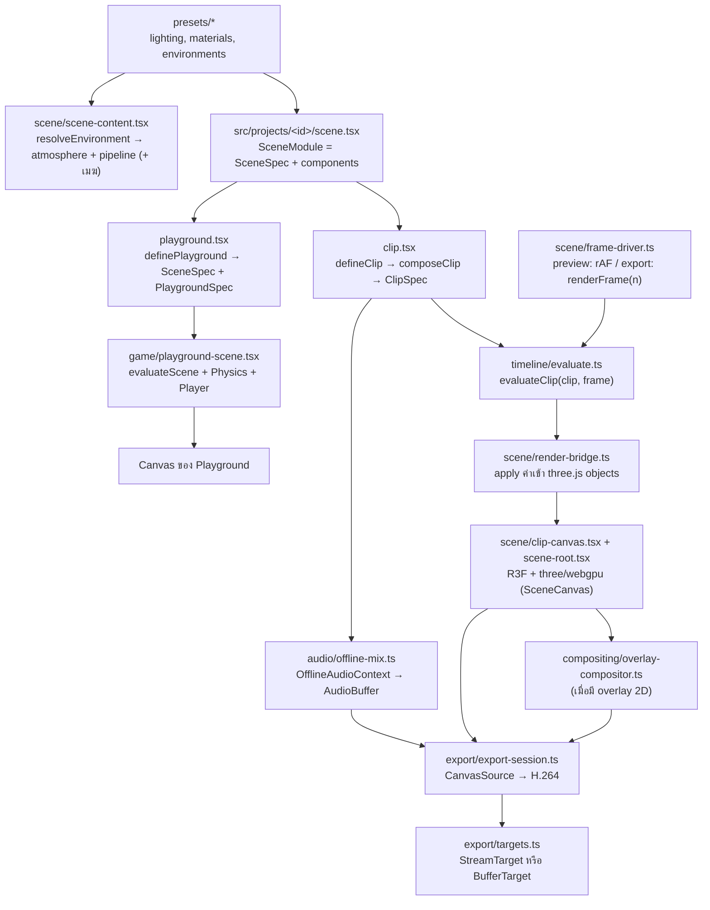

# สถาปัตยกรรม 3D Clip Studio

เอกสารนี้สรุปการออกแบบจาก `final-front-end-3d-video-stack.th.md` ให้ตรงกับโครงสร้างโค้ดจริง (Next.js App Router แทน Vite)

งานแบ่งเป็น **project** แต่ละ project คือโฟลเดอร์ `src/projects/<id>/` ที่มีฉากเดียวใช้ร่วมกันใน 2 โหมด:

- **Playground** (`/projects/<id>/play`): เดินในฉากด้วยคีย์บอร์ดและ physics (Rapier) เพื่อดูแสง สี และวัสดุ
- **Studio** (`/projects/<id>/studio`): preview คลิปของ project แล้ว export เป็น MP4 (H.264 + AAC) ในเบราว์เซอร์ (1 คลิปต่อ project)

## คำศัพท์

| คำ               | ความหมาย                                                                           | อยู่ที่              |
| ---------------- | ---------------------------------------------------------------------------------- | -------------------- |
| Project          | โฟลเดอร์ `src/projects/<id>/` ที่มี `scene.tsx`, `playground.tsx` และ `clip.tsx`   | `src/projects/`      |
| `SceneSpec`      | data ของฉาก: `environment`, `lights` และ `objects`                                 | `src/model/types.ts` |
| `ClipDefinition` | สิ่งที่ `clip.tsx` เขียนทับฉาก: video, camera, audio, `animate` และ `extraObjects` | `src/model/types.ts` |
| `ClipSpec`       | ผลของ `composeClip(scene, definition)` ที่ engine ใช้ evaluate และ export          | `src/model/types.ts` |
| `PlaygroundSpec` | `spawn`, `colliders` และ `extraObjects`                                            | `src/model/types.ts` |

## Data flow



`scene/scene-content.tsx` (environment, post pipeline, lights, objects) ใช้ร่วมกันทั้ง `scene-root.tsx` ของคลิปและ `playground-scene.tsx` แสง ท้องฟ้า และวัสดุจึงเหมือนกันทั้งสองโหมด

## โมดูล

| Path                                             | หน้าที่                                                                                                                                                                               | ข้อจำกัด                                                                                                         |
| ------------------------------------------------ | ------------------------------------------------------------------------------------------------------------------------------------------------------------------------------------- | ---------------------------------------------------------------------------------------------------------------- |
| `src/app/`                                       | routing อย่างเดียว page เป็น Server Component แบบบาง                                                                                                                                  | ห้าม import R3F หรือ three ตรง ๆ ต้องผ่าน loader                                                                 |
| `src/features/studio`, `src/features/playground` | UI ของแต่ละโหมด รับ `projectId`                                                                                                                                                       | `*-loader.tsx` เป็น client boundary (`'use client'` + `dynamic(..., { ssr: false })`)                            |
| `src/projects/`                                  | project ที่ AI เขียน, `define.ts`, `manifest.ts` (metadata) และ `loaders.ts` (lazy import แยก clip/playground)                                                                        | `manifest.ts` ต้องไม่ import โค้ด project เพราะ Server Component ใช้ไฟล์นี้ และ project ห้าม import project อื่น |
| `src/model/`                                     | type ของ scene/clip/playground, ค่าเริ่มต้น และ `composeClip`                                                                                                                         | **pure**: ข้อมูลต้อง serialize เป็น JSON ได้                                                                     |
| `src/timeline/`                                  | evaluator, interpolation, easing และ seeded random                                                                                                                                    | **pure**: เป็นฟังก์ชันของ `(spec, frame)` เท่านั้น                                                               |
| `src/presets/`                                   | preset แสง วัสดุ และสภาพแวดล้อมที่ใช้ร่วมกัน รวมถึงค่าเริ่มต้นและการตรวจค่าของเมฆ (`clouds.ts`)                                                                                       | **pure data**                                                                                                    |
| `src/scene/`                                     | ชั้น render ด้วย R3F + WebGPU, scene content, render bridge, frame driver และ clip clock (ดู "Render layer")                                                                          | client-only และห้าม import `src/projects`                                                                        |
| `src/scene/canvas/`                              | `SceneCanvas` ตัวเดียวที่ทั้ง playground และ studio ใช้ สร้าง `WebGPURenderer` (ขอ limit ของเมฆ) และตรวจว่ารองรับ WebGPU                                                              | ห้ามสร้าง `<Canvas>` เองที่อื่น                                                                                  |
| `src/scene/atmosphere/`                          | ท้องฟ้า ดวงอาทิตย์ และ IBL จาก takram (`createAtmosphere`, `<Atmosphere>`, `<Sky>`, `<SunLight>`)                                                                                     | import `@takram/*` ผ่าน `atmosphere/takram.ts` เท่านั้น                                                          |
| `src/scene/pipeline/`                            | post-processing (`createScenePipeline`, `<ScenePipeline>`)                                                                                                                            | import `@takram/*` ผ่าน `pipeline/takram.ts` เท่านั้น                                                            |
| `src/scene/clouds/`                              | เมฆเชิงปริมาตร: `createClouds` (`CloudsHandle`), adapter ของไลบรารีเมฆ (`three-clouds.ts`), quality presets (`quality.ts`) และ loader ของ texture (`cloud-textures.ts`) (ดู "Clouds") | import ไลบรารีเมฆและ `@takram/*` ผ่าน `clouds/three-clouds.ts` เท่านั้น                                          |
| `src/game/`                                      | controls, physics config, player และ playground scene                                                                                                                                 | client-only, physics ใช้ fixed timestep                                                                          |
| `src/audio/`                                     | โหลดเสียง, เล่นเสียงตอน preview และ mix แบบ offline                                                                                                                                   | client-only                                                                                                      |
| `src/export/`                                    | capability check, AAC fallback, output target และ export loop                                                                                                                         | `mediabunny` import ได้เฉพาะใน `export/mediabunny.ts`                                                            |
| `src/compositing/`                               | Canvas 2D สำหรับ subtitle/logo ที่ต้องติดไปในวิดีโอ                                                                                                                                   | เพิ่มเมื่อมีความต้องการจริง                                                                                      |
| `src/stores/`                                    | zustand store สำหรับ state ของ UI                                                                                                                                                     | ห้ามใช้ store ขับ scene ทีละเฟรม                                                                                 |
| `public/assets/`                                 | ใช้ร่วมกัน: `models/`, `textures/`, `hdri/`, `audio/`, `fonts/` และ texture ของเมฆ (`clouds/`) เฉพาะ project: `projects/<id>/`                                                        | same-origin เท่านั้น เพื่อเลี่ยงปัญหา CORS ตอนอ่าน canvas                                                        |

**pure** หมายถึงห้าม import `react`, `three`, `@react-three/*`, `@takram/*`, `@yong_three/*`, `mediabunny` และโมดูลชั้นบน ESLint (`no-restricted-imports` ใน `eslint.config.mjs`) บังคับกฎนี้ กฎ entry เดียวของ mediabunny กฎ adapter ของ `@takram/*` (`atmosphere/takram.ts`, `pipeline/takram.ts`, `clouds/three-clouds.ts`) กฎ adapter เดียวของไลบรารีเมฆ (`@yong_three/*` ผ่าน `clouds/three-clouds.ts`) กฎห้ามใช้ `postprocessing`/`@react-three/postprocessing` และ entry WebGL ของ `@takram/three-clouds`/`@yong_three/three-clouds` และกฎห้าม project import project อื่น (`@/projects/<id>/…`)

## Render layer (WebGPU)

ทั้งแอป render ด้วย WebGPU อย่างเดียว ไม่มี WebGL path

```text
features (playground-app / viewport)
└─ SceneCanvas quality (canvas/)        useWebGPUSupport() → <Canvas gl={createRenderer}> flat, shadows="percentage", dpr ตาม RENDER_QUALITIES[quality], frameloop
   └─ RenderQualityContext
      └─ SceneContent                   resolveEnvironment(spec.environment)
         ├─ EnvironmentRenderer         environmentEpochMs(dateTime)
         │  └─ Atmosphere (atmosphere/) AtmosphereContext → renderer.contextNode, พิกัดโลก (geo-frame.ts), วันเวลา, กล้อง
         │     ├─ Sky                   scene.backgroundNode = skyBackground() (ปิดดาว), scene.environmentNode = skyEnvironment()
         │     └─ SunLight              AtmosphereLight (เงา, ปิด indirect เพราะใช้ IBL จาก skyEnvironment)
         ├─ ScenePipeline (pipeline/)   pass(MRT output + highpVelocity) → เมฆ (ถ้ามี) → lensFlare → toneMapping(AgX, exposure) → TAA → renderOutput (sRGB) → dithering
         ├─ LightRig                    แสงเสริมจาก spec.lights
         └─ SceneObject × n             primitive + MeshStandardNodeMaterial
```

- **สองชั้นในแต่ละโฟลเดอร์**:
  - ฟังก์ชัน imperative (`createAtmosphere`, `createScenePipeline`, `createClouds`) สร้าง อัปเดต และ dispose node เอง
  - component บาง ๆ ผูกกับ R3F ด้วย `useMemo` + `useDisposable` + effect
  - แยกแบบนี้เพื่อให้ export (M1) เรียกฟังก์ชันชุดเดียวกันได้โดยไม่ผ่าน React และผ่านกฎ `react-hooks/immutability`
- **ค่าที่จูนได้** (คุณภาพการแสดงผล ซึ่งรวม dpr และคุณภาพเมฆ, กล้อง, tone mapping, เงาดวงอาทิตย์) อยู่ใน `scene/render-config.ts` ที่เดียว
- **คุณภาพการแสดงผล** (`RENDER_QUALITIES` ใน `render-config.ts`): `high` (ค่าเริ่มต้น) กับ `performance` กำหนด dpr และคุณภาพเมฆ
  - `SceneCanvas` รับ prop `quality` แล้วส่งต่อผ่าน `RenderQualityContext` (`canvas/render-quality.ts`) `ScenePipeline` อ่านด้วย `useRenderQuality()` แล้วส่งให้ `CloudsHandle.setQuality`
  - Studio ใช้ค่าเริ่มต้นเสมอ playground ค่าเริ่มต้นจึงเห็นภาพเดียวกับ Studio ส่วน `performance` (เมฆ `medium` + dpr 1) เป็นตัวเลือกใน environment panel ของ playground เท่านั้น ห้ามใช้ตอน export
  - เปลี่ยนคุณภาพไม่ remount canvas: R3F resize ตาม dpr และ `ScenePipeline` ตั้ง preset ใหม่กับ `CloudsNode` ตัวเดิม (compile shader ใหม่เมื่อ flag ที่ฝังใน shader เปลี่ยน ไม่โหลด texture ซ้ำ)
  - เติม `?stats` ใน URL ของ playground เพื่อแสดง FPS (drei `<Stats>`) วัดใน production build (`bun run build` แล้ว `bun run start`) เพราะ dev mode มี StrictMode และ overlay
- **พิกัด**: world origin วางที่ `environment.location` ด้วย `Ellipsoid.WGS84.getNorthUpEastFrame` แกนเป็น +X เหนือ, +Y ขึ้น, +Z ตะวันออก และ 1 หน่วยเท่ากับ 1 เมตร
  - การแปลง geodetic → ECEF และ local frame → ECEF อยู่ใน `atmosphere/geo-frame.ts` ที่เดียว
  - ไม่เปิด `highPrecision` และ `reversedDepthBuffer` เพราะใช้เมื่อวาง object ในพิกัด ECEF เท่านั้น
  - `highPrecision` ใช้กับ `SkinnedMesh`/`InstancedMesh` ไม่ได้
  - frame นี้มี translation จึงต้องใช้ patch ของ atmosphere ที่กลับ matrix ด้วย `invert()` (ดู "Clouds")
- **เวลา**: ทิศดวงอาทิตย์และดวงจันทร์คำนวณจาก `environment.dateTime` โดยใช้ origin เป็นตำแหน่งผู้สังเกต (observer)
  - `environmentEpochMs` บังคับให้ `dateTime` เป็น ISO-8601 ที่ลงท้ายด้วย `Z` หรือ `±hh:mm` เพราะถ้าไม่มี offset จะถูกตีเป็นเวลาของเครื่อง
  - ห้ามใช้ `new Date()` ตอน runtime
- **Tone mapping** ทำใน pipeline ที่เดียว `SceneCanvas` จึงตั้ง `flat` ถ้าไม่ตั้ง R3F จะใส่ ACES ให้ แล้ว `RenderPipeline` จะ tone map ซ้ำ
- **Dithering ทำหลังแปลงเป็น sRGB**: `createScenePipeline` ตั้ง `outputColorTransform = false` แล้วเรียก `renderOutput()` เองก่อน `dithering`
  - `dithering` มีขนาด ±0.5/255 ใน display space ถ้าใส่ก่อน OETF ของ sRGB noise ในส่วนมืดจะขยายเป็นหลายระดับของ 8-bit
  - `renderOutput()` ที่ไม่ส่งอาร์กิวเมนต์อ่าน tone mapping และ color space ของ renderer จาก context ของ `RenderPipeline` จึงยังต้องตั้ง `flat`
- **Velocity สำหรับ TAA** ใช้ `highpVelocity` ของ takram ห้ามใช้ `velocity` ของ three
  - TAA ของ takram ยกเลิก jitter ผ่าน `highpVelocity.setProjectionMatrix()` เท่านั้น และใช้ค่า `.z` ตรวจ depth แต่ `velocity` ของ three เป็น `vec2`
  - `highpVelocity` ใช้กับ `SkinnedMesh`/`InstancedMesh` ได้ เพราะ MRT มี key `velocity` และ three จะคำนวณ `positionPrevious` ให้
- **กล้อง**: canvas หนึ่งตัวมีกล้องตัวเดียวตลอดอายุ และห้าม `makeDefault` กล้องใหม่
  - node ของ takram (sky, environment, TAA) และ `CloudsNode` จับกล้องไว้ตอน setup ส่วน `ScenePipeline` จะ rebuild ทุกครั้งที่กล้องเปลี่ยน
  - โหมดต่าง ๆ (inspect, player, clip) เขียนค่าลงกล้อง default ของ R3F เอง
- **ลำดับ `useFrame`**: controls (-1) → update (0) → render (`RENDER_PRIORITY` = 1)
  - priority ที่มากกว่า 0 ทำให้ R3F เลิกเรียก `gl.render` เอง
- **ต้องเป็น WebGPU จริง**: `createRenderer` ตรวจ `renderer.backend` หลัง `init()`
  - ถ้าไม่ใช่ WebGPU backend หรือ init ล้มเหลว จะ throw `WebGPUUnavailableError`
  - `CanvasErrorBoundary` แปลง error นี้เป็น `fallback` ส่วน error อื่นส่งต่อให้ `error.tsx`
  - `createRenderer` ขอ `CLOUDS_REQUIRED_LIMITS` (`maxSampledTexturesPerShaderStage` 32) ทุกครั้ง GPU ที่ให้ไม่ถึงจะ init ไม่ผ่านและเห็น `fallback` แม้ฉากไม่มีเมฆ
- **Dispose**: `RTTNode` ไม่คืน render target เอง `createScenePipeline` จึง dispose `renderTarget` ของ tone-mapped RTT และ `lensFlare.featuresNode` เอง
- **Exposure** ของ takram เป็นหน่วย luminance ค่าที่ใช้ได้จริงอยู่ราว 3–10
- **`@takram/*`** import ได้เฉพาะ `atmosphere/takram.ts`, `pipeline/takram.ts` และ `clouds/three-clouds.ts`
  - ไฟล์เหล่านี้ cast type ให้เข้ากับ `@types/three` 0.184 เมื่อจำเป็น เพราะ d.ts ของ takram build กับ 0.182
  - เมื่ออัปเกรด takram ให้ตรวจไฟล์เหล่านี้และ `patches/` ก่อน
- **ไม่ใช้ WebGL2 fallback ของ `WebGPURenderer`**: `detectWebGPU` ตรวจ `navigator.gpu` แล้วแสดง `fallback` ถ้าไม่รองรับ เพราะ node ของ takram ยังพังบน fallback (issue #108, #114–#116)
- **`@takram/three-atmosphere` root entry**: ฟังก์ชันคำนวณทิศดวงอาทิตย์และดวงจันทร์มีแค่ใน root entry ซึ่ง `build/shared.js` import `postprocessing` (WebGL)
  - ตรวจ production build (Turbopack) แล้ว `EffectComposer` และ `EffectPass` ถูกตัดทิ้ง แต่ class พื้นฐานบางส่วนของ `postprocessing` (เช่น `Effect`/`BlendMode`) กับ GLSL ของ `AerialPerspectiveEffect` ยังติดมา ถือเป็น known cost ไว้ก่อน
  - เมื่ออัปเกรด takram หรือ Next.js ให้ตรวจซ้ำ
- **หนึ่ง `Atmosphere` ต่อ canvas** และอยู่ตลอดอายุ canvas เพราะ node ที่ compile แล้ว (รวมถึง `CloudsNode`) จับ `AtmosphereContext` ไว้ตอน setup
- **ยังไม่ได้ทำ**:
  - aerial perspective: แทรก `aerialPerspective(color, depth)` ระหว่าง scene pass กับเมฆใน `createScenePipeline` เมื่อมีฉากกลางแจ้งระยะไกล
    - ตัวนี้โหลด `stbn.bin` จาก media.githubusercontent.com ตอน runtime และต้องตรวจ license ตาม issue #117
    - ใน `@takram/three-geospatial` 0.9.1 ตั้ง `stbnTexture.url` เพื่อ self-host ไม่ได้ เพราะ `STBNTextureNode.clone()` ไม่ copy `url` และ `stbn` clone ทุกครั้ง
    - `AerialPerspectiveNode` วาด sky เองที่ depth = 1 ต้องตั้ง `skyNode = null` หรือเอา `scene.backgroundNode` ออก ไม่อย่างนั้น sky จะถูกคำนวณซ้ำ
    - เมื่อทำแล้วให้ส่ง `getShadowLengthNode()` ของเมฆเข้า `shadowLengthNode` และเปิด `lightShafts` ตาม preset (ดู "Clouds")
  - stars: `Sky` ตั้ง `showStars = false` เพราะค่า default จะโหลด `stars.bin` จาก GitHub ต้อง self-host ก่อนเปิดใช้กับฉากกลางคืน
  - animate เวลาของวันในคลิป ต้องเพิ่ม environment เข้า `EvaluatedScene` และ render bridge
  - TAA และ temporal upscale ของเมฆสะสม history ข้ามเฟรม ตอน M1 ต้องตัดสินว่าจะ warm-up หลัง seek หรือปิดตอน export
  - export ต้อง render warm-up หลายเฟรมก่อนเริ่ม: รอ LUT และ `AtmosphereLight` จะอัปเดตตำแหน่งช้าไปหนึ่ง render ในเฟรมแรก ๆ
  - `FrameDriverOptions.advance` รับเวลาเป็นวินาที เพราะ R3F ในโหมด `frameloop="never"` เอาค่านี้ไปใส่ `clock.elapsedTime` ตรง ๆ

### Clouds

สถานะ: render บน WebGPU ด้วย `@yong_three/three-clouds` 0.1.3 (entry `/webgpu`) ซึ่งเป็น fork ของ three-geospatial ที่ port `CloudsEffect` ของ takram เป็น TSL ใช้ชั่วคราวจนกว่า takram จะออกเมฆ WebGPU (branch `webgpu/clouds` ของ takram ยังมีแค่ procedural texture) ตัวอย่างอยู่ที่ project `showroom`

```text
ScenePipeline (pipeline/)            createScenePipeline(renderer, scene, camera, { clouds: environment.clouds !== null })
└─ createClouds(depth)               clouds/create-clouds.ts → CloudsHandle { ready, composite, setClouds, setQuality, setMotion }
   ├─ clouds(depth)                  clouds/three-clouds.ts → CloudsNode ของ fork (cast เป็น type ของเรา)
   └─ loadCloudTextures() + STBN     texture จาก /assets/clouds/ และ STBN จาก DEFAULT_STBN_URL
```

- **ขอบเขตของไลบรารี**: โค้ดที่รู้จักไลบรารีเมฆมีแค่ 2 ไฟล์ใน `scene/clouds/`
  - `three-clouds.ts` เป็นไฟล์เดียวที่ import ไลบรารีเมฆ (ESLint บังคับ) มีแค่ re-export กับ cast เป็น type `CloudsNode` ที่ประกาศเฉพาะ member ที่ใช้ เพราะ d.ts ของ fork เขียนกับ `@types/three` คนละเวอร์ชัน (`UniformNode<number>`)
  - `create-clouds.ts` แปลง `ResolvedClouds`, `CloudsRenderSettings` และ `EvaluatedCloudMotion` เข้า node แล้วคืน `CloudsHandle` ซึ่งเป็นสัญญาเดียวที่ pipeline ใช้
  - pipeline, component ของ R3F, model, presets, timeline และ texture loader ไม่รู้จักไลบรารีเมฆ
  - ใช้ entry `/webgpu` เท่านั้น เพราะ entry หลักกับ `/r3f` เป็น GLSL บน `postprocessing`
- **ต่อเข้า pipeline**: `createScenePipeline` สร้างเมฆเมื่อ `environment.clouds` ไม่เป็น null แล้วส่ง `clouds.composite(output)` เข้า `lensFlare`
  - composite คือ `color × (1 − clouds.a) + clouds.rgb` เพราะ output ของ `CloudsNode` เป็น premultiplied (rgb เป็น radiance, a เป็น coverage) และเมฆใส่ aerial perspective ระหว่างกล้องกับเมฆมาแล้ว
  - `CloudsNode` อ่าน `matrixWorldToECEF`, `sunDirectionECEF`, LUT และกล้องจาก `AtmosphereContext` ผ่าน `renderer.contextNode` ตัวเดียวกับท้องฟ้า จึงไม่ต้องส่ง atmosphere เข้าไปเอง
  - เปิดหรือปิดเมฆ (null ↔ ไม่ null) คือ rebuild pipeline ทั้งชุด ส่วนการเปลี่ยนค่าของเมฆใช้ node ตัวเดิม
  - `render()` ไม่ทำงานจนกว่า `ready` (texture + STBN) จะ resolve ถ้าโหลดไม่สำเร็จ `ScenePipeline` จะ throw ไปที่ `error.tsx`
  - `lightShafts` ปิดเสมอ (`TODO(future)` ใน `setQuality`) เพราะยังไม่มี `aerialPerspective` รับ shadow length ของเมฆ
  - เงาเมฆ (BSM) ยังไม่ลงบนวัสดุ PBR ต้องต่อ `getSunTransmittanceNode()` เข้ากับแสงของวัสดุก่อน
- **GPU limit**: `CloudsNode` ใช้ sampled texture เกินค่าเริ่มต้น 16 ต่อ stage `createRenderer` จึงขอ `CLOUDS_REQUIRED_LIMITS` (`maxSampledTexturesPerShaderStage` 32) ทุกครั้ง
- **การแปลงค่า** (`create-clouds.ts`):
  - `cloudLayers.reset()` แล้ว `setCloudLayers(layers)` เพราะ `set` ของ fork merge ทีละ slot และ `setCloudLayers` เป็นทางเดียวที่อัปเดต channel swizzle ที่ฝังใน shader
  - `turbulenceDisplacement`, `scatteringCoefficient` และ `absorptionCoefficient` อยู่ใน `parameterUniforms`
  - `scatterAnisotropy*` เป็น field ของ `marchNode` ที่ฝังใน shader (เปลี่ยนแล้ว rebuild เอง) ส่วน `skyLightScale`, `groundBounceScale`, `powder*` และ `haze*` เป็น uniform ของ `marchNode`
  - `setQuality` ใช้ setter `qualityPreset` ของ fork แล้วตามด้วย `temporalUpscale`
- **ข้อมูล** (`EnvironmentSpec.clouds`): ไม่มี field นี้คือไม่มีเมฆ ส่วน `{}` คือค่าเริ่มต้นของ takram
  - `resolveClouds` (`presets/clouds.ts`) merge ค่าเริ่มต้นกับ spec ทีละกลุ่ม แล้วตรวจค่าและ throw เมื่อผิด
  - `layers` ที่ระบุจะแทนชุดเดิมทั้งหมด ไม่ patch ทีละ slot แบบ `.set()` ของ takram และมีได้สูงสุด 4 ชั้น เพราะ shader ใช้ `vec4` และ channel RGBA ของ weather texture
  - ค่าเริ่มต้นทุกค่าคัดลอกจากซอร์สของ takram 0.7.6 (`CloudLayer`, `CloudLayers.DEFAULT`, `CloudsEffect`, `CloudsMaterial`) ซึ่ง fork ใช้ค่าเดียวกัน ได้แก่ coverage 0.3, ชั้นที่มีเงาช่วง 750–1,400 ม. และ 1,000–2,200 ม. กับชั้นบางช่วง 7,500–8,000 ม.
  - clip ที่ตั้ง `environment.clouds` จะแทน clouds ของ scene ทั้งก้อน เพราะ `composeClip` merge แค่ระดับบนสุด
- **หน่วย**: `altitude` และ `height` เป็นเมตร วัดจากผิว WGS84 ellipsoid ไม่ใช่จากพื้นฉากหรือระดับน้ำทะเล
  - origin ของฉากอยู่ที่ `location.height` เหนือ ellipsoid ฐานเมฆเหนือพื้นฉากจึงเท่ากับ `altitude − location.height`
  - ไม่มีการยกฐานเมฆตามภูมิประเทศ
- **การเคลื่อนที่**: `velocity` คือ texture offset ต่อวินาที ไม่ใช่ความเร็วลมหน่วย m/s
  - renderer ต้องอ่าน offset จาก `evaluateCloudMotion(clouds, timeSeconds)` (`timeline/clouds.ts`) ซึ่งเท่ากับ `offset + velocity × timeSeconds`
  - `CloudsNode.updateBefore` บวก `velocity × deltaTime` เข้า offset เอง `createClouds` จึงตั้ง velocity ของ node เป็น 0 และ `ScenePipeline` เขียน offset ผ่าน `setMotion` ทุกเฟรม ห้ามสะสม delta เพราะ seek และ export ต้องได้ค่าเดิม
- **คุณภาพ**: `scene/clouds/quality.ts` คัดลอก `qualityPresets.ts` ของ takram ไว้อ้างอิง ส่วน fork ใช้ตารางของตัวเองซึ่งค่าเท่ากันผ่าน setter `qualityPreset`
  - ใช้ค่าจากโค้ด ไม่ใช้ค่าใน README เช่น high ใช้ `maxIterationCountToSun` 2 และ `maxIterationCountToGround` 3 และ ultra ลด `minStepSize` เป็น 10 ม. นอกจากขยาย shadow map
  - เลือก preset ที่ `RENDER_QUALITIES[quality].clouds` ใน `render-config.ts` ค่าเริ่มต้น (`high`) คือ preset `high` กับ `temporalUpscale` ซึ่งไม่อยู่ใน preset
  - อย่าตัด `maxShadowLengthRayDistance` ให้สั้นลงตาม `camera.far` เพื่อเร่งความเร็ว cascade สุดท้ายของ cloud shadow ไม่มีขอบไกล จึงยังอ่านเงาได้เลย `far` โดยเฉพาะตอนมองเข้าหาดวงอาทิตย์
  - `shadowMaps.maxFar` เป็น null (ผลของ patch) cascade จึงตาม `camera.far` (`CAMERA_DEFAULTS.far` = 5,000 ม.)
  - คุณภาพเป็นเรื่องของ renderer จึงไม่อยู่ใน spec ของฉาก
- **Assets**: `public/assets/clouds/` คัดลอกจาก `@takram/three-clouds` 0.7.6 พร้อม `LICENSE` (MIT) ซึ่ง fork ship ชุดเดียวกันใน `node_modules/@yong_three/three-clouds/assets/`
  - เป็น data texture จึงใช้ `NoColorSpace` และ `RepeatWrapping`
  - filter และ wrap ต้องตรงกับ placeholder ของ fork (2D: `LinearMipmapLinearFilter`/`LinearFilter`, 3D: `RedFormat` + `LinearFilter`) เพราะ shader build จาก placeholder ถ้า 3D texture เป็น `NearestFilter` three จะ compile เป็น `textureLoad` แบบ clamp แทนการ sample แบบ repeat
  - `loadCloudTextures()` ตรวจขนาด `.bin` (128³ และ 32³ ไบต์) เพื่อจับ 404, หน้า HTML หรือ Git LFS pointer
  - `.gitattributes` ตั้ง `*.bin binary` เพราะ `shape.bin` และ `shape_detail.bin` ไม่มีไบต์ NUL Git จึงเดาว่าเป็น text และ `core.autocrlf` จะแปลงข้อมูลเสีย
  - STBN (blue noise) ยังไม่ self-host เพราะไม่มีในแพ็กเกจ และต้องตรวจ license ตาม issue #117
    - `createClouds` โหลด `DEFAULT_STBN_URL` จาก media.githubusercontent.com ตอน runtime (`TODO(future)`)
    - server ส่ง CORS header ให้ จึงไม่ทำให้ canvas tainted
- **Patches** (`patches/` สร้างด้วย `bun patch` และลงทะเบียนใน `patchedDependencies` ของ `package.json`):
  - `@yong_three/three-clouds@0.1.3` ใส่ fix 6 ข้อจาก fork commit `696948c321` ซึ่งอยู่บน `main` แต่ยังไม่ publish:
    1. `FrustumCorners` ใช้ near z = 0 ใน WebGPU (เดิม −1 ทำให้ cascade 0 เลื่อนราว 330 ม.)
    2. `shadowMaps.maxFar` ไม่ hard-code `1e5` แล้ว (รับ `options.shadows.maxFar`)
    3. `getShadowLengthNode()` คืน `vec2(length, 0)` ตามที่ atmosphere ต้องการ
    4. aerial perspective ใน march ส่ง shadow length เป็น `vec2(length, max(d − length, 0))`
    5. Bayer projection jitter กลับเครื่องหมาย y ให้ตรงกับ `screenUV` แบบ top-left
    6. resolve history ล้างเป็น alpha 0 (เดิม 1 ทำให้จอดำแวบหลัง reset)
    - แก้เฉพาะ `build/webgpu.js`, `build/shared.js` (minified) และ `types/webgpu/*.d.ts` ไม่แก้ `.cjs`
  - `@takram/three-atmosphere@0.19.1`: `matrixECEFToWorld` ใช้ `invert()` แทน `transpose()` ตาม upstream commit `127792e87f` ที่ยังไม่ release
    - world frame แบบ North-Up-East มี translation และเมฆใช้ matrix นี้กับจุด (reprojection และ cloud shadow) ส่วนโค้ดของ atmosphere เองใช้กับทิศทาง (w = 0) จึงได้ผลเท่าเดิม
  - เมื่ออัปเกรดแพ็กเกจใดให้ตรวจว่า upstream แก้แล้วหรือยัง ถ้าแก้แล้วให้ลบไฟล์ patch และ entry ใน `patchedDependencies` ถ้ายังให้ทำ patch ใหม่ (`bun patch <pkg>` → แก้ไฟล์ใน `node_modules` → `bun patch --commit <path>`)
- **Export (M1)**: `CloudsNode` เป็น FRAME node
  - `updateBefore` ทำงานครั้งเดียวต่อ `NodeFrame` ซึ่ง renderer เดินด้วย animation loop ของตัวเอง ไม่ได้เดินทุกครั้งที่ `render()` ถ้า render หลายเฟรมใน tick เดียว pass ของเมฆจะไม่ทำงานซ้ำ (TAA ก็เช่นกัน)
  - มี frame counter ภายในที่ `resetHistory()` ไม่ reset (ใช้กับ STBN และ Bayer jitter) และมี temporal history (resolve α 0.1, BSM α 0.01)
  - export ต้อง advance `NodeFrame` หนึ่งครั้งต่อเฟรม และตัดสินเรื่อง warm-up หลัง seek ไปพร้อมกับ TAA หรือปิด `temporalUpscale` ตอน export
  - shader ของเมฆ compile ครั้งแรกอาจนานหลายสิบวินาทีที่ความละเอียดสูง export ต้องรอให้ compile เสร็จก่อนเฟรมแรก
- **เปลี่ยนไปใช้เมฆ WebGPU ของ takram** เมื่อออก:
  1. สลับ dependency (`bun remove @yong_three/three-clouds` แล้ว `bun add @takram/three-clouds@<เวอร์ชัน> --exact`) และลบ `patches/@yong_three%2Fthree-clouds@0.1.3.patch` กับ entry ใน `patchedDependencies`
  2. แก้ import และ cast ใน `clouds/three-clouds.ts` ให้ชี้ entry WebGPU ของ takram แล้วลบ `cloudsForkImports` กับ path `@yong_three/three-clouds(/r3f)` ใน `eslint.config.mjs` (ยังห้าม entry WebGL ของ `@takram/three-clouds` ต่อไป)
  3. ปรับ mapping ใน `clouds/create-clouds.ts` ให้ตรงกับ API ใหม่ โดยคง signature ของ `createClouds` และ `CloudsHandle` ไว้
  4. ตรวจค่าเริ่มต้นใน `presets/clouds.ts` และ `quality.ts`, texture ใน `public/assets/clouds/`, sampler ของ texture และ `CLOUDS_REQUIRED_LIMITS` ซ้ำ

  pipeline, component ของ R3F, model, presets, timeline และ project ไม่ต้องแก้ ส่วน patch ของ atmosphere ให้ลบเมื่อ takram ออกเวอร์ชันที่ใช้ `invert()` แล้ว

## กฎหลัก

### เวลาและ determinism

- `frame` เป็นจำนวนเต็ม และ `timeSeconds = frame / fps`
- ค่าในฉากทุกค่าต้องมาจาก `evaluateClip(clip, frame)` ซึ่ง preview, seek และ export เรียกใช้ร่วมกัน ส่วน playground ใช้ `evaluateScene(scene, frame)` ตัวเดียวกับที่ `evaluateClip` เรียกต่อ
- ห้ามใช้ `Math.random()`, `Date.now()`, `performance.now()` หรือ delta ของ `useFrame` เป็นนาฬิกา ให้ใช้ `createSeededRandom(clip.seed)` แทน กฎนี้ใช้กับ `scene.tsx` และ `clip.tsx` ส่วน component ที่มีเฉพาะใน playground ใช้เวลาจริงได้เพราะไม่ถูกบันทึก
- GLB animation ใช้ `AnimationMixer.setTime(t)` ไม่สะสม delta
- Physics และ particle ใช้ fixed timestep และต้อง reset/replay หรือ bake ไว้ล่วงหน้าเมื่อ seek
- Deterministic หมายถึงเวลาและสถานะฉากทำซ้ำได้ ไม่ได้รับประกันว่าพิกเซลหรือไบต์ของ MP4 จะเหมือนกันทุก GPU

### Render loop

- Canvas ของคลิปใช้ `frameloop="never"` และ `frame-driver` เป็นคนเรียก `advance()` เอง
- ค่าที่เปลี่ยนทุกเฟรมเขียนผ่าน `render-bridge` แบบ imperative ห้ามใช้ `setState(frame)` แล้ว capture ทันที เพราะ React อาจยังไม่ commit
- Custom component อ่านเวลาจาก `useClipFrame()` (ref) ภายใน `useFrame()`
- `studio-store.displayFrame` ใช้แสดงผลใน UI เท่านั้น

### UI ของ Studio

- Layout: header (Export อยู่ที่นี่) → Outliner | Viewport | Inspector → Transport + Timeline เต็มความกว้าง
- Component ทุกตัวสั่งเล่น/seek/export ผ่าน `useStudioController()` ใน `features/studio/studio-controller.tsx` ไม่เรียก setter ของ store ตรง ๆ ตอนต่อ `FrameDriver` (M2) และ export pipeline (M1) จึงแก้แค่ไฟล์นี้
- `studio-store` เก็บ `selection` (รายการที่เลือกใน Outliner/Timeline), `isPlaying`, `isLooping`, `displayFrame`, `exportPresetId` และ `exportState` (union เดียวที่ใช้คำเดียวกับ `CapabilityReport`/`ExportResult`)
- Timeline และ Inspector อ่าน keyframe จาก `ClipSpec` ตรง ๆ (`features/studio/timeline-rows.ts`) ส่วนค่าที่เฟรมปัจจุบันจะแสดงใน M2 ด้วย `evaluateAnimatable`
- หน้า `/dev/ui` (เฉพาะ dev) แสดงทุก state ของ Export dialog, panel ของ Studio และ Playground ที่ยังเปิดจากแอปจริงไม่ได้

### สิ่งที่ติดไปใน MP4

- ไฟล์จะมีเฉพาะสิ่งที่วาดลง canvas ที่ส่งไป encode เท่านั้น DOM, CSS และ Drei `<Html>` จะไม่ติดไปด้วย
- ข้อความให้ render เป็น 3D text หรือวาดใน `compositing/`
- ต้องโหลดโมเดล texture และฟอนต์ (รวมถึงฟอนต์ไทย) ให้พร้อมก่อนเฟรมแรก
- LUT ของ atmosphere สร้างบน GPU ทีละขั้นผ่าน `requestIdleCallback` เฟรมแรก ๆ จึงยังไม่ถูกต้อง ต้องรอให้ครบก่อนเริ่ม export
- capture หลัง `ScenePipeline` render (pass สุดท้าย)

### Export

ลำดับ: เลือกปลายทางไฟล์จาก click ของผู้ใช้ (`pickOutputTarget`) → ตรวจ codec (`checkExportCapabilities`) → snapshot `ClipSpec` → render ทีละเฟรมพร้อมเคารพ backpressure และ cancel → finalize → cleanup ทุกกรณี

- ห้ามเปลี่ยนไฟล์ WebM ให้เป็นนามสกุล `.mp4`
- ห้ามตัดเสียงทิ้งเงียบ ๆ เมื่อ AAC ใช้ไม่ได้

## Stub และ roadmap

ฟังก์ชันที่ยังไม่ทำประกาศ signature เป็น type และให้ stub เรียก `notImplemented()` จาก `src/lib/not-implemented.ts` ส่วน component ที่ยังไม่ทำคืน `null` ทุกจุดมี `TODO(<milestone>)` กำกับ:

```bash
grep -rn "TODO(M1)" src
```

| Milestone                | เป้าหมาย (เกณฑ์ผ่าน)                                                                     | ไฟล์หลัก                                                                                                                                                                                                                                                                                                                       |
| ------------------------ | ---------------------------------------------------------------------------------------- | ------------------------------------------------------------------------------------------------------------------------------------------------------------------------------------------------------------------------------------------------------------------------------------------------------------------------------ |
| **M1** พิสูจน์ export    | คลิป `example-turntable` ยาว 10 วินาที, 1080p30, ไม่มีเสียง, เปิดนอกแอปได้, จำนวนเฟรมถูก | `timeline/evaluate.ts` (`evaluateClip`), `timeline/random.ts`, `scene/clip-canvas.tsx`, `scene-root.tsx`, `scene-content.tsx` (render bridge), `render-bridge.ts`, `frame-driver.ts` (export), `camera/`, `export/capabilities.ts`, `targets.ts`, `export-session.ts`, `features/studio/studio-controller.tsx` (`startExport`) |
| **M2** preview และ seek  | preview, seek และ export ได้ค่าตรงกันที่เฟรม 0 กลางคลิป และเฟรมสุดท้าย                   | `frame-driver.ts` (preview), `clip-clock.tsx`, `objects/` (custom), `studio-controller.tsx` (play/pause/seek), `inspector-fields.tsx` (ค่าที่เฟรมปัจจุบัน)                                                                                                                                                                     |
| **M3** เสียง             | beep ตรง marker ทั้ง native AAC และ WASM fallback                                        | `audio/*`, `export/aac-fallback.ts`, audio track ใน `export-session.ts`                                                                                                                                                                                                                                                        |
| **M4** assets และข้อความ | GLB, ฟอนต์ไทย และ overlay ติดครบในไฟล์                                                   | `model/assets.ts`, `objects/` (model/text), `materials/` (texture maps), `compositing/`                                                                                                                                                                                                                                        |
| **M5** ขอบเขต MVP        | 30–60 วินาที, แนวนอน/แนวตั้ง, cancel, export ซ้ำ, codec ไม่รองรับ, ปลายทางไฟล์ทั้งสองแบบ | `export/*` (cancel, cleanup, ขนาดสูงสุดของ memory target)                                                                                                                                                                                                                                                                      |
| **M6** effects/4K        | วัด RAM, GPU, เวลา export และ A/V sync ใหม่                                              | เพิ่ม node ใน `scene/pipeline/create-scene-pipeline.ts` (bloom, DOF, aerial perspective + light shafts ของเมฆ) และเปลี่ยนเมฆจาก fork ไปใช้ของ takram เมื่อออก (ดู "Clouds")                                                                                                                                                    |
| **G1** เดินใน playground | WASD + pointer lock + physics                                                            | `game/playground-scene.tsx`, `player/` (แทน `game/inspect-camera.tsx`), `features/playground/components/hud.tsx`                                                                                                                                                                                                               |
| **G2** สลับ preset       | สลับแสง สภาพแวดล้อม และดู material swatch                                                | `projects/showroom/`, `environment-panel.tsx`                                                                                                                                                                                                                                                                                  |
| **future**               | นำเข้า JSON และ LLM ในแอป                                                                | `model/schema.ts`                                                                                                                                                                                                                                                                                                              |
