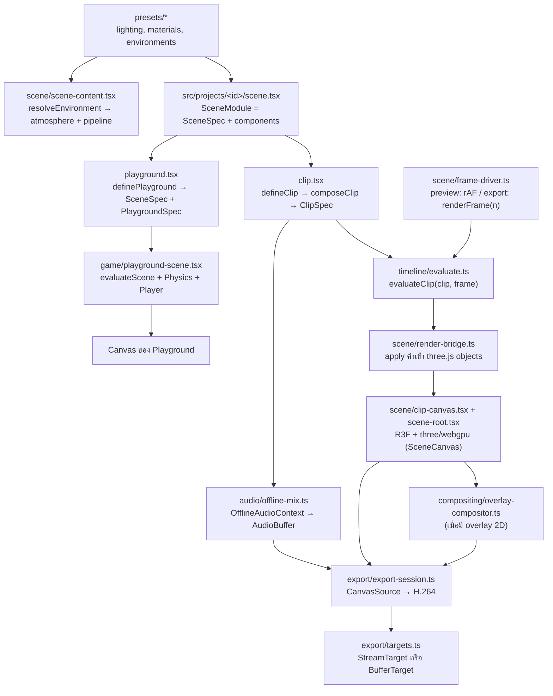

# สถาปัตยกรรม 3D Clip Studio

เอกสารนี้สรุปการออกแบบจาก `final-front-end-3d-video-stack.th.md` ให้ตรงกับโครงสร้างโค้ดจริง (Next.js App Router แทน Vite)

งานแบ่งเป็น **project** แต่ละ project คือโฟลเดอร์ `src/projects/<id>/` ที่มีฉากเดียวใช้ร่วมกันใน 2 โหมด:

- **Playground** (`/projects/<id>/play`): เดินในฉากด้วยคีย์บอร์ดและ physics (Rapier) เพื่อดูแสง สี และวัสดุ
- **Studio** (`/projects/<id>/studio`): preview คลิปของ project แล้ว export เป็น MP4 (H.264 + AAC) ในเบราว์เซอร์ (1 คลิปต่อ project)

## คำศัพท์

| คำ               | ความหมาย                                                                           | อยู่ที่              |
| ---------------- | ---------------------------------------------------------------------------------- | -------------------- |
| Project          | โฟลเดอร์ `src/projects/<id>/` ที่มี `scene.tsx`, `playground.tsx` และ `clip.tsx`   | `src/projects/`      |
| `SceneSpec`      | data ของฉาก: `environment`, `lights` และ `objects`                                 | `src/model/types.ts` |
| `ClipDefinition` | สิ่งที่ `clip.tsx` เขียนทับฉาก: video, camera, audio, `animate` และ `extraObjects` | `src/model/types.ts` |
| `ClipSpec`       | ผลของ `composeClip(scene, definition)` ที่ engine ใช้ evaluate และ export          | `src/model/types.ts` |
| `PlaygroundSpec` | `spawn`, `colliders` และ `extraObjects`                                            | `src/model/types.ts` |

## Data flow



`scene/scene-content.tsx` (environment, post pipeline, lights, objects) ใช้ร่วมกันทั้ง `scene-root.tsx` ของคลิปและ `playground-scene.tsx` แสง ท้องฟ้า และวัสดุจึงเหมือนกันทั้งสองโหมด

## โมดูล

| Path                                             | หน้าที่                                                                                                        | ข้อจำกัด                                                                                                         |
| ------------------------------------------------ | -------------------------------------------------------------------------------------------------------------- | ---------------------------------------------------------------------------------------------------------------- |
| `src/app/`                                       | routing อย่างเดียว page เป็น Server Component แบบบาง                                                           | ห้าม import R3F หรือ three ตรง ๆ ต้องผ่าน loader                                                                 |
| `src/features/studio`, `src/features/playground` | UI ของแต่ละโหมด รับ `projectId`                                                                                | `*-loader.tsx` เป็น client boundary (`'use client'` + `dynamic(..., { ssr: false })`)                            |
| `src/projects/`                                  | project ที่ AI เขียน, `define.ts`, `manifest.ts` (metadata) และ `loaders.ts` (lazy import แยก clip/playground) | `manifest.ts` ต้องไม่ import โค้ด project เพราะ Server Component ใช้ไฟล์นี้ และ project ห้าม import project อื่น |
| `src/model/`                                     | type ของ scene/clip/playground, ค่าเริ่มต้น และ `composeClip`                                                  | **pure**: ข้อมูลต้อง serialize เป็น JSON ได้                                                                     |
| `src/timeline/`                                  | evaluator, interpolation, easing และ seeded random                                                             | **pure**: เป็นฟังก์ชันของ `(spec, frame)` เท่านั้น                                                               |
| `src/presets/`                                   | preset แสง วัสดุ และสภาพแวดล้อมที่ใช้ร่วมกัน                                                                   | **pure data**                                                                                                    |
| `src/scene/`                                     | ชั้น render ด้วย R3F + WebGPU, scene content, render bridge, frame driver และ clip clock (ดู "Render layer")   | client-only และห้าม import `src/projects`                                                                        |
| `src/scene/canvas/`                              | `SceneCanvas` ตัวเดียวที่ทั้ง playground และ studio ใช้ สร้าง `WebGPURenderer` และตรวจว่ารองรับ WebGPU         | ห้ามสร้าง `<Canvas>` เองที่อื่น                                                                                  |
| `src/scene/atmosphere/`                          | ท้องฟ้า ดวงอาทิตย์ และ IBL จาก takram (`createAtmosphere`, `<Atmosphere>`, `<Sky>`, `<SunLight>`)              | import `@takram/*` ผ่าน `atmosphere/takram.ts` เท่านั้น                                                          |
| `src/scene/pipeline/`                            | post-processing (`createScenePipeline`, `<ScenePipeline>`)                                                     | import `@takram/*` ผ่าน `pipeline/takram.ts` เท่านั้น                                                            |
| `src/game/`                                      | controls, physics config, player และ playground scene                                                          | client-only, physics ใช้ fixed timestep                                                                          |
| `src/audio/`                                     | โหลดเสียง, เล่นเสียงตอน preview และ mix แบบ offline                                                            | client-only                                                                                                      |
| `src/export/`                                    | capability check, AAC fallback, output target และ export loop                                                  | `mediabunny` import ได้เฉพาะใน `export/mediabunny.ts`                                                            |
| `src/compositing/`                               | Canvas 2D สำหรับ subtitle/logo ที่ต้องติดไปในวิดีโอ                                                            | เพิ่มเมื่อมีความต้องการจริง                                                                                      |
| `src/stores/`                                    | zustand store สำหรับ state ของ UI                                                                              | ห้ามใช้ store ขับ scene ทีละเฟรม                                                                                 |
| `public/assets/`                                 | ใช้ร่วมกัน: `models/`, `textures/`, `hdri/`, `audio/`, `fonts/` เฉพาะ project: `projects/<id>/`                | same-origin เท่านั้น เพื่อเลี่ยงปัญหา CORS ตอนอ่าน canvas                                                        |

**pure** หมายถึงห้าม import `react`, `three`, `@react-three/*`, `@takram/*`, `mediabunny` และโมดูลชั้นบน ESLint (`no-restricted-imports` ใน `eslint.config.mjs`) บังคับกฎนี้ กฎ entry เดียวของ mediabunny กฎ adapter เดียวของ `@takram/*` และกฎห้าม project import project อื่น (`@/projects/<id>/…`)

## Render layer (WebGPU)

```text
SceneCanvas (canvas/)               WebGPURenderer, flat, shadows="percentage", dpr [1, 2]
└─ SceneContent                     resolveEnvironment(spec.environment)
   ├─ EnvironmentRenderer
   │  └─ Atmosphere (atmosphere/)   AtmosphereContext → renderer.contextNode, พิกัดโลก, วันเวลา, กล้อง
   │     ├─ Sky                     scene.backgroundNode = skyBackground(), scene.environmentNode = skyEnvironment()
   │     └─ SunLight                AtmosphereLight (เงา, ปิด indirect เพราะใช้ IBL จาก skyEnvironment)
   ├─ ScenePipeline (pipeline/)     pass(MRT output + velocity) → lensFlare → toneMapping(AgX, exposure) → TAA → dithering
   ├─ LightRig                      แสงเสริมจาก spec.lights
   └─ SceneObject × n               primitive + MeshStandardNodeMaterial
```

- **สองชั้นในแต่ละโฟลเดอร์**:
  - ฟังก์ชัน imperative (`createAtmosphere`, `createScenePipeline`) สร้าง อัปเดต และ dispose node เอง
  - component บาง ๆ ผูกกับ R3F ด้วย `useMemo` + `useDisposable` + effect
  - แยกแบบนี้เพื่อให้ export (M1) เรียกฟังก์ชันชุดเดียวกันได้โดยไม่ผ่าน React และผ่านกฎ `react-hooks/immutability`
- **ค่าที่จูนได้** (dpr, กล้อง, tone mapping, เงาดวงอาทิตย์) อยู่ใน `scene/render-config.ts` ที่เดียว
- **พิกัด**: world origin วางที่ `environment.location` ด้วย `Ellipsoid.WGS84.getNorthUpEastFrame` แกนเป็น +X เหนือ, +Y ขึ้น, +Z ตะวันออก และ 1 หน่วยเท่ากับ 1 เมตร
  - ไม่เปิด `highPrecision` และ `reversedDepthBuffer` เพราะใช้เมื่อวาง object ในพิกัด ECEF เท่านั้น
  - `highPrecision` ใช้กับ `SkinnedMesh`/`InstancedMesh` ไม่ได้
- **เวลา**: ทิศดวงอาทิตย์และดวงจันทร์คำนวณจาก `environment.dateTime` (ISO-8601 ที่มี offset) ห้ามใช้ `new Date()` ตอน runtime
- **Tone mapping** ทำใน pipeline ที่เดียว `SceneCanvas` จึงตั้ง `flat` ถ้าไม่ตั้ง R3F จะใส่ ACES ให้ แล้ว `RenderPipeline` จะ tone map ซ้ำ
- **Exposure** ของ takram เป็นหน่วย luminance ค่าที่ใช้ได้จริงอยู่ราว 3–10
- **`@takram/*`** import ได้เฉพาะ `atmosphere/takram.ts` และ `pipeline/takram.ts`
  - สองไฟล์นี้ cast type ให้เข้ากับ `@types/three` 0.184 เพราะ d.ts ของ takram build กับ 0.182
  - เมื่ออัปเกรด takram ให้ตรวจสองไฟล์นี้ก่อน
- **WebGPU เท่านั้น**: `SceneCanvas` ตรวจ `navigator.gpu` แล้วแสดง `fallback` ถ้าไม่รองรับ ไม่ใช้ WebGL2 fallback ของ `WebGPURenderer` เพราะ node ของ takram ยังพังบน fallback (issue #108, #114–#116)
- **หนึ่ง `Atmosphere` ต่อ canvas** และอยู่ตลอดอายุ canvas เพราะ node ที่ compile แล้วจับ `AtmosphereContext` ไว้ตอน setup
- **ยังไม่ได้ทำ**:
  - aerial perspective: แทรก `aerialPerspective(color, depth)` ระหว่าง scene pass กับ `lensFlare` ใน `createScenePipeline` เมื่อมีฉากกลางแจ้งระยะไกล
    - ตัวนี้โหลด `stbn.bin` จาก media.githubusercontent.com ตอน runtime
    - ต้อง self-host ผ่าน `stbnTexture.url` และตรวจ license ตาม issue #117 ก่อน
  - clouds (takram ยังไม่มี WebGPU entry) และ stars (โหลด `stars.bin` จาก GitHub)
  - animate เวลาของวันในคลิป ต้องเพิ่ม environment เข้า `EvaluatedScene` และ render bridge
  - TAA สะสม history ข้ามเฟรม ตอน M1 ต้องตัดสินว่าจะ warm-up หลัง seek หรือปิด TAA ตอน export

## กฎหลัก

### เวลาและ determinism

- `frame` เป็นจำนวนเต็ม และ `timeSeconds = frame / fps`
- ค่าในฉากทุกค่าต้องมาจาก `evaluateClip(clip, frame)` ซึ่ง preview, seek และ export เรียกใช้ร่วมกัน ส่วน playground ใช้ `evaluateScene(scene, frame)` ตัวเดียวกับที่ `evaluateClip` เรียกต่อ
- ห้ามใช้ `Math.random()`, `Date.now()`, `performance.now()` หรือ delta ของ `useFrame` เป็นนาฬิกา ให้ใช้ `createSeededRandom(clip.seed)` แทน กฎนี้ใช้กับ `scene.tsx` และ `clip.tsx` ส่วน component ที่มีเฉพาะใน playground ใช้เวลาจริงได้เพราะไม่ถูกบันทึก
- GLB animation ใช้ `AnimationMixer.setTime(t)` ไม่สะสม delta
- Physics และ particle ใช้ fixed timestep และต้อง reset/replay หรือ bake ไว้ล่วงหน้าเมื่อ seek
- Deterministic หมายถึงเวลาและสถานะฉากทำซ้ำได้ ไม่ได้รับประกันว่าพิกเซลหรือไบต์ของ MP4 จะเหมือนกันทุก GPU

### Render loop

- Canvas ของคลิปใช้ `frameloop="never"` และ `frame-driver` เป็นคนเรียก `advance()` เอง
- ค่าที่เปลี่ยนทุกเฟรมเขียนผ่าน `render-bridge` แบบ imperative ห้ามใช้ `setState(frame)` แล้ว capture ทันที เพราะ React อาจยังไม่ commit
- Custom component อ่านเวลาจาก `useClipFrame()` (ref) ภายใน `useFrame()`
- `studio-store.displayFrame` ใช้แสดงผลใน UI เท่านั้น

### UI ของ Studio

- Layout: header (Export อยู่ที่นี่) → Outliner | Viewport | Inspector → Transport + Timeline เต็มความกว้าง
- Component ทุกตัวสั่งเล่น/seek/export ผ่าน `useStudioController()` ใน `features/studio/studio-controller.tsx` ไม่เรียก setter ของ store ตรง ๆ ตอนต่อ `FrameDriver` (M2) และ export pipeline (M1) จึงแก้แค่ไฟล์นี้
- `studio-store` เก็บ `selection` (รายการที่เลือกใน Outliner/Timeline), `isPlaying`, `isLooping`, `displayFrame`, `exportPresetId` และ `exportState` (union เดียวที่ใช้คำเดียวกับ `CapabilityReport`/`ExportResult`)
- Timeline และ Inspector อ่าน keyframe จาก `ClipSpec` ตรง ๆ (`features/studio/timeline-rows.ts`) ส่วนค่าที่เฟรมปัจจุบันจะแสดงใน M2 ด้วย `evaluateAnimatable`
- หน้า `/dev/ui` (เฉพาะ dev) แสดงทุก state ของ Export dialog, panel ของ Studio และ Playground ที่ยังเปิดจากแอปจริงไม่ได้

### สิ่งที่ติดไปใน MP4

- ไฟล์จะมีเฉพาะสิ่งที่วาดลง canvas ที่ส่งไป encode เท่านั้น DOM, CSS และ Drei `<Html>` จะไม่ติดไปด้วย
- ข้อความให้ render เป็น 3D text หรือวาดใน `compositing/`
- ต้องโหลดโมเดล texture และฟอนต์ (รวมถึงฟอนต์ไทย) ให้พร้อมก่อนเฟรมแรก
- LUT ของ atmosphere สร้างบน GPU ทีละขั้นผ่าน `requestIdleCallback` เฟรมแรก ๆ จึงยังไม่ถูกต้อง ต้องรอให้ครบก่อนเริ่ม export
- capture หลัง `ScenePipeline` render (pass สุดท้าย)

### Export

ลำดับ: เลือกปลายทางไฟล์จาก click ของผู้ใช้ (`pickOutputTarget`) → ตรวจ codec (`checkExportCapabilities`) → snapshot `ClipSpec` → render ทีละเฟรมพร้อมเคารพ backpressure และ cancel → finalize → cleanup ทุกกรณี

- ห้ามเปลี่ยนไฟล์ WebM ให้เป็นนามสกุล `.mp4`
- ห้ามตัดเสียงทิ้งเงียบ ๆ เมื่อ AAC ใช้ไม่ได้

## Stub และ roadmap

ฟังก์ชันที่ยังไม่ทำประกาศ signature เป็น type และให้ stub เรียก `notImplemented()` จาก `src/lib/not-implemented.ts` ส่วน component ที่ยังไม่ทำคืน `null` ทุกจุดมี `TODO(<milestone>)` กำกับ:

```bash
grep -rn "TODO(M1)" src
```

| Milestone                | เป้าหมาย (เกณฑ์ผ่าน)                                                                     | ไฟล์หลัก                                                                                                                                                                                                                                                                                                                       |
| ------------------------ | ---------------------------------------------------------------------------------------- | ------------------------------------------------------------------------------------------------------------------------------------------------------------------------------------------------------------------------------------------------------------------------------------------------------------------------------ |
| **M1** พิสูจน์ export    | คลิป `example-turntable` ยาว 10 วินาที, 1080p30, ไม่มีเสียง, เปิดนอกแอปได้, จำนวนเฟรมถูก | `timeline/evaluate.ts` (`evaluateClip`), `timeline/random.ts`, `scene/clip-canvas.tsx`, `scene-root.tsx`, `scene-content.tsx` (render bridge), `render-bridge.ts`, `frame-driver.ts` (export), `camera/`, `export/capabilities.ts`, `targets.ts`, `export-session.ts`, `features/studio/studio-controller.tsx` (`startExport`) |
| **M2** preview และ seek  | preview, seek และ export ได้ค่าตรงกันที่เฟรม 0 กลางคลิป และเฟรมสุดท้าย                   | `frame-driver.ts` (preview), `clip-clock.tsx`, `objects/` (custom), `studio-controller.tsx` (play/pause/seek), `inspector-fields.tsx` (ค่าที่เฟรมปัจจุบัน)                                                                                                                                                                     |
| **M3** เสียง             | beep ตรง marker ทั้ง native AAC และ WASM fallback                                        | `audio/*`, `export/aac-fallback.ts`, audio track ใน `export-session.ts`                                                                                                                                                                                                                                                        |
| **M4** assets และข้อความ | GLB, ฟอนต์ไทย และ overlay ติดครบในไฟล์                                                   | `model/assets.ts`, `objects/` (model/text), `materials/` (texture maps), `compositing/`                                                                                                                                                                                                                                        |
| **M5** ขอบเขต MVP        | 30–60 วินาที, แนวนอน/แนวตั้ง, cancel, export ซ้ำ, codec ไม่รองรับ, ปลายทางไฟล์ทั้งสองแบบ | `export/*` (cancel, cleanup, ขนาดสูงสุดของ memory target)                                                                                                                                                                                                                                                                      |
| **M6** effects/4K        | วัด RAM, GPU, เวลา export และ A/V sync ใหม่                                              | เพิ่ม node ใน `scene/pipeline/create-scene-pipeline.ts` (bloom, DOF, aerial perspective)                                                                                                                                                                                                                                       |
| **G1** เดินใน playground | WASD + pointer lock + physics                                                            | `game/playground-scene.tsx`, `player/` (แทน `game/inspect-camera.tsx`), `features/playground/components/hud.tsx`                                                                                                                                                                                                               |
| **G2** สลับ preset       | สลับแสง สภาพแวดล้อม และดู material swatch                                                | `projects/showroom/`, `environment-panel.tsx`                                                                                                                                                                                                                                                                                  |
| **future**               | นำเข้า JSON และ LLM ในแอป                                                                | `model/schema.ts`                                                                                                                                                                                                                                                                                                              |
